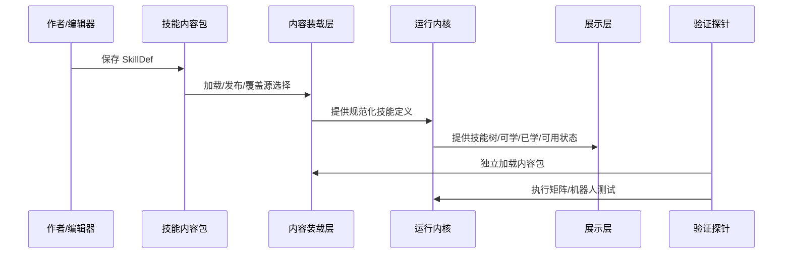
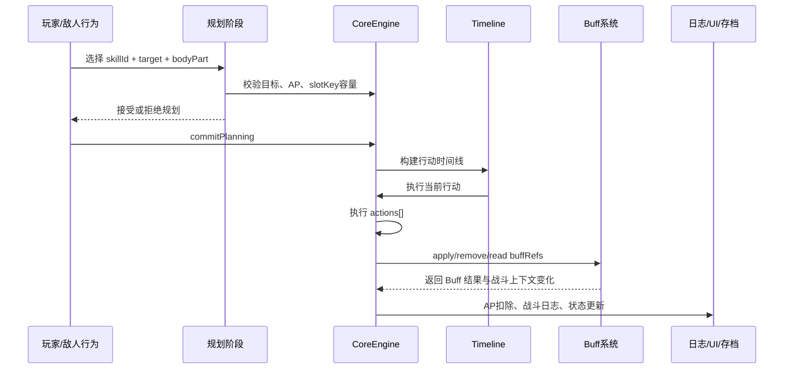
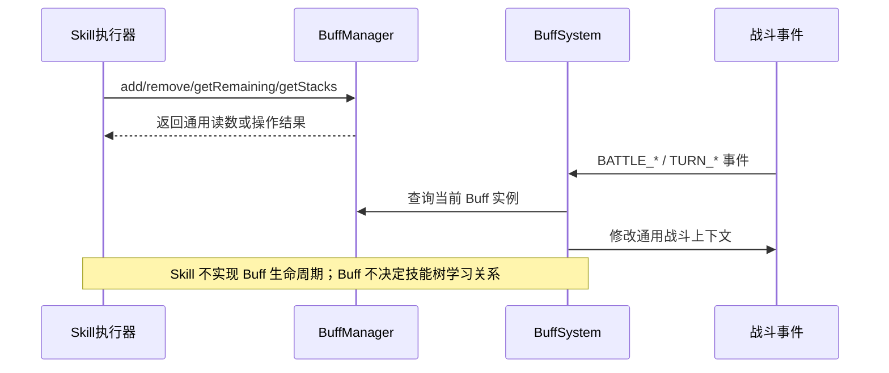
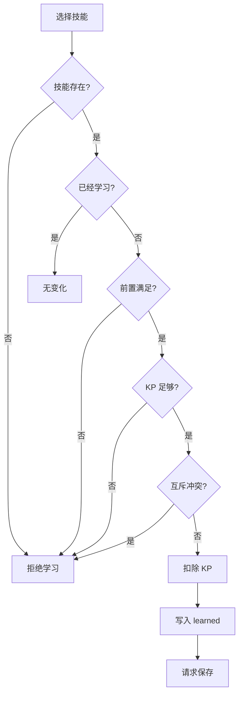

# S4 技能系统与技能树软件设计说明

> 本文件是 `NodeConsoleApp2` 中 `S4 技能系统与技能树` 的主软件设计说明文档。本文描述本阶段认可的系统设计：系统边界、分层结构、数据契约、运行内核、编辑展示工具、验证探针、关键流程和验收口径。
>
> 本文不把本项目强行拆成传统前端/后端。`NodeConsoleApp2` 的技能、Buff、敌人等系统大多由前端语言、本地 Node 服务和静态/本地 JSON 共同实现，因此本文采用更贴近当前工程的分层口径：数据契约层、内容装载层、运行内核层、编辑展示层、验证探针层。
>
> `04-技能编辑器(skill_editor_design)-设计说明.md`、`05-技能规划(skill_planning_design)-设计说明.md`、`06-技能平衡(skill_balance_design)-设计说明.md` 和 `29-敌人技能包与技能编辑器模式切换(enemy_skill_pack_editor_mode)-设计说明.md` 是本文的子设计或关联设计文档。

**日期：** 2026-05-28

**状态：** `当前有效`

**对应范围：**

- `S4` 技能系统与技能树。
- 玩家技能包：`assets/data/skills_melee_v4_5.json`。
- 敌人技能包：`assets/data/skills_enemy_v1.json`。
- 技能运行内核：`script/engine/CoreEngine.js` 中技能学习、规划、时间线执行和技能 action 结算相关方法。
- 技能内容装载：`script/engine/DataManagerV2.js` 中技能 catalog、技能契约摘要和敌人技能 fallback。
- 技能编辑工具：`test/skill_editor_test_v3.html`、`script/editor/skill/*`。
- 技能包本地保存/发布接口：`app.js` 中 `/api/skill-packs/save`、`/api/skill-packs/publish`、`/api/skill-packs/recent`。
- 技能运行时验证：`test/skill_formal_skill_matrix.test.mjs`、`test/skill_buff_decoupled_runtime.test.mjs`、`test/skill_buff_battle_robot.test.mjs`、`test/skill_editor_file_persistence.test.mjs`。

## 1. 文档目的与设计口径

### 1.1 文档目的

本文用于回答以下设计问题：

1. Skill 系统是什么，边界在哪里。
2. 技能数据、技能树、技能编辑器、战斗引擎、Buff 系统、敌人系统之间如何解耦。
3. 技能从 JSON 定义到战斗生效的完整生命周期是什么。
4. 哪些字段属于运行时事实，哪些字段只属于编辑展示，哪些字段属于历史或退役口径。
5. 技能如何施加、移除和读取 Buff，但不内嵌 Buff 生命周期逻辑。
6. 玩家技能和敌人技能如何复用同一套 Skill schema。
7. 新增技能时 Codex 和人工作者应遵守哪些结构约束、统计口径和验证入口。

### 1.2 设计口径

本文采用目标态软件设计说明口径：

- 描述系统应该如何组织，而不是堆叠历史问答、临时修补或某一轮聊天结论。
- 描述分层职责、对象模型、状态机、运行流程和验收口径，而不只描述 JSON 字段。
- 当前实现事实必须能在代码、数据或测试中找到对应依据。
- 尚未落地的内容设计建议不写成当前实现事实。
- 不采用传统“前端/后端”二分，而采用本项目实际更合适的“数据契约 / 内容装载 / 运行内核 / 编辑展示 / 验证探针”分层。

### 1.3 Skill 文档与 Buff 文档的写法差异

Buff 与 Skill 的设计文档写法必须不同。

Buff 是技能、敌人、道具和关卡效果的基础机制原子。每新增、删除或修改一个 Buff，都可能改变底层状态机、事件触发、叠加规则和战斗上下文。因此 Buff 文档必须把当前 Buff 类型逐项列清楚，并让每个 Buff 的状态机与实现一一对应。

Skill 是面向内容生产的组合层，是应当被编辑器持续扩展、调整和版本化的对象。如果主设计文档逐条列出所有具体技能，反而说明系统没有把技能抽象成可统计、可归类、可校验、可编辑的结构化接口，也会削弱技能编辑器作为内容生产工具的意义。

因此，Skill 主文档采用以下写法：

1. **不逐条穷尽所有技能。** 具体技能清单由技能 JSON、技能编辑器、技能测试矩阵和版本文件承担。
2. **按结构类型归类。** 例如即时 HP 伤害、护甲伤害、治疗、护甲回复、Buff 施加、Buff 移除、Buff 读数计算、多段动作、自身目标、敌方部位目标。
3. **按统计口径分析。** 例如各稀有度数量、KP 成本分布、AP 成本分布、Buff 引用分布、目标类型分布。
4. **按运行能力描述。** 文档描述系统支持什么能力、字段如何解释、执行器如何消费，而不是描述当前有哪几个具体技能。
5. **具体技能只作为样例。** 主文档可以保留代表性样例，用于说明字段和生命周期，但样例不构成全部内容清单。

### 1.4 术语使用规则

| 中文名 | 实现名 | 说明 |
| --- | --- | --- |
| 技能定义 | `SkillDef` | 技能 JSON 中的单个技能对象 |
| 技能内容包 | skill pack | `skills_melee_v4_5.json` 或 `skills_enemy_v1.json` |
| 玩家技能包 | player skill pack | 参与玩家技能树、KP 学习和玩家战斗配置的技能包 |
| 敌人技能包 | enemy skill pack | 敌人 AI 与敌人模板消费的技能包，不参与玩家 KP 学习 |
| 技能目录 | skill catalog | `DataManagerV2` 归一化后的技能索引 |
| 技能契约摘要 | skill contract summary | 从正式字段派生出的结构化摘要，用于工具、测试和校验 |
| 技能目标 | `target` | 技能规划阶段选择的主体、范围和部位 |
| 动作 | `actions[]` | 技能执行阶段逐项结算的动作列表 |
| Buff 引用 | `buffRefs` | 技能对 Buff 的施加、移除或读数引用 |
| 学习成本 | `unlock.cost.kp` | 技能树成长层消耗的 KP |
| 战斗成本 | `costs.ap` | 战斗规划和执行层消耗的 AP |
| 编辑元数据 | `editorMeta` | 技能树布局、编辑状态和显示控制，不参与战斗结算 |

### 1.5 系统主路径

技能系统的主路径是：

```text
技能内容包维护
  -> 技能编辑器加载玩家或敌人技能包
    -> 编辑器按 SkillDef 渲染技能树、列表、Inspector 和 Buff 引用面板
      -> 保存 authoring 版本或发布到 runtime 技能包
        -> DataManagerV2 加载技能包并构建 skill catalog
          -> 玩家通过 KP 学习技能，敌人通过模板和 AI 引用技能
            -> 规划阶段生成待执行技能动作
              -> 时间线排序并执行 actions[]
                -> Skill 施加/移除/读取 Buff
                  -> CoreEngine / BuffSystem / EventBus 共同产出战斗结果
                    -> UI、日志、存档、测试矩阵消费结果
```

## 2. 系统定位

### 2.1 一句话定位

`S4 技能系统与技能树` 是角色成长和战斗动作的统一数据契约与运行消费链。它把玩家技能、敌人技能、技能树学习、回合规划、动作结算和 Buff 引用统一到一套可编辑、可校验、可运行时消费的 Skill 对象中。

### 2.2 正面工作对象

本系统的正面工作对象是：

```text
可被运行时消费的技能内容包
```

不是：

- 写在页面中的临时技能按钮。
- 写在主引擎里的单个技能特判。
- 只用于说明、运行时不消费的自由文本。
- 技能树截图或编辑器局部状态。

技能内容包既是策划编辑对象，也是运行时事实来源。技能树、技能编辑器、战斗运行时、敌人行为、平衡分析和测试脚本都应围绕同一套 skill 数据语义工作。

### 2.3 设计原则

1. **技能内容包是技能事实源。** 运行时允许构建 skill catalog 和 contract summary，但它们必须是对静态内容包的规范化投影。
2. **技能树布局来自手工编辑。** `editorMeta.x/y` 与 `prerequisites` 表达节点位置和拓扑关系，不由运行时自动重排覆盖。
3. **技能只引用 Buff，不内嵌 Buff 生命周期逻辑。** Skill 可以施加、移除、读取 Buff，但 Buff 自己负责持续时间、层数、触发时机和状态机。
4. **技能执行器消费通用结构。** 当前硬运行链路主要消费 `target / costs.ap / actions / buffRefs`；`requirements`、`costs.partSlot`、`costs.perTurnLimit` 当前作为数据契约、展示和测试摘要字段存在，尚未成为 CoreEngine/TurnPlanner 的硬释放门槛。
5. **技能说明面向玩家。** `description` 应描述真实效果、消耗和目标，不写“启动器”“低 KP”“中复杂度”等开发者设计标签。
6. **玩家技能和敌人技能复用 schema。** 差异体现在内容组织和消费方，不另造敌人专用技能执行协议。

## 3. 业务目标与边界

### 3.1 本阶段负责

`S4` 负责：

- 定义技能内容包顶层结构、技能对象字段和运行时消费语义。
- 定义玩家技能树学习结构，包括 `prerequisites`、`unlock.cost.kp`、`unlock.exclusives`。
- 定义技能目标选择契约，包括目标阵营、目标范围、部位选择和目标校验。
- 定义战斗规划资源契约，包括 `costs.ap`、`costs.partSlot`、`costs.perTurnLimit`、`placement.maxSlots`；其中当前硬消费字段必须与实际运行代码区分。
- 定义 `actions[]` 的可执行效果集合。
- 定义 Skill 对 Buff 的施加、移除和读数引用边界。
- 定义技能编辑器保存、发布、最近版本加载和玩家/敌人技能包切换的系统边界。
- 定义技能运行时回归、正式技能覆盖矩阵和作者护栏检查。

### 3.2 本阶段不负责

`S4` 不负责：

- Buff 自己的生命周期、事件触发和状态机。这些归入 `S5 Buff 系统与编辑器`。
- 敌人 AI 如何选择技能。这些归入 `S6 敌人系统与编辑器`。
- 关卡资源节奏、敌人组合和地图节点。这些归入 `S3` 与 `S6`。
- 完整战斗公式和部位伤害总设计。这些归入 `S2 战斗运行时`。
- 具体流派全部数值定稿。这些归入 `06-技能平衡(skill_balance_design)-设计说明.md`。
- 历史旧技能附加字段继续作为正式 schema。退役口径已并入本文第 12 章；历史盘点记录不再作为当前活动 schema 入口。

### 3.3 上下游边界

```text
S4 技能系统
  -> 读取技能内容包
    -> 规划阶段生成待执行技能动作
      -> S2 战斗运行时执行 actions[]
        -> S5 Buff 系统处理 buffRefs 与事件响应
          -> UI / 日志 / 存档消费执行结果
```

`S4` 可以声明：

- 技能 ID、名称、描述、稀有度、学习成本、前置节点。
- 战斗目标、AP 成本、部位槽、速度修正和每回合限制。
- 直接动作类型、动作数值、动作目标绑定、重复次数。
- 对某个 Buff 的施加、移除、读取剩余回合或读取层数。

`S4` 不应声明：

- 某个 Buff 在回合开始或回合结束如何结算。
- 某个 Buff 如何递减 `remaining` 或 `stacks`。
- 针对某个 `buffId` 的专用主引擎特判。
- 敌人 AI 的行为权重和条件判断。

## 4. 总体架构

### 4.1 分层结构

```text
编辑展示层
  - test/skill_editor_test_v3.html
  - script/editor/skill/*
  - 技能树视图、Inspector、文件区、保存发布区
  - 技能编辑器中的 Buff 引用面板

验证探针层
  - test/skill_formal_skill_matrix.test.mjs
  - test/skill_buff_decoupled_runtime.test.mjs
  - test/skill_buff_battle_robot.test.mjs
  - test/skill_editor_file_persistence.test.mjs
  - tools/validate_skill_authoring_guard.mjs

内容装载层
  - script/engine/DataManagerV2.js
  - app.js 的 skill pack API
  - ContentPackOverrideStore 相关覆盖源
  - 技能包保存、发布、最近版本选择

数据契约层
  - assets/data/skills_melee_v4_5.json
  - assets/data/skills_enemy_v1.json
  - SkillDef / target / costs / requirements / actions / buffRefs / unlock / editorMeta

运行内核层
  - script/engine/CoreEngine.js
  - TurnPlanner / planning snapshot
  - TimelineManager
  - EventBus 与战斗上下文
```

### 4.2 分层职责矩阵

| 层次 | 负责 | 不负责 |
| --- | --- | --- |
| 数据契约层 | 定义技能字段、目标、动作、Buff 引用、学习成本和布局元数据 | 直接执行战斗逻辑 |
| 内容装载层 | 加载、归一化、catalog 构建、保存发布、版本选择、覆盖源选择 | 判断技能是否平衡 |
| 运行内核层 | 目标校验、AP 成本、规划入槽、时间线执行、action 结算、Buff 引用消费 | 编辑器布局和人工说明 |
| 编辑展示层 | 技能树展示、表单编辑、连线编辑、导入保存发布、最近版本下拉 | 作为运行时生效证据 |
| 验证探针层 | 独立验证技能可执行、Buff 引用解耦、正式技能覆盖、编辑器保存发布 | 替代人工设计审定 |

### 4.3 模块权威状态矩阵

| 状态 / 信息 | 权威归属 | 消费方 |
| --- | --- | --- |
| `id/name/description/rarity` | 技能内容包 | 编辑器、技能树、UI、测试矩阵 |
| 技能树位置 | `editorMeta.x/y` | 技能编辑器、技能树展示 |
| 技能树拓扑 | `prerequisites` | 技能编辑器、技能学习、技能树展示 |
| 学习成本 | `unlock.cost.kp` | 技能树、成长系统 |
| 玩家已学技能 | 玩家存档 `player.skills.learned` | 技能树、主流程、战斗技能面板 |
| 战斗 AP 成本 | `costs.ap` + 规划 AP 修正 | TurnPlanner、CoreEngine |
| 部位槽资源 | slot layout、slotKey、TurnPlanner；`costs.partSlot` 当前为展示/统计/契约字段 | 规划阶段、战斗 UI、契约摘要 |
| 当前回合规划 | TurnPlanner 与 runtime planning snapshot | 时间线、存档恢复、UI |
| 技能动作效果 | `actions[].effect` | CoreEngine 执行器 |
| Buff 生命周期 | `S5 Buff 系统` | BuffSystem、BuffManager、CoreEngine |
| 敌人技能选择 | EnemyActionPlanner / 敌人模板 | 敌人系统、战斗运行时 |
| 编辑器选择状态 | 编辑器页面内存 | 仅编辑器 |

## 5. 核心对象模型

### 5.1 SkillDef

当前玩家技能包 `skills_melee_v4_5.json` 使用的活动字段为：

```text
actions
buffRefs
costs
description
editorMeta
id
name
placement
prerequisites
rarity
requirements
speed
target
unlock
```

推荐 SkillDef 结构：

```json
{
  "id": "skill_id",
  "name": "技能名",
  "rarity": "Common",
  "description": "面向玩家的一句话效果描述。",
  "prerequisites": [],
  "unlock": {
    "cost": { "kp": 1 },
    "requirements": {},
    "exclusives": [],
    "grants": { "type": "permanent" }
  },
  "editorMeta": {
    "x": 0,
    "y": 0,
    "group": "melee",
    "locked": false,
    "editState": "done"
  },
  "speed": 0,
  "placement": { "maxSlots": 1 },
  "target": {},
  "requirements": {},
  "costs": {},
  "buffRefs": { "apply": [], "remove": [] },
  "actions": []
}
```

字段职责：

| 字段 | 运行时消费 | 编辑器消费 | 说明 |
| --- | --- | --- | --- |
| `id` | 是 | 是 | 全局唯一技能 ID |
| `name` | 是 | 是 | UI、日志和编辑器显示名 |
| `description` | 间接 | 是 | 面向玩家的效果描述，不作为运行时逻辑 |
| `rarity` | 间接 | 是 | 主要服务成长、平衡和展示 |
| `prerequisites` | 是 | 是 | 技能树前置关系；不表达战斗释放条件 |
| `unlock` | 是 | 是 | 学习成本、互斥、成长授权 |
| `target` | 是 | 是 | 规划阶段目标选择与校验 |
| `requirements` | 否/间接 | 是 | 当前写入契约摘要与 UI 展示；尚未作为硬释放门槛校验 |
| `costs` | 部分是 | 是 | `costs.ap` 硬消费；`partSlot/perTurnLimit` 当前为契约/展示字段 |
| `placement` | 否 | 是 | 当前仅见于内容数据；规划器未消费 `placement.maxSlots` |
| `speed` | 是 | 是 | 行动顺序修正 |
| `actions` | 是 | 是 | 直接执行动作列表 |
| `buffRefs` | 是 | 是 | Buff 施加和移除引用 |
| `editorMeta` | 否 | 是 | 画布布局、编辑状态和隐藏开关 |

### 5.2 target

`target` 负责描述技能规划阶段选择谁。它不同于 `actions[].target`，后者描述某个具体 action 如何跟随或覆盖技能目标。

推荐结构：

```json
{
  "target": {
    "subject": "SUBJECT_ENEMY",
    "scope": "SCOPE_PART",
    "selection": {
      "mode": "single",
      "candidateParts": ["head", "chest", "abdomen", "arm", "leg"],
      "selectedParts": [],
      "selectCount": 1
    }
  }
}
```

当前运行口径：

| 字段 | 说明 |
| --- | --- |
| `subject=SUBJECT_SELF` | 技能必须以释放者自己为目标 |
| `subject=SUBJECT_ENEMY` | 技能必须以敌方为目标 |
| `scope=SCOPE_ENTITY` | 目标是实体，不强制指定部位 |
| `scope=SCOPE_PART` | 目标是单个部位，规划时必须提供 `bodyPart` |
| `scope=SCOPE_MULTI_PARTS` | 目标是多个部位，当前也被视为需要部位目标的技能 |

`CoreEngine._validateSkillTargetSelection()` 在规划阶段校验：

1. `targetId` 必须能解析到真实实体。
2. `SUBJECT_SELF` 不允许指向敌人。
3. `SUBJECT_ENEMY` 不允许指向自己。
4. `SCOPE_PART / SCOPE_MULTI_PARTS` 必须提供有效 `bodyPart`。

### 5.3 action target binding

`actions[].target` 负责描述某个 action 的真实作用对象。

当前 `_resolveActionTarget()` 的关键规则：

1. `binding.mode` 不是 `explicit` 时，action 默认跟随技能目标。
2. `binding.mode=explicit` 时，action 可通过 `spec.subject` 指向 `SUBJECT_SELF` 或 `SUBJECT_ENEMY`。
3. `spec.scope` 为部位范围时，优先使用 `spec.selection.selectedParts[0]`，其次使用技能规划传入的 `bodyPart`，最后使用默认部位。

示例：

```json
{
  "target": {
    "binding": {
      "mode": "follow",
      "ref": "skillTarget"
    }
  }
}
```

```json
{
  "target": {
    "binding": { "mode": "explicit" },
    "spec": {
      "subject": "SUBJECT_SELF",
      "scope": "SCOPE_ENTITY"
    }
  }
}
```

### 5.4 requirements 与 costs

`requirements` 是释放门槛的数据契约，表示设计上必须满足但不一定扣除资源。当前实现中，`DataManagerV2.getSkillContractSummary()` 会保留 `requirements` 并据此派生 `runtimeFlags.isConditional`，编辑器和 UI 会展示该字段；但 `CoreEngine` 与 `TurnPlanner` 尚未按 `requirements.selfPart` 或其它 requirements 条目做硬释放校验。

`costs` 是释放成本的数据契约。当前实现里只有 `costs.ap` 已成为规划与执行的硬成本；`costs.partSlot` 和 `costs.perTurnLimit` 已进入技能包、编辑器和契约摘要，但尚未被 TurnPlanner 作为槽位消耗或次数限制直接执行。

当前核心字段：

| 字段 | 类型 | 运行口径 |
| --- | --- | --- |
| `costs.ap` | 成本 | `_getSkillApCostStrict()` 要求为非负数字；规划预算读取，执行后扣除 AP |
| `costs.partSlot` | 契约/展示 | UI 展示与契约摘要读取；TurnPlanner 当前不按 `slotCost` 占用多个槽 |
| `costs.perTurnLimit` | 契约/展示 | 当前正式包每个技能均有该字段；当前每回合同技能限制主要由 `planningDraftBySkill` 的 `skillId` key 和替换语义间接形成 |
| `requirements.selfPart` | 契约/展示 | 表示释放者某部位可用等要求；当前运行时不校验部位可用性 |
| `placement.maxSlots` | 历史/编排字段 | 当前玩家技能包只有个别技能保留该字段；TurnPlanner 不消费它 |

设计规则：

1. `prerequisites` 只表达技能树前置关系。
2. `requirements` 表达战斗释放条件的设计数据；在成为硬门槛前，不能假设运行时已阻止非法释放。
3. `costs.ap` 表达当前硬战斗消耗；`costs.partSlot/perTurnLimit` 当前只能作为内容契约和设计约束，不能作为已实现的硬运行规则。
4. `unlock.cost.kp` 是成长层学习成本，不等同于战斗 AP。

### 5.5 actions[]

`actions[]` 是技能执行阶段的直接动作列表。当前 `CoreEngine._executeSkillActions()` 支持以下 `effectType`：

| effectType | 当前意义 | 主要运行方法 |
| --- | --- | --- |
| `DMG_HP` | 对目标造成生命伤害，通常先经过护甲与 Buff 事件 | `_applyBattleDamage` |
| `DMG_ARMOR` | 只伤害目标部位护甲 | `_applyArmorOnlyDamage` |
| `HEAL` | 恢复目标 HP | `_applyHpDelta` |
| `ARMOR_ADD` | 恢复目标部位护甲 | `_applyArmorDelta` |
| `AP_GAIN` | 增加目标 AP | `_setEntityCurrentAp` |
| `BUFF_REMOVE` | 当前按技能效果移除目标身上的 debuff；`effect.amount >= 100` 时调用 `removeByType('debuff')` | `_removeBuffsBySkillEffect` |

动作执行顺序：

1. 技能执行前发出 `BATTLE_ACTION_PRE`。
2. 若 Buff 或其他监听者取消行动，则技能记录为 skipped。
3. 逐个 action 解析目标。
4. 逐个 action 计算数值。
5. 按 `effect.repeat.count` 进行多段结算。
6. 所有 actions 执行后，再处理 `buffRefs.apply/remove`。
7. 生成日志、结果和 `buffResults`。

当前直接 action 结算不引入命中概率概念。多段动作是确定性重复结算，不是概率命中。但 `buffRefs.apply[].chance` 当前仍被代码实际读取，且当前玩家/敌人技能包存在 `chance < 1` 的 Buff 施加数据；如果继续坚持无概率设计，应把这部分迁移为确定性效果或确定性释放条件。

### 5.6 amount 与 amountSource

当前 `_computeEffectAmount()` 支持以下 `amountType`：

| amountType | 当前意义 | 适合机制 |
| --- | --- | --- |
| `ABS` | 固定数值 | 基础伤害、治疗、护甲回复 |
| `PCT_MAX` | 目标最大值百分比 | 最大生命或最大护甲比例效果 |
| `PCT_CURRENT` | 当前实现走当前值基数；对护甲类取当前部位护甲，对 HP 类取当前 HP | 当前生命或当前护甲比例效果 |
| `BUFF_STACKS` | 读取指定 Buff 层数 | 中毒类层数资源 |
| `BUFF_REMAINING` | 读取指定 Buff 剩余持续时间 | 流血类持续时间资源 |

`BUFF_STACKS / BUFF_REMAINING` 的推荐结构：

```json
{
  "effect": {
    "effectType": "DMG_HP",
    "amountType": "BUFF_REMAINING",
    "amount": 1,
    "amountSource": {
      "owner": "skillTarget",
      "buffId": "buff_bleed",
      "multiplier": 8,
      "missingAs": 0
    }
  }
}
```

规则：

1. 流血是持续时间型状态，读取 `remaining`，不读取层数。
2. 中毒如果后续加入，才适合成为层数型状态，读取 `stacks`。
3. `BUFF_REMAINING` 和 `BUFF_STACKS` 是 Skill 对 Buff 的通用读数，不是 Skill 自己实现 Buff 生命周期。

### 5.7 buffRefs

`buffRefs` 是 Skill 与 Buff 的主要对接字段。

推荐结构：

```json
{
  "buffRefs": {
    "apply": [
      {
        "buffId": "buff_bleed",
        "target": "enemy",
        "duration": 2,
        "stacks": 1,
        "extendBy": 1,
        "params": {}
      }
    ],
    "remove": [
      {
        "buffId": "buff_slow",
        "target": "enemy"
      }
    ]
  }
}
```

当前 `_applySkillBuffRefs()` 真实消费：

| 字段 | 当前行为 |
| --- | --- |
| `buffRefs.apply[]` | 对目标调用 `target.buffs.add()` |
| `buffRefs.remove[]` | 对目标调用 `target.buffs.remove()` |
| `row.target === "self"` | 指向释放者 |
| 其他 `row.target` | 指向技能默认目标 |
| `duration` | 透传给 BuffManager |
| `params` | 透传给 BuffManager |
| `stacks` | 透传给 BuffManager |
| `stackStrategy` | 透传给 BuffManager |
| `maxStacks` | 透传给 BuffManager |
| `extendBy` | 透传给 BuffManager |
| `chance` | 当前代码兼容读取并会实际影响是否施加 Buff；当前玩家/敌人技能包仍存在 `chance < 1` 的数据。若继续坚持“无概率技能”设计，应把这些内容迁移为确定性约束或确定性效果 |

旧文档中的非活动字段如果当前运行时不消费，不应继续作为推荐 schema。旧字段退役口径以本文第 12 章为准。

### 5.8 unlock 与 prerequisites

玩家技能树使用 `unlock` 和 `prerequisites` 表达成长结构。

```json
{
  "prerequisites": ["skill_parent"],
  "unlock": {
    "cost": { "kp": 1 },
    "requirements": {},
    "exclusives": [],
    "grants": { "type": "permanent" }
  }
}
```

当前 `CoreEngine.learnSkill()` 的核心规则：

1. 技能必须存在。
2. 已学习技能不重复学习。
3. `prerequisites` 中的前置技能必须已学习。
4. 玩家 `skillPoints` 必须不少于 `unlock.cost.kp`。
5. `unlock.exclusives` 中任一技能已学习，则不能学习当前技能。
6. 学习成功后扣除 KP，并写入 `player.skills.learned`。

敌人技能包复用 Skill schema，但通常不参与 KP 学习和玩家技能树前置。

### 5.9 editorMeta

`editorMeta` 是编辑展示层元数据，不参与战斗结算。

当前关键字段：

| 字段 | 说明 |
| --- | --- |
| `x/y` | 技能树节点手工布局坐标 |
| `group` | 技能树或编辑器分组 |
| `locked` | 编辑器锁定状态 |
| `editState` | 编辑状态标记 |
| `hiddenInSkillTree` | 测试、演示或非正式节点在正式技能树中隐藏 |

设计规则：

1. 已有正式技能的 `editorMeta.x/y` 是手工排布事实源。
2. 新增正式技能必须显式写入坐标。
3. 运行时技能树可以缩放或投影坐标，但不能丢失相对布局关系。
4. 测试/演示节点必须显式标记隐藏，不再依赖旧标签。

## 6. 技能生命周期与状态机

### 6.1 技能内容生命周期



阶段说明：

| 阶段 | 输入 | 输出 | 主要错误 |
| --- | --- | --- | --- |
| 编辑/保存 | 表单、画布、Buff 引用 | authoring JSON | 字段缺失、引用不存在、坐标冲突 |
| 发布/装载 | runtime JSON | skill catalog | JSON 结构错误、重复 ID、版本路径错误 |
| 学习/解锁 | KP、前置、互斥 | learned skill | KP 不足、前置缺失、互斥冲突 |
| 规划 | skillId、目标、部位、AP | planned action | 目标无效、AP 不足、槽位不足 |
| 执行 | planned action | 战斗结果 | effectType 不支持、目标解析失败 |
| 反馈/持久化 | 结果、日志、状态 | UI、存档、测试证据 | 结果不一致、运行时漂移 |

### 6.2 战斗使用生命周期



当前实现分工：

- `assignSkillToSlot()`：单槽规划入口。
- `commitPlanning()`：草稿批量提交入口。
- `_enterPlanningBudgetSnapshot()`：规划阶段 AP 预算快照。
- `_freezePlannerToQueue()`：把规划器状态冻结成执行队列。
- `TimelineManager`：按速度和规则排序行动。
- `_executeTimelineEntry()`：根据行动来源分派玩家或敌人技能。
- `executePlayerSkill()`：执行玩家技能并扣除玩家 AP。
- `executeEnemySkill()`：执行敌人技能并扣除敌人 AP。

注意：当前规划链路校验目标、AP 和 slotKey 容量；`requirements`、`costs.partSlot.slotCost`、`costs.perTurnLimit` 不是当前 TurnPlanner 的硬校验项。

### 6.3 Skill 与 Buff 的边界



边界规则：

1. Skill 只声明施加、移除、读取哪个 Buff。
2. Buff 系统负责 Buff 何时触发、如何衰减、如何修改战斗上下文。
3. CoreEngine 只提供通用事件和通用上下文，不写某个具体 Buff 的生命周期特判。

### 6.4 学习生命周期



## 7. 运行能力矩阵

### 7.1 技能结构类型

Skill 主文档按结构类型描述系统能力，不逐条列举当前所有技能。

| 类型 | 触发入口 | 运行时路径 | 典型字段 |
| --- | --- | --- | --- |
| 即时 HP 伤害 | 技能执行 | `_executeSkillActions -> DMG_HP` | `actions[].effect.effectType=DMG_HP` |
| 护甲伤害 | 技能执行 | `_executeSkillActions -> DMG_ARMOR` | `DMG_ARMOR` |
| 治疗 | 技能执行 | `_executeSkillActions -> HEAL` | `HEAL` |
| 护甲回复 | 技能执行 | `_executeSkillActions -> ARMOR_ADD` | `ARMOR_ADD` |
| AP 获取 | 技能执行 | `_executeSkillActions -> AP_GAIN` | `AP_GAIN` |
| Buff 施加 | actions 后 | `_applySkillBuffRefs -> buffs.add` | `buffRefs.apply` |
| Buff 移除 | actions 后 | `_applySkillBuffRefs -> buffs.remove` 或 `BUFF_REMOVE` | `buffRefs.remove` / `BUFF_REMOVE` |
| Buff 读数计算 | 数值计算 | `_computeEffectAmount` | `BUFF_STACKS` / `BUFF_REMAINING` |
| 多段动作 | 单个 action 内 | `repeat.count` 循环 | `effect.repeat.count` |
| 自身目标技能 | 规划与执行 | target subject self + action binding | `SUBJECT_SELF` |
| 部位目标技能 | 规划与执行 | target selection + bodyPart | `SCOPE_PART` |

### 7.2 当前玩家技能包结构统计快照

本节只给统计口径示例，不列举全部技能条目。

基于 `assets/data/skills_melee_v4_5.json` 的当前快照：

| 维度 | 统计 |
| --- | --- |
| 技能总数 | 45 |
| 稀有度 | Common 9 / Uncommon 7 / Rare 11 / Epic 11 / Legendary 7 |
| KP 成本 | 0 KP 5 / 1 KP 8 / 2 KP 5 / 3 KP 10 / 5 KP 10 / 8 KP 7 |
| AP 成本 | 0 AP 3 / 1 AP 22 / 2 AP 10 / 3 AP 6 / 4 AP 2 / 5 AP 2 |
| 目标主体 | SUBJECT_SELF 20 / SUBJECT_ENEMY 25 |
| 目标范围 | SCOPE_ENTITY 14 / SCOPE_PART 28 / SCOPE_MULTI_PARTS 3 |
| 使用部位槽 | 25 |
| 声明每回合限制 | 45 |
| 施加 Buff 的技能 | 23 |
| 读取 Buff 资源的技能 | 2 |
| 多段动作技能 | 3 |

这些统计来自正式字段实时派生。后续技能新增、删除或重排后，应由工具和测试动态更新，不应靠主文档手工维护具体清单。

### 7.3 技能契约摘要

`DataManagerV2.getSkillContractSummary(skillId)` 负责把正式技能字段投影成结构化摘要。

摘要至少包含：

- `id`
- `runtimeAliasOf`
- `name`
- `description`
- `target.subject`
- `target.scope`
- `target.selection`
- `requirements`
- `costs`
- `actionEffectTypes`
- `buffRefs.apply`
- `buffRefs.remove`
- `runtimeFlags`

`runtimeFlags` 当前包含：

| 标记 | 来源 |
| --- | --- |
| `isAlias` | `runtimeAliasOf` |
| `isPartTargeted` | `target.scope === SCOPE_PART` |
| `isMultiParts` | `SCOPE_MULTI_PARTS` 或多选 |
| `isBuffDriven` | 无直接 action 且有 Buff apply/remove |
| `isConditional` | `requirements` 非空；这是摘要标记，不代表运行时已执行释放条件校验 |
| `consumesPartSlot` | `costs.partSlot.part`；这是摘要标记，不代表规划器已按 `slotCost` 扣槽 |

技能契约摘要服务于工具、测试和校验，不是第二套技能定义。

## 8. 玩家技能包与敌人技能包

### 8.1 玩家技能包

玩家技能包路径：

```text
assets/data/skills_melee_v4_5.json
```

职责：

1. 玩家技能树节点。
2. 玩家可学习技能。
3. KP 成本、稀有度、前置关系、技能树坐标。
4. 主流程中玩家战斗技能的运行时配置。

玩家技能包必须重点维护：

- `prerequisites`
- `unlock.cost.kp`
- `rarity`
- `editorMeta.x/y`
- `target`
- `costs`
- `actions`
- `buffRefs`

### 8.2 敌人技能包

敌人技能包路径：

```text
assets/data/skills_enemy_v1.json
```

职责：

1. 敌人专用攻击、治疗、防御、控制和骚扰技能。
2. 敌人种族、职业、AI 策略使用的技能候选池。
3. 不参与玩家技能树和 KP 学习。
4. 可被敌人编辑器、敌人行为规划器、运行时战斗执行器消费。

敌人技能与玩家技能共享以下运行时字段：

- `id`
- `name`
- `description`
- `speed`
- `target`
- `costs`
- `requirements`
- `actions`
- `buffRefs`

敌人技能的内容组织方式不同：

| 维度 | 玩家技能 | 敌人技能 |
| --- | --- | --- |
| 是否进技能树 | 是 | 否 |
| 是否有 KP 成本 | 是 | 通常否 |
| 是否需要前置关系 | 是 | 通常否 |
| 主要组织方式 | 技能树 | 列表、分组、种族/职业池 |
| 消费者 | 玩家成长、玩家战斗 | 敌人模板、敌人 AI、敌人战斗 |

当前敌人技能包为了复用 schema，可能保留 `unlock/prerequisites/editorMeta` 等字段；这些字段不参与玩家 KP 学习。`EnemyActionPlanner` 当前主要消费 `target/costs.ap/actions/buffRefs` 来选技和出手，不执行完整 `requirements` 或 `perTurnLimit` 规则。

### 8.3 运行时技能查找

`DataManagerV2.getSkillConfig(skillId)`：

1. 优先从玩家技能 catalog 查找。
2. 找不到时使用旧敌人技能 alias 兼容映射。
3. alias 返回值会带 `runtimeAliasOf`。

`DataManagerV2.getEnemySkillConfig(skillId)`：

1. 优先从敌人技能 catalog 查找。
2. 找不到时 fallback 到 `getSkillConfig()`。

长期方向是敌人技能进入独立敌人技能包，旧 alias 只作为过渡兼容，不作为新内容生产规范。

## 9. 技能与 Buff 对接

### 9.1 基本边界

技能系统继承 Buff 文档已确认的原则：

1. Skill 可以施加、移除、读取 Buff。
2. Skill 不实现 Buff 生命周期。
3. Skill 不按具体 `buffId` 写主引擎特判。
4. 流血类机制使用 `remaining`，不使用层数。
5. 中毒类机制未来可使用 `stacks`，但必须由 Buff 系统定义状态机。
6. 吸血、迸发这类“按某 Buff 资源计算”的技能属于中复杂度：Skill 指定 `amountSource.buffId`，执行器读取通用 Buff 读数。

### 9.2 Buff 复杂度分级

| 复杂度 | 定义 | 处理策略 |
| --- | --- | --- |
| 低 | 技能只施加或移除已有 Buff | 可直接进入技能 JSON，但必须通过引用校验 |
| 中 | 技能动作读取指定 Buff 的 `remaining` 或 `stacks` | 必须确认 Buff 状态模型匹配读数 |
| 高 | 需要记录来源、部位、回合历史或跨技能循环 | 不直接落 JSON，先做机制设计和引擎影响评估 |

例外和风险：

- `chance` 字段当前代码会实际读取，且当前内容包仍有 `chance < 1` 的技能。若继续采用确定性战斗设计，新技能不应再使用该字段；既有概率触发技能应作为迁移项单独处理。
- Skill 不应为了单个技能新增主引擎专用状态字段；若确实需要，必须先抽象为通用 Buff 或通用上下文能力。

### 9.3 流血与中毒的设计边界

流血固定为持续时间型状态：

1. 流血只有剩余回合数，不设计伤害层数。
2. 每个回合结束固定造成 HP 伤害，然后剩余回合减 1。
3. 重复施加流血是增加剩余回合，不是刷新持续时间，也不是增加每回合伤害。
4. 剑系可以利用、兑现或消耗流血剩余回合，但它是在操作一个状态窗口，不是滚雪球 DoT。

中毒如果后续加入，应作为层数型状态：

1. 中毒可以按层数造成伤害。
2. 中毒可以每回合衰减层数。
3. 中毒的设计重点是累计压力，流血的设计重点是制造可被剑系操作的状态窗口。

这类具体状态机以 `S5 Buff 系统` 文档为权威，技能文档只描述 Skill 如何引用和读取。

## 10. 技能编辑器与内容生产流程

### 10.1 编辑器职责

技能编辑器负责：

- 加载玩家或敌人技能包。
- 展示技能树、技能列表、节点连线和 Inspector。
- 编辑 `target / costs / requirements / actions / buffRefs / unlock / editorMeta`。
- 加载 Buff 包并辅助理解 Buff 引用。
- 保存 authoring 版本。
- 发布 runtime 技能包。
- 列出最近技能 JSON 版本。

技能编辑器不负责：

- 替代战斗运行时证明技能真实生效。
- 自动设计技能平衡。
- 自动覆盖已有手工技能树布局。
- 承担 Buff 生命周期模拟的权威地位。

### 10.2 保存、发布与最近版本

当前本地服务提供：

| API | 用途 |
| --- | --- |
| `/api/skill-packs/save` | 保存 authoring 版本到 `assets/skill_packs/authoring/` |
| `/api/skill-packs/publish` | 发布 runtime 技能包到 `assets/data/` |
| `/api/skill-packs/recent` | 按 `kind` 和时间列出最近技能 JSON |
| `/__skill_editor_file` | 通用项目内 JSON 读写入口，保留兼容 |

玩家技能模式：

- 默认运行时路径：`assets/data/skills_melee_v4_5.json`
- 工作稿命名：`skills_melee_v4_5_YYYYMMDD_HHMMSS.json`
- 发布目标：`assets/data/skills_melee_v4_5.json`

敌人技能模式：

- 默认运行时路径：`assets/data/skills_enemy_v1.json`
- 工作稿命名：`skills_enemy_v1_YYYYMMDD_HHMMSS.json`
- 发布目标：`assets/data/skills_enemy_v1.json`

### 10.3 新增技能作者护栏

Codex 或人工作者新增正式技能前，必须读取：

1. `assets/data/skills_melee_v4_5.json`
2. `assets/data/buffs_v2_7.json`
3. `DOC/CODEX_DOC/04_研发文档/18-技能新增Codex护栏与排布检查规程.md`
4. 最近技能/Buff 测试报告

新增或调整技能后，必须运行：

```bash
node tools/validate_skill_authoring_guard.mjs <技能工作稿路径> assets/data/buffs_v2_7.json
```

如果修改正式运行时技能包，还必须运行对应技能测试矩阵。

## 11. 技能说明与内容设计边界

### 11.1 玩家描述规则

`description` 是给玩家看的，不是给开发者看的。

正确方向：

- `消耗1AP，对目标部位造成10点生命伤害。`
- `消耗1AP，对目标施加2回合流血。流血会在回合结束时造成5点生命伤害。`
- `消耗2AP，恢复自身20点生命值。`

错误方向：

- `低成本启动器`
- `清流血启动`
- `低 KP`
- `中复杂度 Buff 读数技能`
- `用于验证 BUFF_REMAINING`

开发者设计意图可以写在平衡文档、设计表、自测报告或 authoring 备注中，但不能污染玩家技能说明。

### 11.2 流派设计归属

具体流派设计不是本主文档的核心职责。

归属建议：

| 内容 | 归属文档 |
| --- | --- |
| 战斗数值基准模型 | `00_总纲/03-战斗数值基准模型(combat_numeric_baseline)-设计说明.md` |
| 剑系、锤系、法术、护甲、技巧等流派定位 | `06-技能平衡(skill_balance_design)-设计说明.md` |
| 未审定技能思路、模块化脑暴 | `08-技能头脑风暴(skill_design_brainStorm)-设计说明.md` |
| 新增技能工作规程 | `04_研发文档/18-技能新增Codex护栏与排布检查规程.md` |
| 敌人技能组织与编辑器切换 | `29-敌人技能包与技能编辑器模式切换(enemy_skill_pack_editor_mode)-设计说明.md` |

主文档只规定系统能力、字段契约和边界，不把某一版剑系技能方案写成长期架构事实。

### 11.3 平衡入口

技能数值设计必须优先遵循：

```text
00_总纲/03-战斗数值基准模型(combat_numeric_baseline)-设计说明.md
```

当前已确认的核心基准包括：

1. 基础伤害公式以 `1 AP = 10 点 HP 伤害` 为基本量尺。
2. 前期伤害技能少、可用受击部位少，敌人至少 3-5 轮击败是合理目标。
3. 中期可全力输出时单轮 50 伤害左右成立，但敌人技能和攻击欲望会阻止玩家无脑全输出。
4. 后期高血量敌人需要更多机制、状态窗口、续航和终结技配合。

这些属于平衡基准，不改变 Skill schema。

## 12. 旧字段与退役口径

当前活动 schema 不再把旧技能附加字段、旧技能附加参数字段、旧枚举字段作为正式字段。

退役原则：

1. 正式功能不依赖旧技能附加字段。
2. UI 分类、搜索、图标和平衡统计应从正式字段实时派生。
3. 契约校验只校验正式字段之间的一致性。
4. 技能编辑器不再暴露旧标签编辑能力。
5. 历史技能包可以保留旧字段作为归档，但不能反向定义当前系统。

历史退役盘点记录见：

```text
25-旧技能附加字段退役(skill_legacy_field_retirement)-设计说明.md
```

## 13. 测试与验收口径

### 13.1 技能验证分层

技能验证不应只靠“主页面点一下看看能不能放技能”。验证体系需要覆盖从配置到主流程消费的完整链路，并按层次拆开，避免把所有问题都混成“技能不能用”。

推荐验证分层如下：

1. 配置层验证
   - skill pack 是否满足 schema。
   - 枚举、引用、前置依赖、`buffRefs` 是否有效。
2. 编辑器层验证
   - 编辑器是否能正确加载、编辑、保存、保留字段、发布技能数据。
3. 规划层验证
   - 当前已实现部分：AP、目标选择、slotKey 容量、单选/多选草稿提交。
   - 设计债务部分：`requirements`、`costs.partSlot.slotCost`、`costs.perTurnLimit` 若要成为硬规则，必须补运行时校验后再作为验收项。
4. 执行层验证
   - `actions[]`、`selectionResult`、Buff 施加/移除/读数、伤害、治疗、护甲结算是否真实生效。
5. 主流程消费验证
   - 技能树学习、技能入池、技能部署、提交规划、执行、进入下一回合的完整链路是否成立。
6. 跨系统联动验证
   - Skill 与 Buff、敌人 AI、关卡配置、存档/读档之间是否保持一致。

`test/*.html` 更适合做局部隔离验证，`mock_ui_v11.html` 更适合做主流程消费验证；两者互补，不互相替代。

### 13.2 最小验证入口

| 验证目标 | 推荐命令或入口 |
| --- | --- |
| 正式技能逐项可执行 | `node --test test/skill_formal_skill_matrix.test.mjs` |
| Skill/Buff 解耦运行 | `node --test test/skill_buff_decoupled_runtime.test.mjs` |
| 技能 Buff 战斗机器人 | `node --test test/skill_buff_battle_robot.test.mjs` |
| 技能编辑器保存发布 | `node --test test/skill_editor_file_persistence.test.mjs` |
| 新增技能作者护栏 | `node tools/validate_skill_authoring_guard.mjs <skill-json> assets/data/buffs_v2_7.json` |
| 技能树视觉/布局回归 | `node --test test/skill_tree_visual_redesign.test.mjs` |

### 13.3 验收标准

主文档验收标准：

1. 字段说明能在技能 JSON、运行时代码或编辑器代码中找到对应事实。
2. 生命周期图能对应真实调用链。
3. 文档不把已退役字段写成推荐 schema。
4. Buff 生命周期不在技能文档中重复实现，只以引用和消费方式说明。
5. 技能内容设计建议与系统实现事实分离。
6. 主文档不逐条穷尽当前技能，而通过结构类型和统计口径描述系统能力。

技能内容验收标准：

1. 新增或调整技能必须能通过作者护栏检查。
2. 正式技能包修改必须通过正式技能矩阵测试。
3. 引用 Buff 的技能必须能追溯到真实 Buff 定义。
4. 玩家描述必须能表达真实效果、消耗、持续时间和目标。
5. 技能树坐标和前置关系必须尊重已有手工布局。
