# S5 Buff 系统与编辑器软件设计说明

> 本文件是 `NodeConsoleApp2` 中 `S5 Buff 系统与编辑器` 的主软件设计说明文档。本文描述本阶段认可的目标态系统设计：系统边界、分层结构、数据契约、运行内核、编辑展示工具、验证探针、关键流程和验收口径。
>
> 本文不把本项目强行拆成传统前端/后端。`NodeConsoleApp2` 的技能、Buff、敌人等系统大多由前端语言和静态/本地 JSON 共同实现，因此本文采用更贴近当前工程的分层口径：数据契约层、内容装载层、运行内核层、编辑展示层、验证探针层。
>
> `10-Buff编辑器(buff_editor_design)-设计说明.md` 是本文的子设计文档，专门描述 Buff 编辑器的信息架构、交互、导入导出、校验面板和模拟器形态。

**日期：** 2026-05-28

**对应范围：**

- `S5` Buff 系统与编辑器
- Buff 数据包：`assets/data/buffs_v2_7.json`
- Buff 运行内核：`script/engine/buff/*`
- Buff 编辑工具：`test/buff_editor_v4.html` 及历史编辑器页
- Buff 运行时探针：`test/buff_runtime_probe.html`
- 技能编辑器中的 Buff 引用能力：`test/skill_editor_test_v3.html`

## 1. 文档目的与设计口径

### 1.1 文档目的

本文用于回答以下设计问题：

1. Buff 系统是什么，边界在哪里。
2. Buff 数据、技能数据、战斗引擎、编辑器之间如何解耦。
3. Buff 的核心对象、生命周期、状态机和事件触发规则是什么。
4. 哪些逻辑属于 Buff 运行内核，哪些只属于编辑展示工具。
5. `buffs_v2_7.json` 应如何组织，如何被加载、校验、编辑和运行时消费。
6. 技能如何引用 Buff，但不内嵌 Buff 运行逻辑。
7. Buff 系统如何测试，怎样证明某个 Buff 真的被运行时消费。

### 1.2 设计口径

本文采用目标态软件设计说明口径：

- 描述系统应该如何设计，不把历史争论、临时问答和一次性修补散落在正文中。
- 描述分层职责、对象模型、状态机、运行流程和验收口径，而不只描述 JSON 字段。
- 允许保留当前实现事实，但实现事实必须服务于架构边界说明。
- 不采用传统“前端/后端”二分，而采用本项目实际更合适的“数据契约 / 运行内核 / 编辑展示 / 验证探针”分层。

### 1.3 术语使用规则

本文面向设计评审，优先使用中文概念名。英文名只在第一次出现时作为实现命名对照，或在文件名、类名、字段名中使用。

核心术语：

| 中文名 | 实现名 | 说明 |
| --- | --- | --- |
| Buff 定义 | `BuffDef` | JSON 中声明的 Buff 模板，不代表运行中实例 |
| Buff 实例 | `Buff` | 战斗中挂在某个 actor 身上的状态实例 |
| Buff 注册表 | `BuffRegistry` | 管理 Buff 定义、别名、参数默认值与模板替换 |
| Buff 管理器 | `BuffManager` | 挂在角色/战斗对象上，负责本对象的 Buff 增删查、层数和持续时间 |
| Buff 系统 | `BuffSystem` | 订阅战斗事件，按 trigger 分发并执行 Buff effect |
| 动作库 | `ActionLibrary` | `BuffSystem` 内部 action 字符串到确定性函数的映射 |
| 内容包 | `buffs_v2_7.json` | Buff 数据契约与 Buff 定义库 |
| Buff 引用 | `buffRefs` | 技能数据中对 Buff 的施加、移除、读取声明 |

### 1.4 系统主路径

Buff 系统的主路径是：

```text
Buff 数据包维护
  -> 编辑器加载 buffs_v2_7.json
    -> 编辑器基于 meta.enums / fieldNotes 渲染表单和校验
      -> 技能编辑器通过 buffRefs 引用 buffId
        -> DataManagerV2 装载 Buff 内容包
          -> BuffRegistry 解析定义、alias、paramsSchema 和占位符
            -> Skill / Battle 在运行中调用 BuffManager.add/remove
              -> BuffSystem 监听战斗事件并执行 effects
                -> BuffManager 维护 stacks / remaining / statModifiers
                  -> 战斗运行时读取通用上下文和通用 Buff 读数
```

运行时验证路径是：

```text
保存或替换 Buff 数据
  -> 独立运行时探针重新加载 DataManagerV2
    -> 重建 BuffRegistry / BuffSystem / Probe Actor
      -> 实际 add Buff 并触发事件
        -> 检查 active buffs、remaining、stacks、context diff 和日志
```

## 2. 系统定位

### 2.1 一句话定位

`S5 Buff 系统与编辑器` 是战斗状态效果的统一数据契约与运行内核。它把技能、装备、敌人、关卡可能施加的持续状态、属性修正、回合结算和事件反应统一抽象为可编辑、可校验、可运行时消费的 Buff 对象。

### 2.2 正面工作对象

本系统的正面工作对象是：

```text
可被运行时消费的 Buff 内容包
```

不是：

- 写在技能里的临时效果脚本。
- 写在主战斗引擎里的某个具体 Buff 特判。
- 只供编辑器展示、运行时不消费的说明文本。
- 一份孤立的 Buff 清单。

Buff 内容包既是策划编辑对象，也是运行时事实来源。编辑器、技能编辑器、DataManager、BuffRegistry、BuffSystem 和测试探针都应围绕同一份内容包工作。

### 2.3 设计原则

1. **技能只引用 Buff，不内嵌 Buff 逻辑。** 技能负责“何时、对谁、以什么参数施加/移除哪个 Buff”，Buff 自己负责生命周期与结算。
2. **Buff 是效果原子对象。** 单个 Buff 尽量表达一个清晰机制；复杂技能通过组合多个 Buff 或多个 effect 实现。
3. **数据契约先于展示形态。** 编辑器 UI 来自 `meta.enums`、`meta.fieldNotes`、schema 和校验规则，不在 UI 里复制一套隐形枚举。
4. **运行内核不写具体 Buff 特判。** 例如 `buff_bleed` 的结算必须由通用 `effects`、`remaining`、`stackStrategy` 实现，不能在 `CoreEngine` 中写 `if buffId === "buff_bleed"`。
5. **展示工具不等于运行时。** 编辑器可以有模拟器，但是否真正生效必须通过独立运行时探针或战斗机器人测试证明。

## 3. 业务目标与边界

### 3.1 本阶段负责

本阶段 `S5` 负责：

- 定义 Buff 内容包顶层结构、meta、枚举、字段说明和默认值。
- 定义单个 Buff 的基础信息、生命周期、effect、statModifier、alias 和动态参数。
- 定义 `remaining` 与 `stacks` 的不同语义，避免持续时间型状态和层数型状态混用。
- 定义 `BuffRegistry / BuffManager / BuffSystem / Buff` 的运行职责。
- 定义 Buff action、trigger、target、payload 的最小可运行集合。
- 定义技能系统通过 `buffRefs` 与 Buff 系统对接的边界。
- 定义 Buff 编辑器与运行时探针的职责分工。
- 定义可回归的测试入口和验收标准。

### 3.2 本阶段不负责

本阶段 `S5` 不负责：

- 技能树排布、KP 消耗、技能学习路径设计。这些归入 `S4`。
- 敌人 AI 如何选择技能。这些归入 `S6`。
- 地图节点、关卡生成、地图编辑器发布策略。这些归入 `S3`。
- 完整战斗公式和部位伤害总设计。这些归入 `S2`。
- 把编辑器模拟器做成完整战斗系统复刻。

### 3.3 上下游边界

```text
S4 技能系统
  -> 通过 buffRefs.apply / remove / amountSource 引用 Buff
    -> S5 Buff 系统
      -> 通过事件、上下文、statModifiers 和 Buff 读数影响 S2 战斗运行时
```

`S4` 可以声明：

- 施加哪个 `buffId`。
- 施加给 `self` 还是 `enemy`。
- 持续时间、层数、叠加策略或动态参数。
- 读取指定 Buff 的 `remaining` 或 `stacks` 作为技能数值来源。

`S4` 不应声明：

- 该 Buff 在回合末如何掉血。
- 该 Buff 如何递减持续时间。
- 该 Buff 的 `onTakeDamagePre` 如何修改上下文。
- 针对某个 `buffId` 的专用执行代码。

`S2` 可以消费：

- `BuffManager.getEffectiveStat(statKey, baseValue)` 的结果。
- `BuffSystem` 写入战斗上下文的通用字段，例如 `preventHpDamage`、`preventArmorDamage`、`damageTakenMult`、`tempModifiers`。
- `BUFF_REMAINING`、`BUFF_STACKS` 这类通用读数。

`S2` 不应消费：

- 某个具体 Buff 的显示名。
- 某个具体 Buff 的专用字段名。
- 编辑器内部状态。

## 4. 总体架构

### 4.1 分层结构

```text
编辑展示层
  - buff_editor_v4.html
  - skill_editor_test_v3.html 的 Buff 引用面板
  - 编辑器校验面板、筛选、表单、导入导出

验证探针层
  - buff_runtime_probe.html
  - buff_editor_io_test.html
  - skill_buff_battle_robot.test.mjs
  - skill_buff_decoupled_runtime.test.mjs

内容装载层
  - DataManagerV2
  - ContentPackOverrideStore
  - buffs_v2_7.json 解析与归一化

数据契约层
  - buffs_v2_7.json
  - meta.enums / meta.fieldNotes / meta.defaults
  - BuffDef / lifecycle / effects / statModifiers / paramsSchema

运行内核层
  - BuffRegistry
  - BuffManager
  - BuffSystem
  - Buff
  - EventBus / battle context integration
```

### 4.2 分层职责矩阵

| 层次 | 负责 | 不负责 |
| --- | --- | --- |
| 数据契约层 | 定义 Buff 数据结构、枚举、字段说明、默认值、对象规范 | 直接执行战斗逻辑 |
| 内容装载层 | 加载、归一化、版本检查、覆盖源选择 | 判断 Buff 是否平衡 |
| 运行内核层 | Buff 实例生命周期、事件分发、action 执行、stat 汇总 | 编辑器布局、表单交互 |
| 编辑展示层 | 表单编辑、校验呈现、搜索筛选、引用选择 | 作为运行时生效证据 |
| 验证探针层 | 独立重建运行时并验证内容包消费 | 替代正式战斗回归 |

### 4.3 模块权威状态矩阵

| 状态 / 信息 | 权威归属 | 消费方 |
| --- | --- | --- |
| Buff id/name/description/type/tags | `buffs_v2_7.json` | 编辑器、运行时、技能编辑器 |
| trigger/action/target 枚举 | `buffs_v2_7.json.meta.enums` | Buff 编辑器、校验器、作者护栏 |
| 当前 actor 身上的 Buff 实例 | `BuffManager` | BuffSystem、战斗运行时、探针 |
| `remaining` / `stacks` | `Buff` + `BuffManager` | 技能数值读取、UI、日志 |
| action 执行函数 | `BuffSystem._actionLibrary` | BuffSystem |
| 编辑器选择状态、展开状态 | 编辑器页面内存 | 仅编辑器 |
| 运行时内容包来源 | `DataManagerV2` | BuffRegistry、探针、主流程 |

## 5. 核心对象模型

### 5.1 BuffDef

`BuffDef` 是数据包中的 Buff 定义模板。推荐结构：

```json
{
  "id": "buff_bleed",
  "name": "流血",
  "description": "回合结束时受到固定生命伤害。",
  "type": "debuff",
  "tags": ["physical", "dot"],
  "lifecycle": {
    "duration": 1,
    "maxStacks": 1,
    "stackStrategy": "extend",
    "removeOnBattleEnd": true
  },
  "effects": [
    {
      "trigger": "onTurnEnd",
      "action": "DAMAGE_HP",
      "target": "self",
      "payload": { "value": 5, "valueType": "flat" }
    }
  ],
  "statModifiers": [],
  "paramsSchema": {}
}
```

### 5.2 Buff 实例

`Buff` 是运行时挂在 actor 身上的实例，至少包含：

- `definition`
- `id`
- `instanceId`
- `ownerId`
- `duration`
- `remaining`
- `stacks`
- `maxStacks`
- `stackStrategy`
- `tags`
- trigger 计数

`Buff` 只表达实例状态，不负责遍历战斗对象，也不直接订阅事件。

### 5.3 BuffRegistry

`BuffRegistry` 的职责：

- 保存当前 Buff 定义库。
- 根据 `buffId` 获取定义。
- 支持 `aliasOf`。
- 合并 `paramsSchema` 默认值与 Skill 传入参数。
- 递归替换 `${paramName}` 占位符。

`BuffRegistry` 不负责：

- 判断目标是谁。
- 执行 action。
- 递减持续时间。
- 编辑器 UI 渲染。

### 5.4 BuffManager

`BuffManager` 挂在单个 actor 上，负责：

- `add(buffId, options)`
- `remove(buffId, reason)`
- `removeByTag(tag)`
- `removeByType(type)`
- `has(buffId)`
- `getStacks(buffId)`
- `getRemaining(buffId)`
- `tickTurn()`
- `getEffectiveStat(statKey, baseValue)`
- `toJSON()` / `fromJSON()`

`BuffManager` 是 Buff 实例状态的权威来源。

### 5.5 BuffSystem

`BuffSystem` 是事件驱动执行器，负责：

- 注册/注销多个 `BuffManager`。
- 订阅战斗事件。
- 根据 trigger 分发每个 Buff 的 effects。
- 通过 action library 执行确定性动作。
- 将效果写回 actor 或战斗上下文。
- 对不支持的 action/type 产生 `BUFF:WARN`，对执行异常产生 `BUFF:ERROR`。

`BuffSystem` 不应根据具体 `buffId` 分支执行。

## 6. 生命周期与状态机

### 6.1 当前实现对齐口径

本章只描述当前代码已经实现的状态机，不混入目标态、建议态或未接入的枚举项。对齐范围如下：

- `script/engine/CoreEngine.js`：回合开始、规划、时间线执行、伤害管线、技能 `buffRefs`、反击桥接。
- `script/engine/TimelineManager.js`：时间线 entry 执行与 `TIMELINE_FINISHED`。
- `script/engine/buff/BuffSystem.js`：事件订阅、trigger 分发、effect action 执行。
- `script/engine/buff/BuffManager.js`：Buff 添加、合并、移除、回合递减、属性修正聚合。
- `script/engine/buff/Buff.js`：单个 Buff 实例的 `duration / remaining / stacks`。

当前状态机遵循三个事实：

1. Buff 不主动轮询引擎；它只响应 `BuffSystem.start()` 已订阅的 `EventBus` 事件。
2. Buff 实例是否存在、如何合并、何时过期，由 `BuffManager` 管理。
3. Buff 对战斗的影响要么写入 actor，要么写入当前事件共享 context；完整护甲/生命伤害结算仍由 `CoreEngine` 完成。

`buffs_v2_7.json` 的 `meta.enums` 中存在部分历史或预留值，例如 `onTakeDamagePost`、`onDefendPre`、`onDeath`、`max`、`independent`。这些值可以存在于数据契约中，但只要当前代码没有订阅或没有专门分支，就不属于本章的运行时状态机。

### 6.2 一回合事件流

```text
startTurn()
  -> reset AP
  -> _resetTurnFlags()
  -> emit TURN_START
  -> PLANNING
  -> commitPlanning() builds timeline
  -> commitTurn()
  -> EXECUTION / TimelineManager.start()
    -> for each timeline entry
      -> _executeTimelineEntry()
        -> if actor._skipTurn: clear flag and skip, no BATTLE_ACTION_PRE
        -> else executePlayerSkill() / executeEnemySkill()
          -> _executeSkillActions()
            -> emit BATTLE_ACTION_PRE
            -> if cancelled / skipTurn: skip
            -> execute skill actions
            -> apply skill.buffRefs
          -> deduct AP if not skipped
    -> TIMELINE_FINISHED
      -> CoreEngine emits TURN_END
        -> BuffSystem dispatches onTurnEnd
        -> BuffSystem calls BuffManager.tickTurn()
      -> startTurn()
```

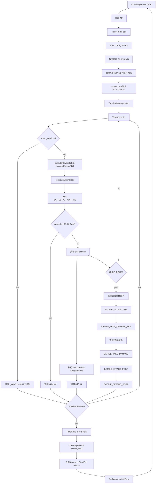
```mermaid
flowchart TB
  A["CoreEngine.startTurn"] --> B["重置 AP"]
  B --> C["_resetTurnFlags"]
  C --> D["emit TURN_START"]
  D --> E["规划阶段 PLANNING"]
  E --> F["commitPlanning 构建时间线"]
  F --> G["commitTurn 进入 EXECUTION"]
  G --> H["TimelineManager.start"]
  H --> I["Timeline entry"]
  I --> J{"actor._skipTurn?"}
  J -- yes --> K["清除 _skipTurn 并跳过行动"]
  J -- no --> L["executePlayerSkill 或 executeEnemySkill"]
  L --> M["_executeSkillActions"]
  M --> N["emit BATTLE_ACTION_PRE"]
  N --> O{"cancelled 或 skipTurn?"}
  O -- yes --> P["返回 skipped"]
  O -- no --> Q["执行 skill.actions"]
  Q --> R["执行 skill.buffRefs apply/remove"]
  R --> S["调用方扣 AP"]
  Q --> T{"动作产生伤害?"}
  T -- yes --> U["伤害管线事件序列"]
  U --> V["BATTLE_ATTACK_PRE"]
  V --> W["BATTLE_TAKE_DAMAGE_PRE"]
  W --> X["护甲/生命结算"]
  X --> Y["BATTLE_TAKE_DAMAGE"]
  Y --> Z["BATTLE_ATTACK_POST"]
  Z --> AA["BATTLE_DEFEND_POST"]
  T -- no --> I
  K --> AB{"Timeline finished?"}
  P --> AB
  S --> AB
  AA --> AB
  AB -- no --> I
  AB -- yes --> AC["TIMELINE_FINISHED"]
  AC --> AD["CoreEngine emit TURN_END"]
  AD --> AE["BuffSystem onTurnEnd effects"]
  AE --> AF["BuffManager.tickTurn"]
  AF --> A
```

当前已经存在的事件：

| 引擎事件 | 触发位置 | BuffSystem 入口 | Buff trigger | 当前分发范围 |
| --- | --- | --- | --- | --- |
| `TURN_START` | `CoreEngine.startTurn()` | `_onTurnStart` | `onTurnStart` | 所有已注册 manager |
| `BATTLE_ACTION_PRE` | `CoreEngine._executeSkillActions()` | `_onActionPre` | `onActionPre` | 当前行动者 manager |
| `BATTLE_ATTACK_PRE` | `_applyBattleDamage()` / `_applyArmorDamage()` | `_onAttackPre` | `onAttackPre` | attacker/source 与 target |
| `BATTLE_TAKE_DAMAGE_PRE` | `_applyBattleDamage()` / `_applyArmorDamage()` | `_onTakeDamagePre` | `onTakeDamagePre` | attacker/source 与 target；先汇入 statModifiers |
| `BATTLE_TAKE_DAMAGE` | `_applyBattleDamage()` / `_applyArmorDamage()` | `_onTakeDamage` | `onTakeDamage` | attacker/source 与 target |
| `BATTLE_ATTACK_POST` | `_applyBattleDamage()` / `_applyArmorDamage()` | `_onAttackPost` | `onAttackPost` | attacker/source 与 target |
| `BATTLE_DEFEND_POST` | `_applyBattleDamage()` / `_applyArmorDamage()` | `_onDefendPost` | `onDefendPost` | attacker/source 与 target |
| `TURN_END` | `CoreEngine._bindTimelineEvents()` 的 `TIMELINE_FINISHED` 回调 | `_onTurnEnd` | `onTurnEnd` | 所有已注册 manager；effects 后执行 `tickTurn()` |

当前没有独立的“技能扣费前事件”。`AP_COST_ADD / AP_COST_REDUCE` 只能作为普通 Buff action 在某个已订阅 trigger 中执行，当前数据里实际用法是 `onTurnStart` 写入 actor 的 `_planningApCostFlatDelta`，随后 `CoreEngine._getSkillApCostStrict()` 读取这个字段。

### 6.3 BuffSystem 监听与分发

`BuffSystem.start()` 订阅核心引擎事件，并把引擎事件转换为 Buff trigger。转换关系如下：

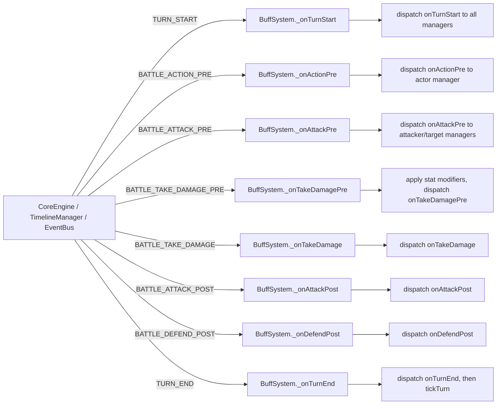
```mermaid
flowchart LR
  CE["CoreEngine / TimelineManager / EventBus"] -->|TURN_START| BS1["BuffSystem._onTurnStart"]
  CE -->|BATTLE_ACTION_PRE| BS2["BuffSystem._onActionPre"]
  CE -->|BATTLE_ATTACK_PRE| BS3["BuffSystem._onAttackPre"]
  CE -->|BATTLE_TAKE_DAMAGE_PRE| BS4["BuffSystem._onTakeDamagePre"]
  CE -->|BATTLE_TAKE_DAMAGE| BS5["BuffSystem._onTakeDamage"]
  CE -->|BATTLE_ATTACK_POST| BS6["BuffSystem._onAttackPost"]
  CE -->|BATTLE_DEFEND_POST| BS7["BuffSystem._onDefendPost"]
  CE -->|TURN_END| BS8["BuffSystem._onTurnEnd"]

  BS1 --> D1["dispatch onTurnStart to all managers"]
  BS2 --> D2["dispatch onActionPre to actor manager"]
  BS3 --> D3["dispatch onAttackPre to attacker/target managers"]
  BS4 --> D4["apply stat modifiers, dispatch onTakeDamagePre"]
  BS5 --> D5["dispatch onTakeDamage"]
  BS6 --> D6["dispatch onAttackPost"]
  BS7 --> D7["dispatch onDefendPost"]
  BS8 --> D8["dispatch onTurnEnd, then tickTurn"]
```

分发规则：

- 回合事件 `TURN_START / TURN_END` 分发给所有已注册的 `BuffManager`。
- 行动尝试事件 `BATTLE_ACTION_PRE` 只分发给当前行动者的 `BuffManager`。
- 攻击、受击、防御事件分发给本次上下文中的 attacker/source 和 target。
- `BATTLE_TAKE_DAMAGE_PRE` 在 trigger 分发前会先把 `damageDealtMult / damageTakenMult` 等 `statModifiers` 汇入上下文。
- `TURN_END` 的顺序是先执行 `onTurnEnd` effects，再由所有 manager 执行 `tickTurn()`。
- `EventBus.emit()` 是同步调用，所以同一事件内的 context 修改会被后续代码直接读取。
- `BuffSystem._processManager()` 只匹配 `effect.trigger === triggerName` 的 effect。
- 不存在 action key 会发出 `BUFF:WARN`；action 执行抛异常会发出 `BUFF:ERROR`。
- `BuffSystem` 当前没有订阅 `onTakeDamagePost`、`onDefendPre`、`onDeath` 对应事件。

### 6.4 Buff 实例生命周期

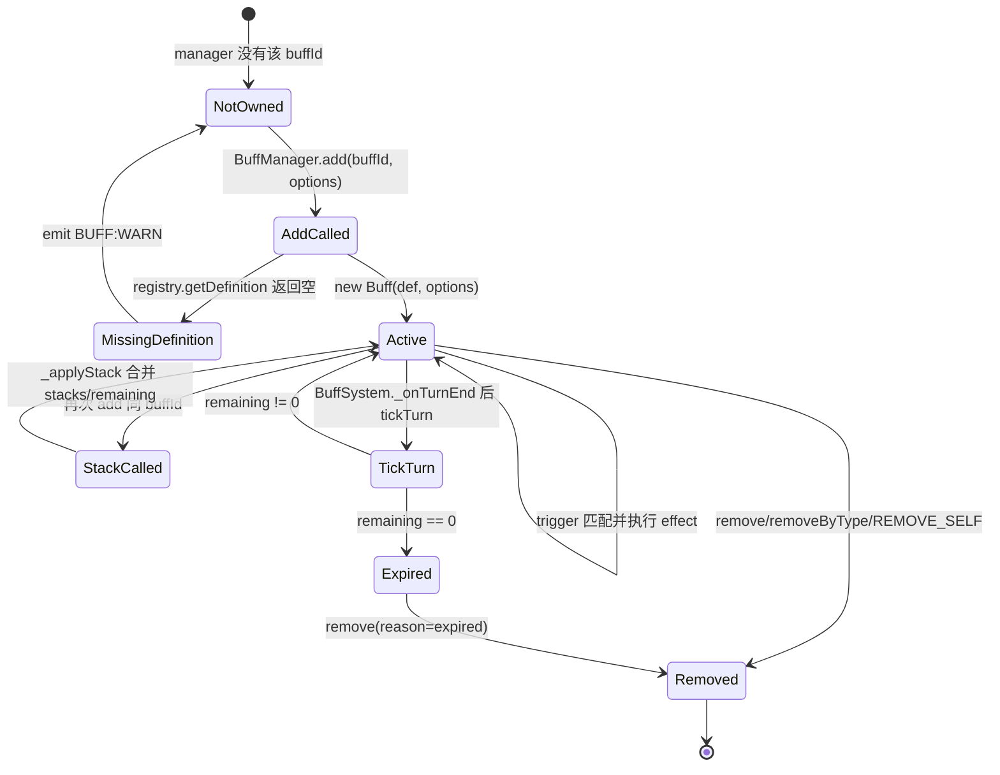
```mermaid
stateDiagram-v2
  [*] --> NotOwned: manager 没有该 buffId
  NotOwned --> AddCalled: BuffManager.add(buffId, options)
  AddCalled --> MissingDefinition: registry.getDefinition 返回空
  MissingDefinition --> NotOwned: emit BUFF:WARN
  AddCalled --> Active: new Buff(def, options)
  Active --> Active: trigger 匹配并执行 effect
  Active --> StackCalled: 再次 add 同 buffId
  StackCalled --> Active: _applyStack 合并 stacks/remaining
  Active --> TickTurn: BuffSystem._onTurnEnd 后 tickTurn
  TickTurn --> Active: remaining != 0
  TickTurn --> Expired: remaining == 0
  Active --> Removed: remove/removeByType/REMOVE_SELF
  Expired --> Removed: remove(reason=expired)
  Removed --> [*]
```

Buff 获得来源：

| 来源 | 入口 | 说明 |
| --- | --- | --- |
| 技能施加 | `CoreEngine._applySkillBuffRefs()` -> `target.buffs.add()` | 读取 `skillConfig.buffRefs.apply` |
| Buff 连锁施加 | `BuffSystem._act_applyBuff()` -> `target.buffs.add()` | 读取 effect 的 `payload.value` 和 `payload` 剩余参数 |
| 存档恢复 | `CoreEngine._ensureBuffManager()` -> `BuffManager.fromJSON()` | 当 entity 原有 `buffs` 是数组时恢复 |
| 测试/工具直接调用 | `BuffManager.add()` | 运行时允许，但不属于主战斗流程入口 |

Buff 移除来源：

| 来源 | 入口 | 说明 |
| --- | --- | --- |
| 持续时间耗尽 | `TURN_END` -> `BuffSystem._onTurnEnd()` -> `BuffManager.tickTurn()` | `Buff.isExpired()` 为 `remaining === 0` 时移除 |
| 技能引用移除 | `CoreEngine._applySkillBuffRefs()` -> `target.buffs.remove()` | 读取 `skillConfig.buffRefs.remove` |
| 技能动作移除 | `CoreEngine._removeBuffsBySkillEffect()` | 当前仅 `BUFF_REMOVE` 且 `amount >= 100` 时 `removeByType('debuff')` |
| Buff 自我消耗 | effect `REMOVE_SELF` | 一次性反应、一次性破甲、触发后消耗 |
| API 直接调用 | `remove()` / `removeByTag()` / `removeByType()` | `BuffManager` 公开能力 |

当前实现没有扫描 `removeOnBattleEnd` 的战斗结束清理路径；`removeOnBattleEnd` 是数据字段，不是当前生命周期状态机的一条边。

### 6.5 持续时间型状态与层数型状态

当前 `Buff` 实例同时持有 `remaining` 和 `stacks`，代码不会强制区分“持续时间型”和“层数型”。这两个概念由数据和技能设计约束来区分。

| 读数 | 代码来源 | 当前语义 |
| --- | --- | --- |
| `remaining` | `Buff.remaining` / `BuffManager.getRemaining()` | 非永久 Buff 的剩余回合数；`tickTurn()` 在回合末递减 |
| `stacks` | `Buff.stacks` / `BuffManager.getStacks()` | 层数；`stackStrategy='add'` 会增加；默认新实例为 1 |
| `statModifiers` 强度 | `BuffManager._getModifierTotals()` | `flat` 和 `percent/percent_base` 都会乘以 `b.stacks` |
| Buff effect 数值 | `BuffSystem._resolveValue()` | 不自动乘以 `stacks` 或 `remaining` |
| Skill action 数值 | `CoreEngine._computeEffectAmount()` | 支持 `BUFF_STACKS` 和 `BUFF_REMAINING` 读取指定 Buff |

因此，持续时间型 Buff 若不希望属性强度叠加，当前数据必须保持 `stacks=1`。流血类技能读取持续时间时应使用 `BUFF_REMAINING`；未来若设计中毒这类层数型状态，再使用 `BUFF_STACKS`。

### 6.6 Buff 逐项状态机

本节按 `assets/data/buffs_v2_7.json` 当前 19 个 Buff 逐项列出状态机。标题使用业务名称；当前 JSON key 只作为追溯字段出现，因为 `new_buff_...` 这类 key 具有历史随机性，不能作为设计概念名。

统一阅读口径：

- **进入**：所有 Buff 都通过 `BuffManager.add(buffId, options)` 进入；如果同 id 已存在，按 6.7 的 `stackStrategy` 合并。
- **触发**：有 `effects` 的 Buff 只在 `BuffSystem` 收到对应 trigger 时响应；无 `effects` 的 Buff 不监听事件，只在 `getEffectiveStat()` 或专门桥接逻辑读取时生效。
- **响应**：响应结果必须落到 actor、BuffManager 或当前事件 context 上。
- **退出**：除 `REMOVE_SELF` 或显式 `remove()` 外，当前统一在 `TURN_END -> BuffSystem._onTurnEnd() -> BuffManager.tickTurn()` 后按 `remaining === 0` 移除。
- **图示规则**：每个状态机图中的事件名、函数名、字段名都对应当前代码路径；没有代码实现的效果不会画成已实现状态。

#### 6.6.1 当前 Buff 类型总表

按数据 `type` 统计：

| 数据类型 | 数量 | Buff |
| --- | ---: | --- |
| `buff` | 11 | 减伤、反伤、反击、吸血、护甲回复、护甲免伤、HP 免伤、攻击获甲、受击获甲、开销降低、加速 |
| `debuff` | 8 | 中毒、晕眩、流血、减速、虚弱、增伤、开销增多、撕裂伤口 |
| `hidden` | 0 | 无 |

按当前运行状态机类型统计：

| 状态机类型 | Buff | 实际触发/读取点 |
| --- | --- | --- |
| 回合末直接 HP 伤害 | 中毒、流血 | `TURN_END -> onTurnEnd -> DAMAGE_HP` |
| 回合开始跳过行动 | 晕眩 | `TURN_START -> onTurnStart -> SKIP_TURN`，随后 `_executeTimelineEntry()` 读取 `_skipTurn` |
| 被动速度修正 | 减速、加速 | `CoreEngine._getEffectiveActorSpeed()` 读取 `speed` |
| 被动攻击/闪避修正 | 虚弱、反击的闪避修正 | `BuffManager.getEffectiveStat()` 可计算；当前主战斗伤害/闪避流程未消费 |
| 受击伤害倍率修正 | 增伤、减伤 | `BATTLE_TAKE_DAMAGE_PRE -> _applyStatModifiersToContext()` |
| 防御后伤害/反击 | 反伤、反击 | `BATTLE_DEFEND_POST -> onDefendPost` |
| 攻击后吸血 | 吸血 | `BATTLE_ATTACK_POST -> onAttackPost -> HEAL_HP` |
| 护甲回复 | 护甲回复、攻击获甲、受击获甲 | `onTurnStart` / `onAttackPre` / `onTakeDamagePre` -> `HEAL_ARMOR` |
| 受击前免伤标记 | 护甲免伤、HP 免伤 | `BATTLE_TAKE_DAMAGE_PRE -> PREVENT_DAMAGE_ARMOR/HP` |
| AP 成本修正 | 开销降低、开销增多 | `TURN_START -> AP_COST_REDUCE/ADD`，规划成本读取 `_planningApCostFlatDelta` |
| 行动前施加另一个 Buff | 撕裂伤口 | `BATTLE_ACTION_PRE -> onActionPre -> APPLY_BUFF` |

#### 6.6.2 中毒

当前 JSON key：`buff_poison`。基础信息：`debuff`，`duration=3`，`maxStacks=5`，`stackStrategy=refresh`，参数 `damageVal` 默认 5。

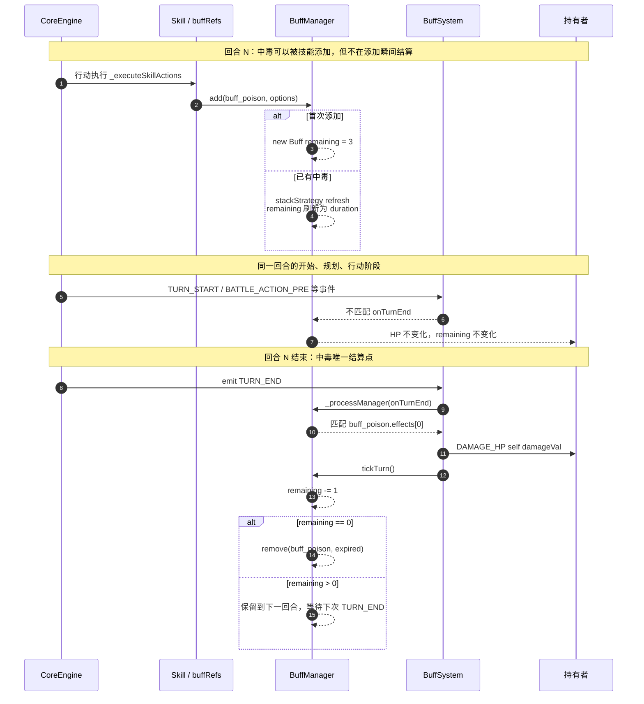
```mermaid
sequenceDiagram
  autonumber
  participant CE as CoreEngine
  participant Skill as Skill / buffRefs
  participant BM as BuffManager
  participant BS as BuffSystem
  participant Holder as 持有者

  Note over CE,Holder: 回合 N：中毒可以被技能添加，但不在添加瞬间结算
  CE->>Skill: 行动执行 _executeSkillActions
  Skill->>BM: add(buff_poison, options)
  alt 首次添加
    BM-->>BM: new Buff remaining = 3
  else 已有中毒
    BM-->>BM: stackStrategy refresh<br/>remaining 刷新为 duration
  end

  Note over CE,Holder: 同一回合的开始、规划、行动阶段
  CE->>BS: TURN_START / BATTLE_ACTION_PRE 等事件
  BS-->>BM: 不匹配 onTurnEnd
  BM-->>Holder: HP 不变化，remaining 不变化

  Note over CE,Holder: 回合 N 结束：中毒唯一结算点
  CE->>BS: emit TURN_END
  BS->>BM: _processManager(onTurnEnd)
  BM-->>BS: 匹配 buff_poison.effects[0]
  BS->>Holder: DAMAGE_HP self damageVal
  BS->>BM: tickTurn()
  BM-->>BM: remaining -= 1
  alt remaining == 0
    BM-->>BM: remove(buff_poison, expired)
  else remaining > 0
    BM-->>BM: 保留到下一回合，等待下次 TURN_END
  end
```

状态机：

1. 进入：`BuffManager.add('buff_poison', options)` 创建实例；`BuffRegistry` 用 `params.damageVal` 或默认值替换 `${damageVal}`。
2. 合并：再次添加时走 `refresh`，当前实现刷新 `remaining`，不增加 `stacks`。
3. 触发：`TURN_END` 进入 `BuffSystem._onTurnEnd()`，匹配 `onTurnEnd`。
4. 响应：执行 `DAMAGE_HP`，`target=self`，`_act_damage()` 直接扣持有者 HP `damageVal`，不进入护甲/部位伤害管线。
5. 退出：同一个 `TURN_END` 事件的 effects 完成后执行 `tickTurn()`；`remaining -= 1`，归 0 后 `remove(reason='expired')`。

当前代码事实：虽然描述写“可叠加”，但 `refresh` 不会增加层数；除非首次添加时显式传入 `stacks`，否则当前伤害不会随 `maxStacks=5` 增长。

#### 6.6.3 晕眩

当前 JSON key：`buff_stun`。基础信息：`debuff`，`duration=1`，`maxStacks=1`，`stackStrategy=replace`。

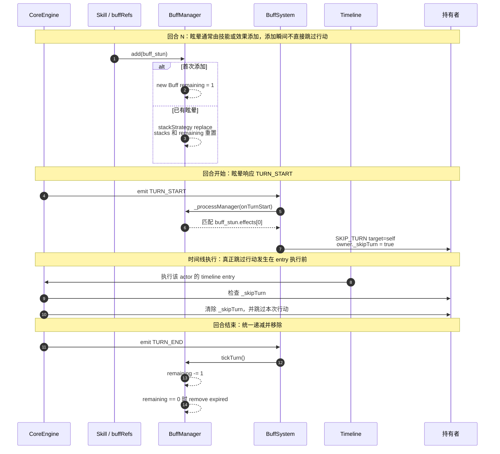
```mermaid
sequenceDiagram
  autonumber
  participant CE as CoreEngine
  participant Skill as Skill / buffRefs
  participant BM as BuffManager
  participant BS as BuffSystem
  participant TL as Timeline
  participant Holder as 持有者

  Note over CE,Holder: 回合 N：眩晕通常由技能或效果添加，添加瞬间不直接跳过行动
  Skill->>BM: add(buff_stun)
  alt 首次添加
    BM-->>BM: new Buff remaining = 1
  else 已有眩晕
    BM-->>BM: stackStrategy replace<br/>stacks 和 remaining 重置
  end

  Note over CE,Holder: 回合开始：眩晕响应 TURN_START
  CE->>BS: emit TURN_START
  BS->>BM: _processManager(onTurnStart)
  BM-->>BS: 匹配 buff_stun.effects[0]
  BS->>Holder: SKIP_TURN target=self<br/>owner._skipTurn = true

  Note over CE,Holder: 时间线执行：真正跳过行动发生在 entry 执行前
  TL->>CE: 执行该 actor 的 timeline entry
  CE->>Holder: 检查 _skipTurn
  CE->>Holder: 清除 _skipTurn，并跳过本次行动

  Note over CE,Holder: 回合结束：统一递减并移除
  CE->>BS: emit TURN_END
  BS->>BM: tickTurn()
  BM-->>BM: remaining -= 1
  BM-->>BM: remaining == 0 时 remove expired
```

状态机：

1. 进入：`BuffManager.add('buff_stun')` 创建实例。
2. 合并：再次添加时走 `replace`，重置 `stacks` 和 `remaining`。
3. 触发：`CoreEngine.startTurn()` 在 `_resetTurnFlags()` 之后 emit `TURN_START`，`BuffSystem._onTurnStart()` 匹配 `onTurnStart`。
4. 响应：执行 `SKIP_TURN`，`_act_skipTurn()` 写入当前 context 的 `skipTurn=true`，并写入持有者 `owner._skipTurn=true`。
5. 行动跳过：时间线执行到该 actor 时，`CoreEngine._executeTimelineEntry()` 在发出 `BATTLE_ACTION_PRE` 之前检查 `_skipTurn`；若为 true，则清除 `_skipTurn` 并跳过该行动。
6. 退出：回合结束时 `tickTurn()` 递减并移除。

当前代码事实：`TURN_START` context 上的 `skipTurn` 字段不会被规划阶段直接消费；真正让行动跳过的是 actor 上的 `_skipTurn`。

#### 6.6.4 流血

当前 JSON key：`buff_bleed`。基础信息：`debuff`，`duration=${buff_duration}`，`maxStacks=1`，`stackStrategy=extend`，参数 `buff_duration` 默认 2。

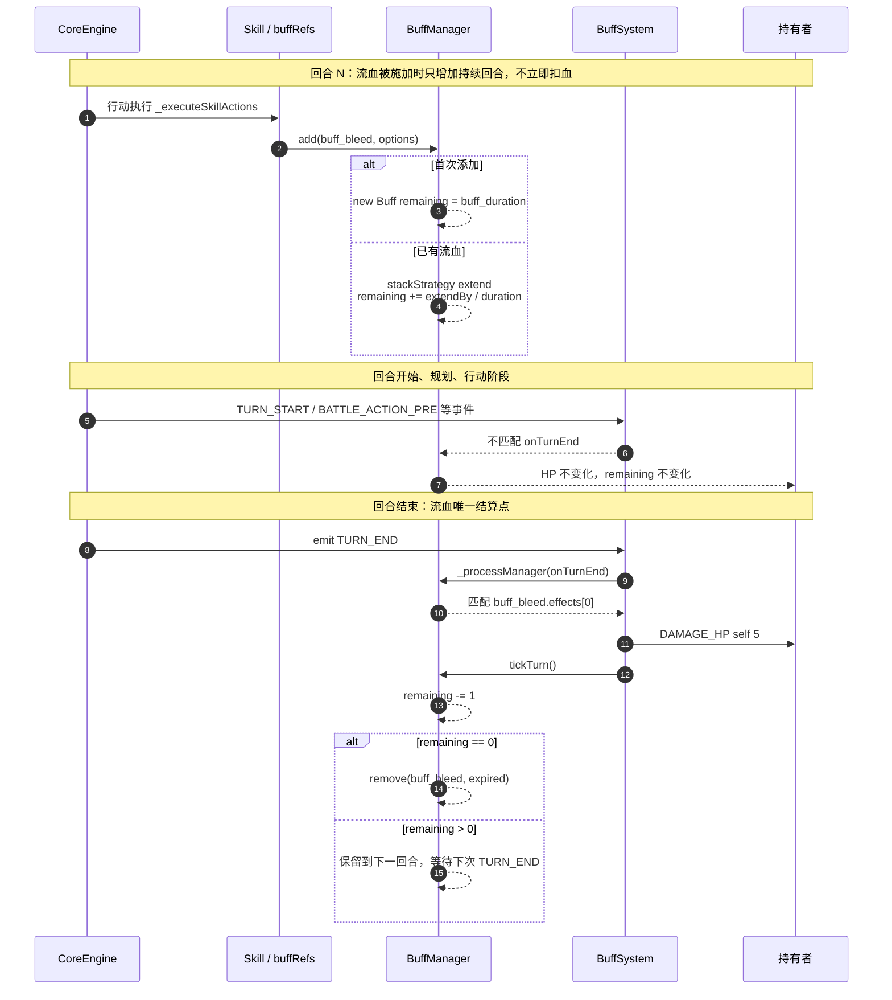
```mermaid
sequenceDiagram
  autonumber
  participant CE as CoreEngine
  participant Skill as Skill / buffRefs
  participant BM as BuffManager
  participant BS as BuffSystem
  participant Holder as 持有者

  Note over CE,Holder: 回合 N：流血被施加时只增加持续回合，不立即扣血
  CE->>Skill: 行动执行 _executeSkillActions
  Skill->>BM: add(buff_bleed, options)
  alt 首次添加
    BM-->>BM: new Buff remaining = buff_duration
  else 已有流血
    BM-->>BM: stackStrategy extend<br/>remaining += extendBy / duration
  end

  Note over CE,Holder: 回合开始、规划、行动阶段
  CE->>BS: TURN_START / BATTLE_ACTION_PRE 等事件
  BS-->>BM: 不匹配 onTurnEnd
  BM-->>Holder: HP 不变化，remaining 不变化

  Note over CE,Holder: 回合结束：流血唯一结算点
  CE->>BS: emit TURN_END
  BS->>BM: _processManager(onTurnEnd)
  BM-->>BS: 匹配 buff_bleed.effects[0]
  BS->>Holder: DAMAGE_HP self 5
  BS->>BM: tickTurn()
  BM-->>BM: remaining -= 1
  alt remaining == 0
    BM-->>BM: remove(buff_bleed, expired)
  else remaining > 0
    BM-->>BM: 保留到下一回合，等待下次 TURN_END
  end
```

状态机：

1. 进入：`BuffManager.add('buff_bleed', options)` 创建实例；首次 `remaining = options.duration ?? lifecycle.duration`。
2. 合并：再次添加时走 `extend`，`remaining += options.extendBy ?? options.duration ?? lifecycle.duration ?? existing.duration`。
3. 触发：`TURN_END -> BuffSystem._onTurnEnd()` 匹配 `onTurnEnd`。
4. 响应：执行 `DAMAGE_HP`，固定直接扣持有者 HP 5 点。
5. 退出：effect 后 `tickTurn()` 递减，`remaining === 0` 时移除。

状态规则：流血是持续时间型状态，重复施加增加的是 `remaining`，不是刷新时间，也不是增加伤害层数。`stacks` 正常保持 1。

#### 6.6.5 减速

当前 JSON key：`buff_slow`。基础信息：`debuff`，`duration=2`，`maxStacks=3`，`stackStrategy=refresh`，`statModifiers.speed flat ${buff_speedVal}`，默认 -5。

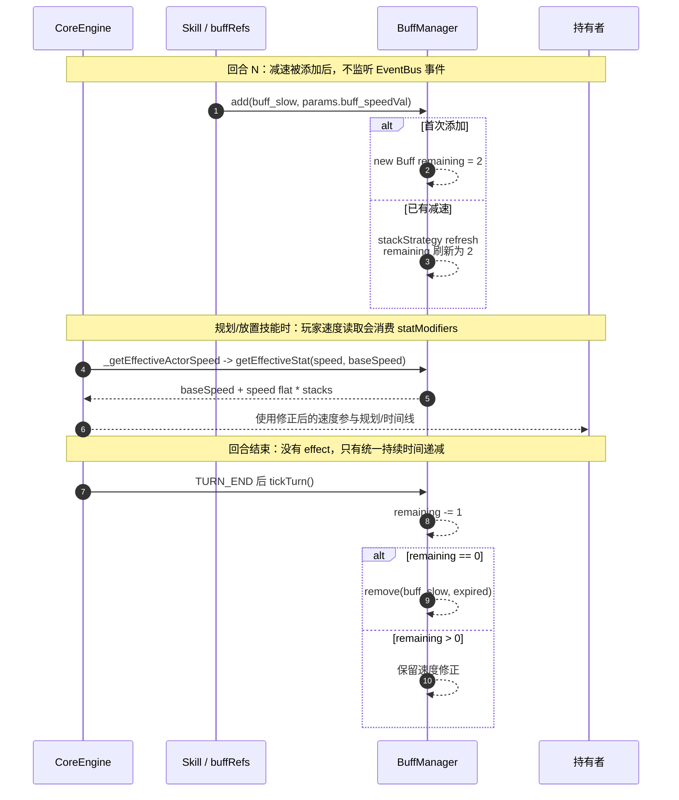
```mermaid
sequenceDiagram
  autonumber
  participant CE as CoreEngine
  participant Skill as Skill / buffRefs
  participant BM as BuffManager
  participant Holder as 持有者

  Note over CE,Holder: 回合 N：减速被添加后，不监听 EventBus 事件
  Skill->>BM: add(buff_slow, params.buff_speedVal)
  alt 首次添加
    BM-->>BM: new Buff remaining = 2
  else 已有减速
    BM-->>BM: stackStrategy refresh<br/>remaining 刷新为 2
  end

  Note over CE,Holder: 规划/放置技能时：玩家速度读取会消费 statModifiers
  CE->>BM: _getEffectiveActorSpeed -> getEffectiveStat(speed, baseSpeed)
  BM-->>CE: baseSpeed + speed flat * stacks
  CE-->>Holder: 使用修正后的速度参与规划/时间线

  Note over CE,Holder: 回合结束：没有 effect，只有统一持续时间递减
  CE->>BM: TURN_END 后 tickTurn()
  BM-->>BM: remaining -= 1
  alt remaining == 0
    BM-->>BM: remove(buff_slow, expired)
  else remaining > 0
    BM-->>BM: 保留速度修正
  end
```

状态机：

1. 进入：`BuffManager.add('buff_slow', options)` 创建实例。
2. 合并：再次添加时走 `refresh`，刷新 `remaining`，不增加 `stacks`。
3. 触发：无 `effects`，不响应 EventBus trigger。
4. 响应：当代码调用 `holder.buffs.getEffectiveStat('speed', baseSpeed)` 时，`BuffManager._getModifierTotals()` 汇总 `speed` 修正，当前公式为 `base + value * stacks`。
5. 当前消费点：玩家规划/放置技能时 `CoreEngine._getEffectiveActorSpeed()` 会读取玩家 `speed`；敌人规划器当前直接使用 `enemy.speed ?? enemy.stats.speed`，不读取敌人 Buff 速度修正。
6. 退出：`TURN_END -> tickTurn()` 递减并移除。

#### 6.6.6 虚弱

当前 JSON key：`debuff_weak`。基础信息：`debuff`，`duration=2`，`maxStacks=1`，`stackStrategy=refresh`，`statModifiers.atk percent_base -0.2`。

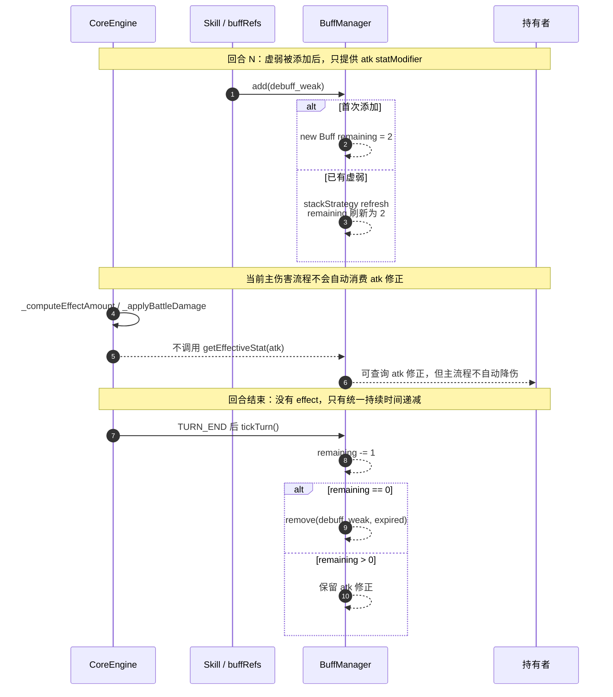
```mermaid
sequenceDiagram
  autonumber
  participant CE as CoreEngine
  participant Skill as Skill / buffRefs
  participant BM as BuffManager
  participant Holder as 持有者

  Note over CE,Holder: 回合 N：虚弱被添加后，只提供 atk statModifier
  Skill->>BM: add(debuff_weak)
  alt 首次添加
    BM-->>BM: new Buff remaining = 2
  else 已有虚弱
    BM-->>BM: stackStrategy refresh<br/>remaining 刷新为 2
  end

  Note over CE,Holder: 当前主伤害流程不会自动消费 atk 修正
  CE->>CE: _computeEffectAmount / _applyBattleDamage
  CE-->>BM: 不调用 getEffectiveStat(atk)
  BM-->>Holder: 可查询 atk 修正，但主流程不自动降伤

  Note over CE,Holder: 回合结束：没有 effect，只有统一持续时间递减
  CE->>BM: TURN_END 后 tickTurn()
  BM-->>BM: remaining -= 1
  alt remaining == 0
    BM-->>BM: remove(debuff_weak, expired)
  else remaining > 0
    BM-->>BM: 保留 atk 修正
  end
```

状态机：

1. 进入：`BuffManager.add('debuff_weak')` 创建实例。
2. 合并：再次添加时走 `refresh`，刷新 `remaining`。
3. 触发：无 `effects`，不响应 EventBus trigger。
4. 响应：`BuffManager.getEffectiveStat('atk', baseAtk)` 可以计算攻击力修正。
5. 当前消费点：主伤害管线 `_computeEffectAmount()` / `_applyBattleDamage()` 当前不读取 `atk`，因此主流程里它只存在于 BuffManager 可查询结果中，不会自动降低伤害。
6. 退出：`TURN_END -> tickTurn()` 递减并移除。

#### 6.6.7 增伤

当前 JSON key：`buff_vulnerable`。基础信息：`debuff`，`duration=2`，`maxStacks=3`，`stackStrategy=refresh`，`statModifiers.damageTakenMult flat 0.2`。

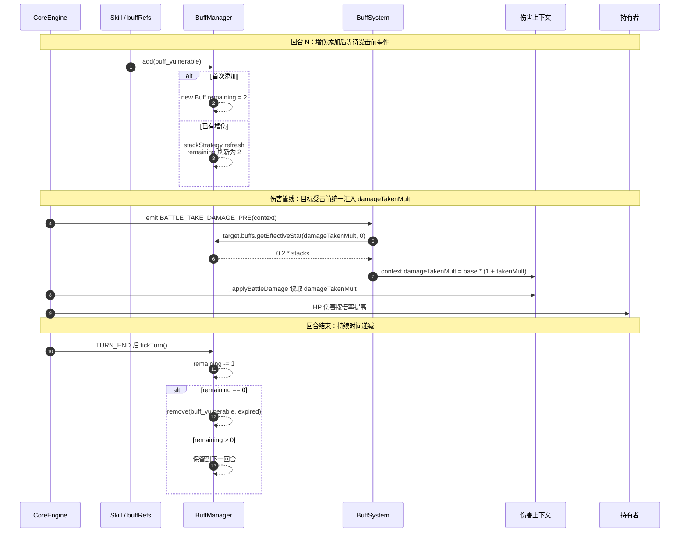
```mermaid
sequenceDiagram
  autonumber
  participant CE as CoreEngine
  participant Skill as Skill / buffRefs
  participant BM as BuffManager
  participant BS as BuffSystem
  participant Ctx as 伤害上下文
  participant Holder as 持有者

  Note over CE,Holder: 回合 N：增伤添加后等待受击前事件
  Skill->>BM: add(buff_vulnerable)
  alt 首次添加
    BM-->>BM: new Buff remaining = 2
  else 已有增伤
    BM-->>BM: stackStrategy refresh<br/>remaining 刷新为 2
  end

  Note over CE,Holder: 伤害管线：目标受击前统一汇入 damageTakenMult
  CE->>BS: emit BATTLE_TAKE_DAMAGE_PRE(context)
  BS->>BM: target.buffs.getEffectiveStat(damageTakenMult, 0)
  BM-->>BS: 0.2 * stacks
  BS->>Ctx: context.damageTakenMult = base * (1 + takenMult)
  CE->>Ctx: _applyBattleDamage 读取 damageTakenMult
  CE->>Holder: HP 伤害按倍率提高

  Note over CE,Holder: 回合结束：持续时间递减
  CE->>BM: TURN_END 后 tickTurn()
  BM-->>BM: remaining -= 1
  alt remaining == 0
    BM-->>BM: remove(buff_vulnerable, expired)
  else remaining > 0
    BM-->>BM: 保留到下一回合
  end
```

状态机：

1. 进入：`BuffManager.add('buff_vulnerable')` 创建实例。
2. 合并：再次添加时走 `refresh`，刷新 `remaining`；当前不因 `maxStacks=3` 自动加层。
3. 触发：伤害管线 emit `BATTLE_TAKE_DAMAGE_PRE`，`BuffSystem._onTakeDamagePre()` 先执行 `_applyStatModifiersToContext()`。
4. 响应：如果持有者是本次 `target`，读取 `target.buffs.getEffectiveStat('damageTakenMult', 0)`，写入 `context.damageTakenMult = base * (1 + takenMult)`。
5. 消费：`CoreEngine._applyBattleDamage()` / `_applyArmorDamage()` 在护甲处理之后、HP 扣减之前按 `context.damageTakenMult` 修正生命伤害。
6. 退出：`TURN_END -> tickTurn()` 递减并移除。

#### 6.6.8 减伤

当前 JSON key：`buff_pain_sup`。基础信息：`buff`，`duration=2`，`maxStacks=1`，`stackStrategy=refresh`，`statModifiers.damageTakenMult flat -0.3`。

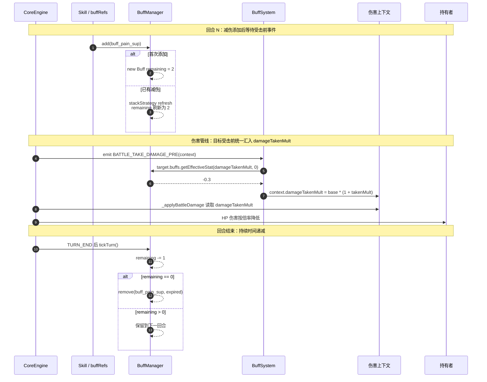
```mermaid
sequenceDiagram
  autonumber
  participant CE as CoreEngine
  participant Skill as Skill / buffRefs
  participant BM as BuffManager
  participant BS as BuffSystem
  participant Ctx as 伤害上下文
  participant Holder as 持有者

  Note over CE,Holder: 回合 N：减伤添加后等待受击前事件
  Skill->>BM: add(buff_pain_sup)
  alt 首次添加
    BM-->>BM: new Buff remaining = 2
  else 已有减伤
    BM-->>BM: stackStrategy refresh<br/>remaining 刷新为 2
  end

  Note over CE,Holder: 伤害管线：目标受击前统一汇入 damageTakenMult
  CE->>BS: emit BATTLE_TAKE_DAMAGE_PRE(context)
  BS->>BM: target.buffs.getEffectiveStat(damageTakenMult, 0)
  BM-->>BS: -0.3
  BS->>Ctx: context.damageTakenMult = base * (1 + takenMult)
  CE->>Ctx: _applyBattleDamage 读取 damageTakenMult
  CE->>Holder: HP 伤害按倍率降低

  Note over CE,Holder: 回合结束：持续时间递减
  CE->>BM: TURN_END 后 tickTurn()
  BM-->>BM: remaining -= 1
  alt remaining == 0
    BM-->>BM: remove(buff_pain_sup, expired)
  else remaining > 0
    BM-->>BM: 保留到下一回合
  end
```

状态机：

1. 进入：`BuffManager.add('buff_pain_sup')` 创建实例。
2. 合并：再次添加时走 `refresh`，刷新 `remaining`。
3. 触发：伤害管线 emit `BATTLE_TAKE_DAMAGE_PRE`，`BuffSystem._onTakeDamagePre()` 汇入 statModifiers。
4. 响应：如果持有者是本次 `target`，写入 `context.damageTakenMult = 0.7` 的等价倍率。
5. 消费：`CoreEngine._applyBattleDamage()` 在 HP 扣减前应用该倍率。
6. 退出：`TURN_END -> tickTurn()` 递减并移除。

#### 6.6.9 反伤

当前 JSON key：`buff_thorns`。基础信息：`buff`，`duration=3`，`maxStacks=1`，`stackStrategy=refresh`。

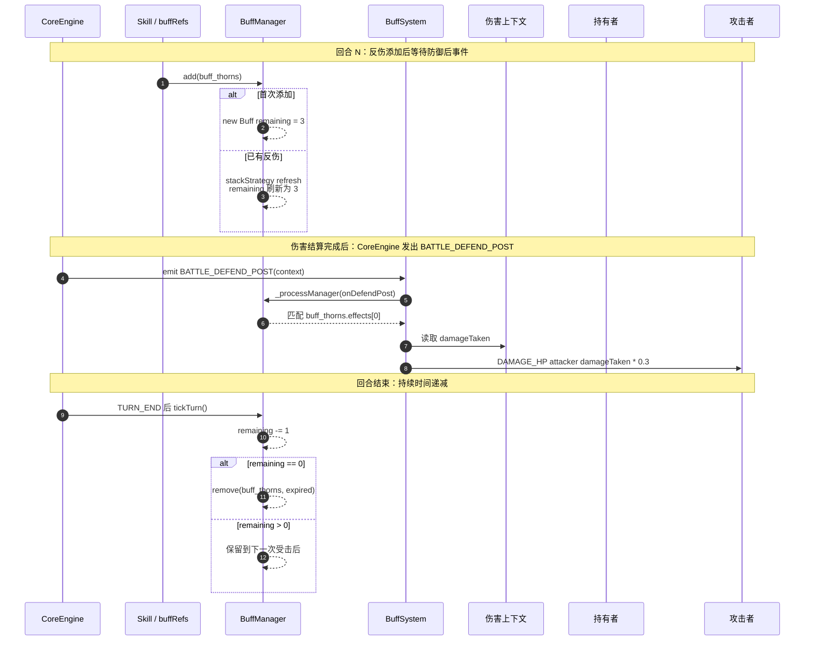
```mermaid
sequenceDiagram
  autonumber
  participant CE as CoreEngine
  participant Skill as Skill / buffRefs
  participant BM as BuffManager
  participant BS as BuffSystem
  participant Ctx as 伤害上下文
  participant Holder as 持有者
  participant Attacker as 攻击者

  Note over CE,Attacker: 回合 N：反伤添加后等待防御后事件
  Skill->>BM: add(buff_thorns)
  alt 首次添加
    BM-->>BM: new Buff remaining = 3
  else 已有反伤
    BM-->>BM: stackStrategy refresh<br/>remaining 刷新为 3
  end

  Note over CE,Attacker: 伤害结算完成后：CoreEngine 发出 BATTLE_DEFEND_POST
  CE->>BS: emit BATTLE_DEFEND_POST(context)
  BS->>BM: _processManager(onDefendPost)
  BM-->>BS: 匹配 buff_thorns.effects[0]
  BS->>Ctx: 读取 damageTaken
  BS->>Attacker: DAMAGE_HP attacker damageTaken * 0.3

  Note over CE,Attacker: 回合结束：持续时间递减
  CE->>BM: TURN_END 后 tickTurn()
  BM-->>BM: remaining -= 1
  alt remaining == 0
    BM-->>BM: remove(buff_thorns, expired)
  else remaining > 0
    BM-->>BM: 保留到下一次受击后
  end
```

状态机：

1. 进入：`BuffManager.add('buff_thorns')` 创建实例。
2. 合并：再次添加时走 `refresh`，刷新 `remaining`。
3. 触发：`CoreEngine._applyBattleDamage()` 或 `_applyArmorDamage()` 末尾 emit `BATTLE_DEFEND_POST`，`BuffSystem._onDefendPost()` 分发到 attacker/source 与 target。
4. 响应：持有者匹配 `onDefendPost` 后执行 `DAMAGE_HP`，`target=attacker`，公式 `damageTaken * 0.3`。
5. 写入：`_act_damage()` 直接扣攻击者 HP，不进入护甲/部位伤害管线。
6. 退出：`TURN_END -> tickTurn()` 递减并移除。

当前代码事实：公式里的 `damageTaken` 是 context 中最终生命伤害；如果本次只造成护甲伤害或 HP 伤害为 0，反伤值会是 0 并被 `_act_damage()` 忽略。

#### 6.6.10 反击

当前 JSON key：`buff_counter`。基础信息：`buff`，`duration=1`，`maxStacks=1`，`stackStrategy=refresh`，`statModifiers.dodgeRate flat 1`。

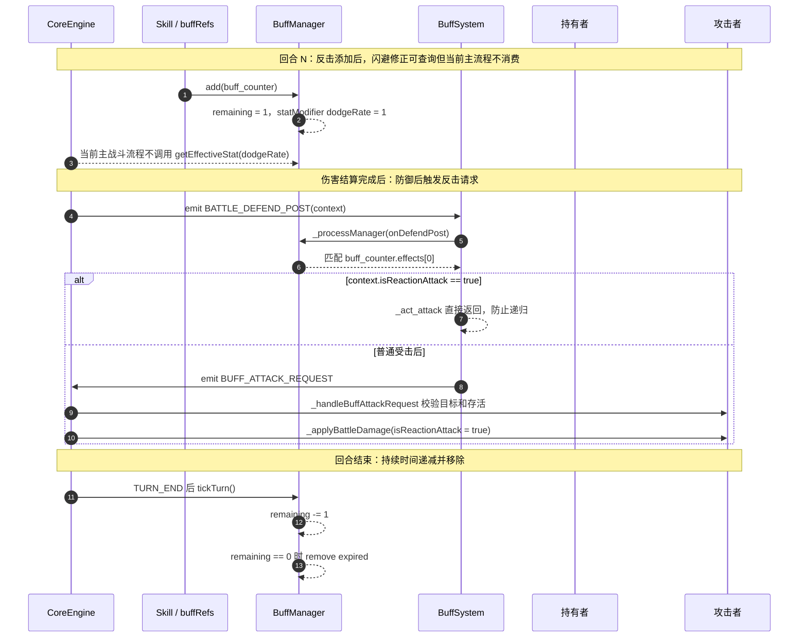
```mermaid
sequenceDiagram
  autonumber
  participant CE as CoreEngine
  participant Skill as Skill / buffRefs
  participant BM as BuffManager
  participant BS as BuffSystem
  participant Holder as 持有者
  participant Attacker as 攻击者

  Note over CE,Attacker: 回合 N：反击添加后，闪避修正可查询但当前主流程不消费
  Skill->>BM: add(buff_counter)
  BM-->>BM: remaining = 1，statModifier dodgeRate = 1
  CE-->>BM: 当前主战斗流程不调用 getEffectiveStat(dodgeRate)

  Note over CE,Attacker: 伤害结算完成后：防御后触发反击请求
  CE->>BS: emit BATTLE_DEFEND_POST(context)
  BS->>BM: _processManager(onDefendPost)
  BM-->>BS: 匹配 buff_counter.effects[0]
  alt context.isReactionAttack == true
    BS-->>BS: _act_attack 直接返回，防止递归
  else 普通受击后
    BS->>CE: emit BUFF_ATTACK_REQUEST
    CE->>Attacker: _handleBuffAttackRequest 校验目标和存活
    CE->>Attacker: _applyBattleDamage(isReactionAttack = true)
  end

  Note over CE,Attacker: 回合结束：持续时间递减并移除
  CE->>BM: TURN_END 后 tickTurn()
  BM-->>BM: remaining -= 1
  BM-->>BM: remaining == 0 时 remove expired
```

状态机：

1. 进入：`BuffManager.add('buff_counter')` 创建实例。
2. 合并：再次添加时走 `refresh`，刷新 `remaining`。
3. 被动修正：`BuffManager.getEffectiveStat('dodgeRate', base)` 可以计算闪避修正；当前主战斗流程没有消费 `dodgeRate`。
4. 触发：伤害管线末尾 emit `BATTLE_DEFEND_POST`，BuffSystem 分发到参与者。
5. 响应：执行 `ATTACK`，`_act_attack()` 以持有者为 `source`、`attacker` 为目标，emit `BUFF_ATTACK_REQUEST`。
6. 桥接：`CoreEngine._handleBuffAttackRequest()` 检查战斗状态、双方存活、目标合法后调用 `_applyBattleDamage({ isReactionAttack: true })`。
7. 防递归：若当前 context 已是 `isReactionAttack=true`，`_act_attack()` 直接返回。
8. 退出：`TURN_END -> tickTurn()` 递减并移除。

当前代码事实：反击请求没有显式伤害时，CoreEngine 会从原始 context 中优先取 `rawDamage`，再取 `damageTaken` / `damageDealt`，最后至少造成 1 点反应攻击伤害。

#### 6.6.11 吸血

当前 JSON key：`buff_lifesteal`。基础信息：`buff`，`duration=3`，`maxStacks=1`，`stackStrategy=refresh`。

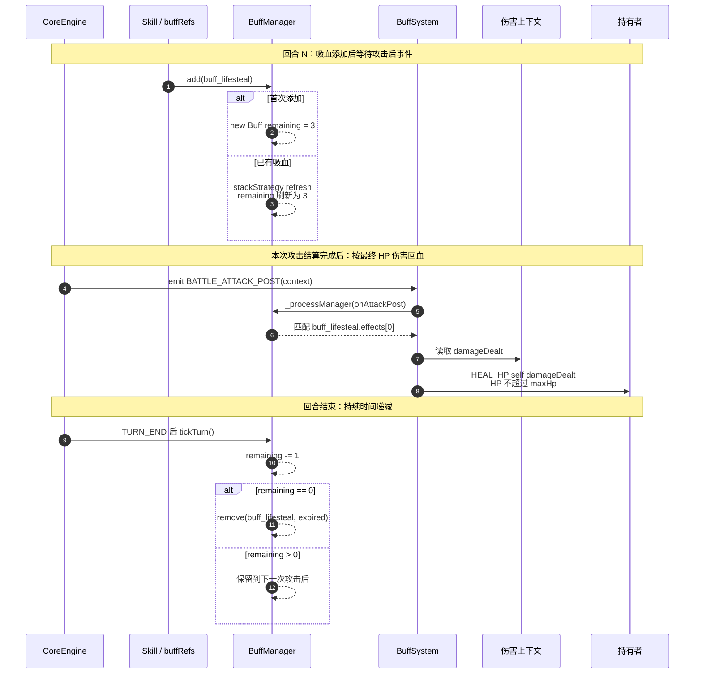
```mermaid
sequenceDiagram
  autonumber
  participant CE as CoreEngine
  participant Skill as Skill / buffRefs
  participant BM as BuffManager
  participant BS as BuffSystem
  participant Ctx as 伤害上下文
  participant Holder as 持有者

  Note over CE,Holder: 回合 N：吸血添加后等待攻击后事件
  Skill->>BM: add(buff_lifesteal)
  alt 首次添加
    BM-->>BM: new Buff remaining = 3
  else 已有吸血
    BM-->>BM: stackStrategy refresh<br/>remaining 刷新为 3
  end

  Note over CE,Holder: 本次攻击结算完成后：按最终 HP 伤害回血
  CE->>BS: emit BATTLE_ATTACK_POST(context)
  BS->>BM: _processManager(onAttackPost)
  BM-->>BS: 匹配 buff_lifesteal.effects[0]
  BS->>Ctx: 读取 damageDealt
  BS->>Holder: HEAL_HP self damageDealt<br/>HP 不超过 maxHp

  Note over CE,Holder: 回合结束：持续时间递减
  CE->>BM: TURN_END 后 tickTurn()
  BM-->>BM: remaining -= 1
  alt remaining == 0
    BM-->>BM: remove(buff_lifesteal, expired)
  else remaining > 0
    BM-->>BM: 保留到下一次攻击后
  end
```

状态机：

1. 进入：`BuffManager.add('buff_lifesteal')` 创建实例。
2. 合并：再次添加时走 `refresh`，刷新 `remaining`。
3. 触发：伤害管线完成 HP/护甲结算后 emit `BATTLE_ATTACK_POST`。
4. 响应：执行 `HEAL_HP`，`target=self`，公式 `damageDealt`。
5. 写入：`_act_heal()` 直接回复持有者 HP，受最大 HP 限制。
6. 退出：`TURN_END -> tickTurn()` 递减并移除。

当前代码事实：`damageDealt` 是本次最终 HP 伤害，不包含护甲伤害。

#### 6.6.12 护甲回复

当前 JSON key：`buff_ap_regen`。基础信息：`buff`，`duration=${buffDuration}`，`maxStacks=1`，`stackStrategy=refresh`，参数 `ArmorGetVal` 默认 20，`buffDuration` 默认 2。

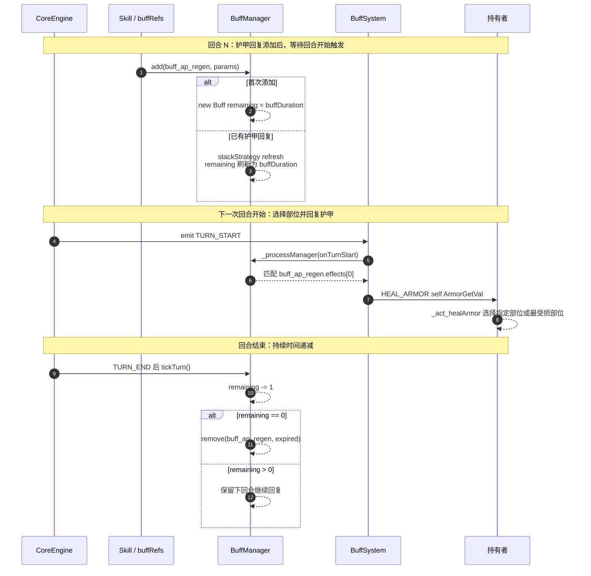
```mermaid
sequenceDiagram
  autonumber
  participant CE as CoreEngine
  participant Skill as Skill / buffRefs
  participant BM as BuffManager
  participant BS as BuffSystem
  participant Holder as 持有者

  Note over CE,Holder: 回合 N：护甲回复添加后，等待回合开始触发
  Skill->>BM: add(buff_ap_regen, params)
  alt 首次添加
    BM-->>BM: new Buff remaining = buffDuration
  else 已有护甲回复
    BM-->>BM: stackStrategy refresh<br/>remaining 刷新为 buffDuration
  end

  Note over CE,Holder: 下一次回合开始：选择部位并回复护甲
  CE->>BS: emit TURN_START
  BS->>BM: _processManager(onTurnStart)
  BM-->>BS: 匹配 buff_ap_regen.effects[0]
  BS->>Holder: HEAL_ARMOR self ArmorGetVal
  Holder-->>Holder: _act_healArmor 选择指定部位或最受损部位

  Note over CE,Holder: 回合结束：持续时间递减
  CE->>BM: TURN_END 后 tickTurn()
  BM-->>BM: remaining -= 1
  alt remaining == 0
    BM-->>BM: remove(buff_ap_regen, expired)
  else remaining > 0
    BM-->>BM: 保留下回合继续回复
  end
```

状态机：

1. 进入：`BuffManager.add('buff_ap_regen', options)` 创建实例，参数替换护甲回复值与持续时间。
2. 合并：再次添加时走 `refresh`，刷新 `remaining`。
3. 触发：`TURN_START -> onTurnStart`。
4. 响应：执行 `HEAL_ARMOR`，`target=self`，回复 `ArmorGetVal`。
5. 部位选择：`_act_healArmor()` 优先使用 effect 参数部位或 context 部位；`TURN_START` 通常没有部位，因此选择当前最受损且 `max > 0` 的部位。
6. 退出：`TURN_END -> tickTurn()` 递减并移除。

#### 6.6.13 护甲免伤

当前 JSON key：`new_buff_1771481773827`。基础信息：`buff`，`duration=${buffDuration}`，`maxStacks=${stackNum}`，`stackStrategy=refresh`，默认 `buffDuration=2`，`stackNum=3`。

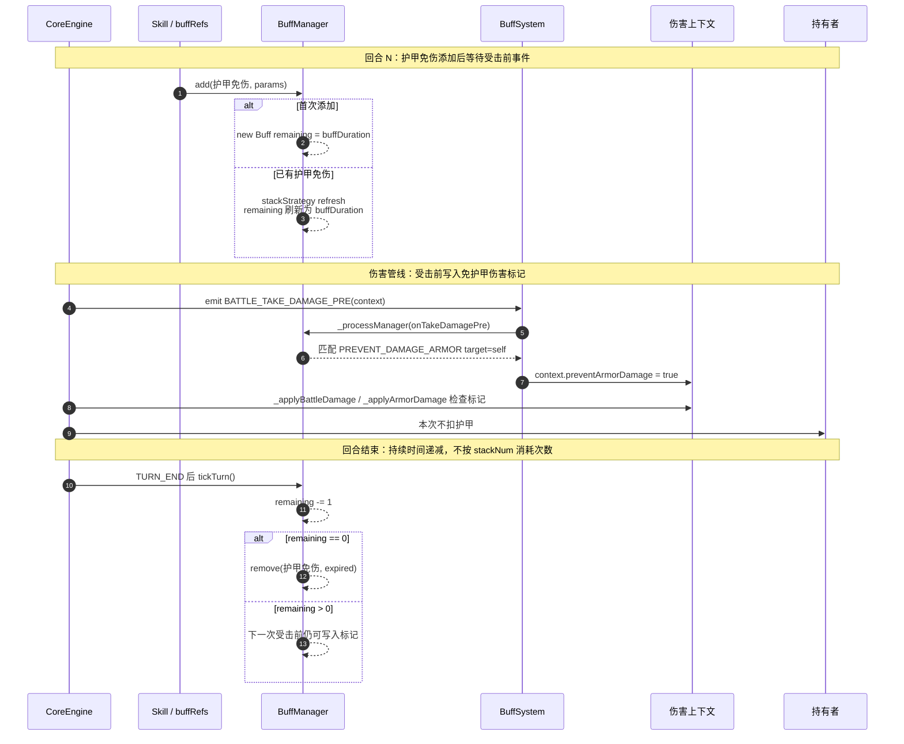
```mermaid
sequenceDiagram
  autonumber
  participant CE as CoreEngine
  participant Skill as Skill / buffRefs
  participant BM as BuffManager
  participant BS as BuffSystem
  participant Ctx as 伤害上下文
  participant Holder as 持有者

  Note over CE,Holder: 回合 N：护甲免伤添加后等待受击前事件
  Skill->>BM: add(护甲免伤, params)
  alt 首次添加
    BM-->>BM: new Buff remaining = buffDuration
  else 已有护甲免伤
    BM-->>BM: stackStrategy refresh<br/>remaining 刷新为 buffDuration
  end

  Note over CE,Holder: 伤害管线：受击前写入免护甲伤害标记
  CE->>BS: emit BATTLE_TAKE_DAMAGE_PRE(context)
  BS->>BM: _processManager(onTakeDamagePre)
  BM-->>BS: 匹配 PREVENT_DAMAGE_ARMOR target=self
  BS->>Ctx: context.preventArmorDamage = true
  CE->>Ctx: _applyBattleDamage / _applyArmorDamage 检查标记
  CE->>Holder: 本次不扣护甲

  Note over CE,Holder: 回合结束：持续时间递减，不按 stackNum 消耗次数
  CE->>BM: TURN_END 后 tickTurn()
  BM-->>BM: remaining -= 1
  alt remaining == 0
    BM-->>BM: remove(护甲免伤, expired)
  else remaining > 0
    BM-->>BM: 下一次受击前仍可写入标记
  end
```

状态机：

1. 进入：`BuffManager.add('new_buff_1771481773827', options)` 创建实例。
2. 合并：再次添加时走 `refresh`，刷新 `remaining`；`maxStacks` 不代表当前已实现的“免伤次数”。
3. 触发：伤害管线 emit `BATTLE_TAKE_DAMAGE_PRE`。
4. 响应：执行 `PREVENT_DAMAGE_ARMOR`，写入共享 `context.preventArmorDamage = true`。
5. 消费：`CoreEngine._applyBattleDamage()` / `_applyArmorDamage()` 在扣护甲时检查该字段；为 true 时不降低护甲；若本次伤害高于当前护甲，剩余伤害仍按普通伤害管线进入 HP 溢出。
6. 退出：`TURN_END -> tickTurn()` 递减并移除。

当前代码事实：`PREVENT_DAMAGE_ARMOR` 不消耗层数，也不按 `stackNum` 计次；只要 Buff 持续存在，每次对应伤害上下文都会写入免护甲伤害标记。

#### 6.6.14 HP 免伤

当前 JSON key：`new_buff_1771481936095`。基础信息：`buff`，`duration=3`，`maxStacks=1`，`stackStrategy=refresh`。

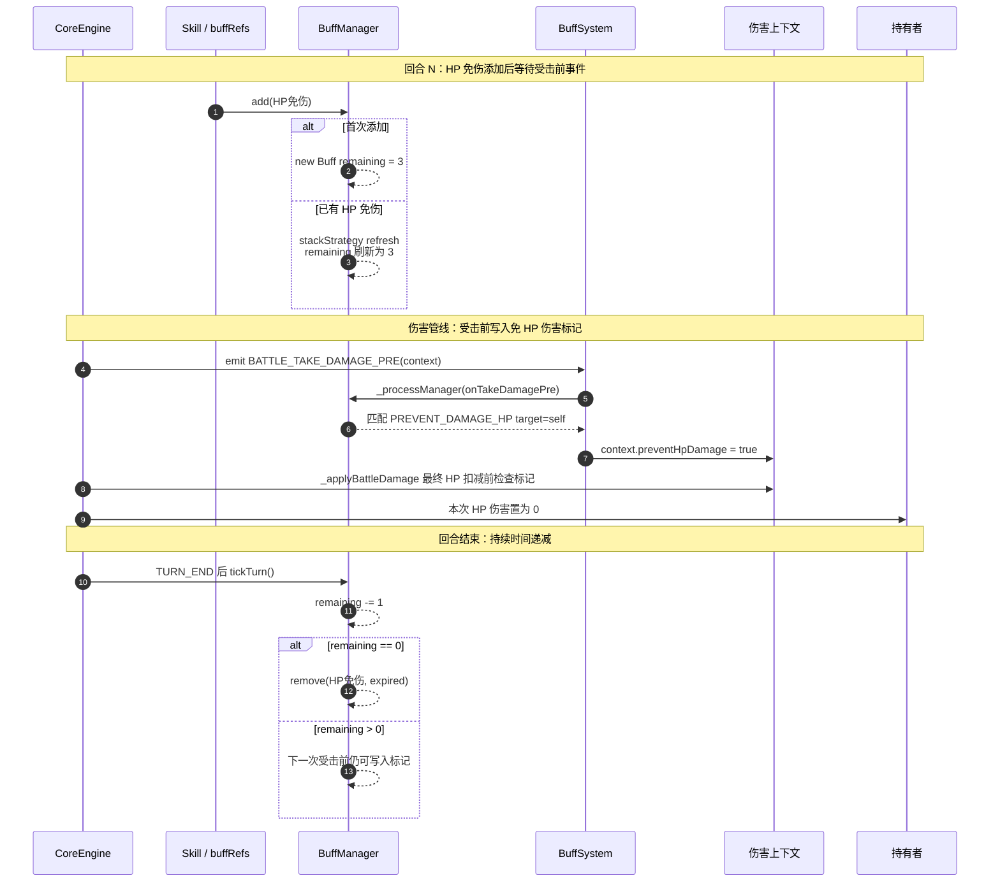
```mermaid
sequenceDiagram
  autonumber
  participant CE as CoreEngine
  participant Skill as Skill / buffRefs
  participant BM as BuffManager
  participant BS as BuffSystem
  participant Ctx as 伤害上下文
  participant Holder as 持有者

  Note over CE,Holder: 回合 N：HP 免伤添加后等待受击前事件
  Skill->>BM: add(HP免伤)
  alt 首次添加
    BM-->>BM: new Buff remaining = 3
  else 已有 HP 免伤
    BM-->>BM: stackStrategy refresh<br/>remaining 刷新为 3
  end

  Note over CE,Holder: 伤害管线：受击前写入免 HP 伤害标记
  CE->>BS: emit BATTLE_TAKE_DAMAGE_PRE(context)
  BS->>BM: _processManager(onTakeDamagePre)
  BM-->>BS: 匹配 PREVENT_DAMAGE_HP target=self
  BS->>Ctx: context.preventHpDamage = true
  CE->>Ctx: _applyBattleDamage 最终 HP 扣减前检查标记
  CE->>Holder: 本次 HP 伤害置为 0

  Note over CE,Holder: 回合结束：持续时间递减
  CE->>BM: TURN_END 后 tickTurn()
  BM-->>BM: remaining -= 1
  alt remaining == 0
    BM-->>BM: remove(HP免伤, expired)
  else remaining > 0
    BM-->>BM: 下一次受击前仍可写入标记
  end
```

状态机：

1. 进入：`BuffManager.add('new_buff_1771481936095')` 创建实例。
2. 合并：再次添加时走 `refresh`，刷新 `remaining`。
3. 触发：伤害管线 emit `BATTLE_TAKE_DAMAGE_PRE`。
4. 响应：执行 `PREVENT_DAMAGE_HP`，写入共享 `context.preventHpDamage = true`。
5. 消费：`CoreEngine._applyBattleDamage()` / `_applyArmorDamage()` 在最终 HP 扣减前检查该字段；为 true 时 `context.damageTaken = 0`。
6. 退出：`TURN_END -> tickTurn()` 递减并移除。

当前代码事实：该 Buff 只阻止 HP 伤害，不阻止护甲伤害。

#### 6.6.15 攻击获甲

当前 JSON key：`new_buff_1771482673293`。基础信息：`buff`，`duration=1`，`maxStacks=1`，`stackStrategy=refresh`，参数 `ArmorGetVal` 默认 5。

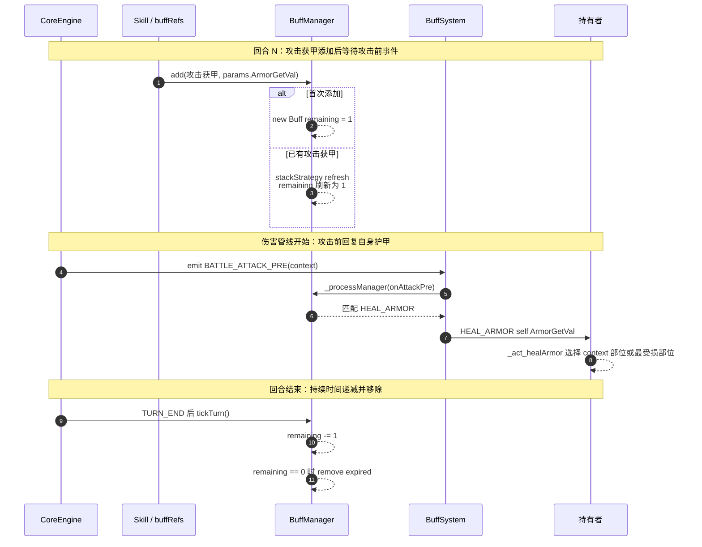
```mermaid
sequenceDiagram
  autonumber
  participant CE as CoreEngine
  participant Skill as Skill / buffRefs
  participant BM as BuffManager
  participant BS as BuffSystem
  participant Holder as 持有者

  Note over CE,Holder: 回合 N：攻击获甲添加后等待攻击前事件
  Skill->>BM: add(攻击获甲, params.ArmorGetVal)
  alt 首次添加
    BM-->>BM: new Buff remaining = 1
  else 已有攻击获甲
    BM-->>BM: stackStrategy refresh<br/>remaining 刷新为 1
  end

  Note over CE,Holder: 伤害管线开始：攻击前回复自身护甲
  CE->>BS: emit BATTLE_ATTACK_PRE(context)
  BS->>BM: _processManager(onAttackPre)
  BM-->>BS: 匹配 HEAL_ARMOR
  BS->>Holder: HEAL_ARMOR self ArmorGetVal
  Holder-->>Holder: _act_healArmor 选择 context 部位或最受损部位

  Note over CE,Holder: 回合结束：持续时间递减并移除
  CE->>BM: TURN_END 后 tickTurn()
  BM-->>BM: remaining -= 1
  BM-->>BM: remaining == 0 时 remove expired
```

状态机：

1. 进入：`BuffManager.add('new_buff_1771482673293', options)` 创建实例。
2. 合并：再次添加时走 `refresh`，刷新 `remaining`。
3. 触发：伤害管线开始时 emit `BATTLE_ATTACK_PRE`。
4. 响应：执行 `HEAL_ARMOR`，`target=self`，给持有者回复 `ArmorGetVal` 护甲。
5. 部位选择：优先使用 context 的 `bodyPart` / `targetPart`；若持有者没有该部位，则回退到最受损部位。
6. 退出：`TURN_END -> tickTurn()` 递减并移除。

当前代码事实：`BATTLE_ATTACK_PRE` 会分发给 attacker/source 与 target；如果双方都持有这个 Buff，双方各自都会以 `self` 为目标执行一次。

#### 6.6.16 受击获甲

当前 JSON key：`new_buff_1771485041778`。基础信息：`buff`，`duration=3`，`maxStacks=1`，`stackStrategy=refresh`，参数 `healArmorVal` 默认 5。

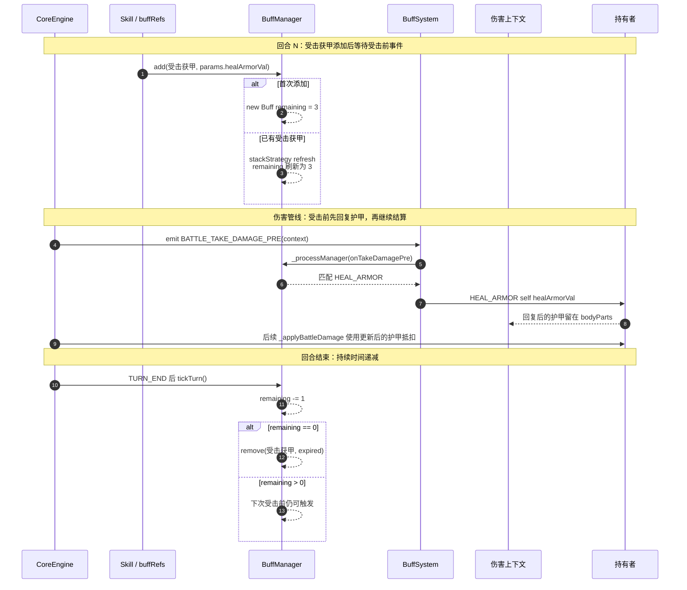
```mermaid
sequenceDiagram
  autonumber
  participant CE as CoreEngine
  participant Skill as Skill / buffRefs
  participant BM as BuffManager
  participant BS as BuffSystem
  participant Ctx as 伤害上下文
  participant Holder as 持有者

  Note over CE,Holder: 回合 N：受击获甲添加后等待受击前事件
  Skill->>BM: add(受击获甲, params.healArmorVal)
  alt 首次添加
    BM-->>BM: new Buff remaining = 3
  else 已有受击获甲
    BM-->>BM: stackStrategy refresh<br/>remaining 刷新为 3
  end

  Note over CE,Holder: 伤害管线：受击前先回复护甲，再继续结算
  CE->>BS: emit BATTLE_TAKE_DAMAGE_PRE(context)
  BS->>BM: _processManager(onTakeDamagePre)
  BM-->>BS: 匹配 HEAL_ARMOR
  BS->>Holder: HEAL_ARMOR self healArmorVal
  Holder-->>Ctx: 回复后的护甲留在 bodyParts
  CE->>Holder: 后续 _applyBattleDamage 使用更新后的护甲抵扣

  Note over CE,Holder: 回合结束：持续时间递减
  CE->>BM: TURN_END 后 tickTurn()
  BM-->>BM: remaining -= 1
  alt remaining == 0
    BM-->>BM: remove(受击获甲, expired)
  else remaining > 0
    BM-->>BM: 下次受击前仍可触发
  end
```

状态机：

1. 进入：`BuffManager.add('new_buff_1771485041778', options)` 创建实例。
2. 合并：再次添加时走 `refresh`，刷新 `remaining`。
3. 触发：伤害管线 emit `BATTLE_TAKE_DAMAGE_PRE`。
4. 响应：执行 `HEAL_ARMOR`，`target=self`，在伤害真正结算前给持有者回复护甲。
5. 消费：回复后的护甲会立即参与本次 `_applyBattleDamage()` 的护甲抵扣。
6. 退出：`TURN_END -> tickTurn()` 递减并移除。

当前代码事实：与其他 `onTakeDamagePre` effect 一样，只要持有者是本次 attacker/source 或 target，都会被分发；设计上应把该 Buff 加给受击方。

#### 6.6.17 开销降低

当前 JSON key：`new_buff_1771485482007`。基础信息：`buff`，`duration=3`，`maxStacks=1`，`stackStrategy=refresh`，参数 `apReduceVal` 默认 1。

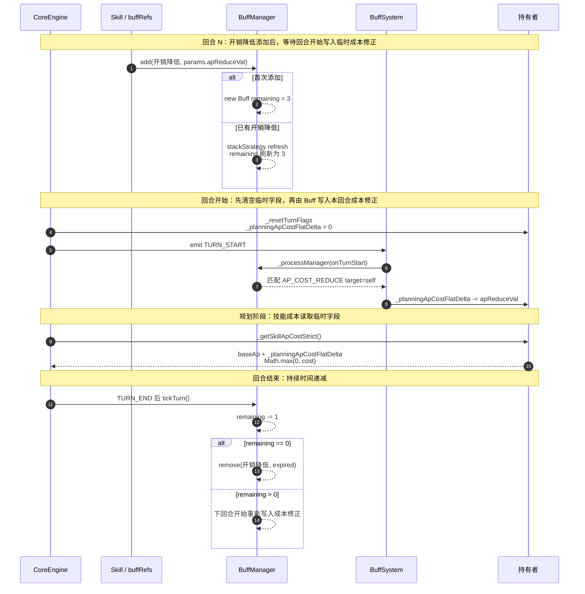
```mermaid
sequenceDiagram
  autonumber
  participant CE as CoreEngine
  participant Skill as Skill / buffRefs
  participant BM as BuffManager
  participant BS as BuffSystem
  participant Holder as 持有者

  Note over CE,Holder: 回合 N：开销降低添加后，等待回合开始写入临时成本修正
  Skill->>BM: add(开销降低, params.apReduceVal)
  alt 首次添加
    BM-->>BM: new Buff remaining = 3
  else 已有开销降低
    BM-->>BM: stackStrategy refresh<br/>remaining 刷新为 3
  end

  Note over CE,Holder: 回合开始：先清空临时字段，再由 Buff 写入本回合成本修正
  CE->>Holder: _resetTurnFlags<br/>_planningApCostFlatDelta = 0
  CE->>BS: emit TURN_START
  BS->>BM: _processManager(onTurnStart)
  BM-->>BS: 匹配 AP_COST_REDUCE target=self
  BS->>Holder: _planningApCostFlatDelta -= apReduceVal

  Note over CE,Holder: 规划阶段：技能成本读取临时字段
  CE->>Holder: _getSkillApCostStrict()
  Holder-->>CE: baseAp + _planningApCostFlatDelta<br/>Math.max(0, cost)

  Note over CE,Holder: 回合结束：持续时间递减
  CE->>BM: TURN_END 后 tickTurn()
  BM-->>BM: remaining -= 1
  alt remaining == 0
    BM-->>BM: remove(开销降低, expired)
  else remaining > 0
    BM-->>BM: 下回合开始重新写入成本修正
  end
```

状态机：

1. 进入：`BuffManager.add('new_buff_1771485482007', options)` 创建实例。
2. 合并：再次添加时走 `refresh`，刷新 `remaining`。
3. 触发：`CoreEngine.startTurn()` 先 `_resetTurnFlags()`，再 emit `TURN_START`；BuffSystem 匹配 `onTurnStart`。
4. 响应：执行 `AP_COST_REDUCE`，`_act_modifyApCost()` 写入持有者 `_planningApCostFlatDelta -= apReduceVal`。
5. 消费：规划阶段 `CoreEngine._getSkillApCostStrict()` 返回 `baseAp + _planningApCostFlatDelta`，并用 `Math.max(0, ...)` 保底。
6. 退出：`TURN_END -> tickTurn()` 递减并移除。

当前代码事实：没有独立“技能扣费前事件”；AP 成本修正靠回合开始写 actor 临时字段实现。

#### 6.6.18 开销增多

当前 JSON key：`new_buff_1771487055554`。基础信息：`debuff`，`duration=3`，`maxStacks=1`，`stackStrategy=refresh`。

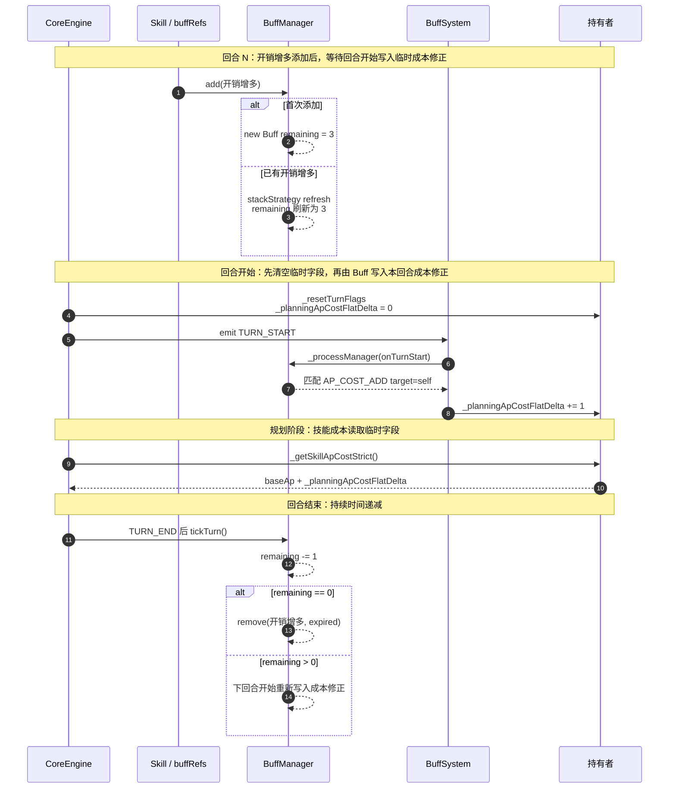
```mermaid
sequenceDiagram
  autonumber
  participant CE as CoreEngine
  participant Skill as Skill / buffRefs
  participant BM as BuffManager
  participant BS as BuffSystem
  participant Holder as 持有者

  Note over CE,Holder: 回合 N：开销增多添加后，等待回合开始写入临时成本修正
  Skill->>BM: add(开销增多)
  alt 首次添加
    BM-->>BM: new Buff remaining = 3
  else 已有开销增多
    BM-->>BM: stackStrategy refresh<br/>remaining 刷新为 3
  end

  Note over CE,Holder: 回合开始：先清空临时字段，再由 Buff 写入本回合成本修正
  CE->>Holder: _resetTurnFlags<br/>_planningApCostFlatDelta = 0
  CE->>BS: emit TURN_START
  BS->>BM: _processManager(onTurnStart)
  BM-->>BS: 匹配 AP_COST_ADD target=self
  BS->>Holder: _planningApCostFlatDelta += 1

  Note over CE,Holder: 规划阶段：技能成本读取临时字段
  CE->>Holder: _getSkillApCostStrict()
  Holder-->>CE: baseAp + _planningApCostFlatDelta

  Note over CE,Holder: 回合结束：持续时间递减
  CE->>BM: TURN_END 后 tickTurn()
  BM-->>BM: remaining -= 1
  alt remaining == 0
    BM-->>BM: remove(开销增多, expired)
  else remaining > 0
    BM-->>BM: 下回合开始重新写入成本修正
  end
```

状态机：

1. 进入：`BuffManager.add('new_buff_1771487055554')` 创建实例。
2. 合并：再次添加时走 `refresh`，刷新 `remaining`。
3. 触发：`TURN_START -> onTurnStart`。
4. 响应：执行 `AP_COST_ADD`，写入持有者 `_planningApCostFlatDelta += 1`。
5. 消费：规划阶段 `CoreEngine._getSkillApCostStrict()` 读取该临时字段，提高技能 AP 成本。
6. 退出：`TURN_END -> tickTurn()` 递减并移除。

#### 6.6.19 撕裂伤口

当前 JSON key：`buff_tear_wound`。基础信息：`debuff`，`duration=2`，`maxStacks=1`，`stackStrategy=refresh`。

```mermaid
sequenceDiagram
  autonumber
  participant CE as CoreEngine
  participant Skill as Skill / buffRefs
  participant BM as BuffManager
  participant BS as BuffSystem
  participant Holder as 行动者

  Note over CE,Holder: 回合 N：撕裂伤口添加后，等待持有者行动前触发
  Skill->>BM: add(buff_tear_wound)
  alt 首次添加
    BM-->>BM: new Buff remaining = 2
  else 已有撕裂伤口
    BM-->>BM: stackStrategy refresh<br/>remaining 刷新为 2
  end

  Note over CE,Holder: 持有者准备执行技能：行动前事件只分发给当前 actor
  CE->>BS: emit BATTLE_ACTION_PRE(actionContext)
  BS->>BM: _onActionPre 仅处理 actor manager
  BM-->>BS: 匹配 APPLY_BUFF
  BS->>Holder: target=self<br/>add(buff_bleed, extendBy=2)
  Holder-->>BM: 流血 remaining 增加 2
  BM-->>CE: 不写 skipTurn / cancelled，本次行动继续执行

  Note over CE,Holder: 回合结束：撕裂伤口自身持续时间递减
  CE->>BM: TURN_END 后 tickTurn()
  BM-->>BM: buff_tear_wound.remaining -= 1
  alt remaining == 0
    BM-->>BM: remove(buff_tear_wound, expired)
  else remaining > 0
    BM-->>BM: 下次行动前仍可触发
  end
```

状态机：

1. 进入：`BuffManager.add('buff_tear_wound')` 创建实例。
2. 合并：再次添加时走 `refresh`，刷新 `remaining`。
3. 触发：`CoreEngine._executeSkillActions()` emit `BATTLE_ACTION_PRE`；`BuffSystem._onActionPre()` 只分发给当前行动者 manager。
4. 响应：执行 `APPLY_BUFF`，`target=self`，给当前行动者自己添加 `buff_bleed`。
5. 连锁参数：`_act_applyBuff()` 传入 `params.buff_duration=2`、`duration=2`、`stackStrategy=extend`、`extendBy=2`，因此流血增加 2 回合持续时间。
6. 行动影响：该 Buff 不写 `skipTurn` 或 `cancelled`，不会阻止本次技能继续执行。
7. 退出：`TURN_END -> tickTurn()` 递减并移除。

#### 6.6.20 加速

当前 JSON key：`new_buff_1771487521271`。基础信息：`buff`，`duration=3`，`maxStacks=1`，`stackStrategy=refresh`，`statModifiers.speed flat ${speedUpVal}`，默认 2。

```mermaid
sequenceDiagram
  autonumber
  participant CE as CoreEngine
  participant Skill as Skill / buffRefs
  participant BM as BuffManager
  participant Holder as 持有者

  Note over CE,Holder: 回合 N：加速被添加后，不监听 EventBus 事件
  Skill->>BM: add(加速, params.speedUpVal)
  alt 首次添加
    BM-->>BM: new Buff remaining = 3
  else 已有加速
    BM-->>BM: stackStrategy refresh<br/>remaining 刷新为 3
  end

  Note over CE,Holder: 规划/放置技能时：玩家速度读取会消费 statModifiers
  CE->>BM: _getEffectiveActorSpeed -> getEffectiveStat(speed, baseSpeed)
  BM-->>CE: baseSpeed + speed flat * stacks
  CE-->>Holder: 使用修正后的速度参与规划/时间线

  Note over CE,Holder: 回合结束：没有 effect，只有统一持续时间递减
  CE->>BM: TURN_END 后 tickTurn()
  BM-->>BM: remaining -= 1
  alt remaining == 0
    BM-->>BM: remove(加速, expired)
  else remaining > 0
    BM-->>BM: 保留速度修正
  end
```

状态机：

1. 进入：`BuffManager.add('new_buff_1771487521271', options)` 创建实例。
2. 合并：再次添加时走 `refresh`，刷新 `remaining`。
3. 触发：无 `effects`，不响应 EventBus trigger。
4. 响应：当代码调用 `holder.buffs.getEffectiveStat('speed', baseSpeed)` 时，返回加速后的速度。
5. 当前消费点：玩家规划/放置技能时 `CoreEngine._getEffectiveActorSpeed()` 会读取玩家速度修正；敌人规划器当前不读取敌人 Buff 速度修正。
6. 退出：`TURN_END -> tickTurn()` 递减并移除。

### 6.7 stackStrategy 语义

| 策略 | `BuffManager._applyStack()` 当前行为 |
| --- | --- |
| `refresh` | 默认分支。保持 `stacks` 不变；如果不是永久 Buff，则 `remaining = def.lifecycle.duration ?? existing.duration`。 |
| `extend` | 如果不是永久 Buff，则 `remaining += options.extendBy ?? options.duration ?? def.lifecycle.duration ?? existing.duration`。 |
| `add` | `stacks = min(maxStacks, existing.stacks + (options.stacks || 1))`；如果不是永久 Buff，则刷新 `remaining`。 |
| `replace` | `stacks = min(maxStacks, options.stacks || 1)`；如果不是永久 Buff，则刷新 `remaining`。 |
| `max` | 没有专门分支；当前会落入 `refresh` 默认分支。 |
| `independent` | 没有专门分支；当前不会创建同 id 多实例，会落入 `refresh` 默认分支。 |
| 其他未知值 | 没有专门分支；当前会落入 `refresh` 默认分支。 |

新建 Buff 实例时，`Buff` 构造函数使用 `options.duration ?? definition.lifecycle.duration ?? 0` 作为 `duration` 和初始 `remaining`；`options.stacks || 1` 作为初始 `stacks`。永久 Buff 的判断是 `duration === -1`。

## 7. 数据契约

### 7.1 顶层结构

当前 `assets/data/buffs_v2_7.json` 使用容器结构：

```json
{
  "$schemaVersion": "buffs_v2_1_wrapped",
  "meta": {
    "title": "Buff 库",
    "notes": [],
    "fieldNotes": {},
    "defaults": {
      "lifecycle": {
        "duration": 1,
        "maxStacks": 1,
        "stackStrategy": "replace",
        "removeOnBattleEnd": true
      }
    },
    "enums": {
      "buffTypes": ["buff", "debuff", "hidden"],
      "stackStrategies": ["refresh", "extend", "add", "max", "replace", "independent"],
      "triggers": ["onTurnStart", "onTurnEnd", "onAttackPre", "onAttackPost", "onTakeDamagePre", "onTakeDamagePost", "onDefendPre", "onDefendPost", "onDeath"],
      "targets": ["self", "target", "attacker"],
      "effectActions": ["DAMAGE_HP", "DAMAGE_ARMOR", "HEAL_HP", "HEAL_ARMOR", "APPLY_BUFF", "SKIP_TURN", "PREVENT_DAMAGE_HP", "PREVENT_DAMAGE_ARMOR", "AP_COST_ADD", "AP_COST_REDUCE"]
    }
  },
  "buffs": {}
}
```

说明：

- `BuffRegistry.setDefinitions()` 当前接收的是已经归一化后的 buff 字典；容器结构由内容加载层拆出。
- `meta.enums` 是编辑器和数据包的枚举来源，不等于运行时全部已订阅或已实现。
- 当前运行时实际订阅的 trigger 以 6.2 和 6.3 为准；`onTakeDamagePost`、`onDefendPre`、`onDeath` 目前没有事件入口。
- 当前数据中 `buff_tear_wound` 使用 `onActionPre`，运行时也订阅 `BATTLE_ACTION_PRE -> onActionPre`，但 `buffs_v2_7.json` 的 `meta.enums.triggers` 尚未列出 `onActionPre`。这是数据契约与运行时枚举未同源的现状。
- 当前运行时 action library 比 `meta.enums.effectActions` 更宽，见 7.4。

### 7.2 单个 Buff 必填字段

- `id: string`
- `name: string`
- `description: string`
- `type: "buff" | "debuff" | "hidden"`
- `tags: string[]`
- `lifecycle`
- `effects: Effect[]`
- `statModifiers: StatModifier[]`

推荐字段：

- `status?: "active" | "deprecated" | "experimental"`
- `aliasOf?: string`
- `version?: string`
- `icon?: string`
- `paramsSchema?: Record<string, ParamSpec>`

### 7.3 Effect 结构

标准 effect 结构：

```json
{
  "trigger": "onTurnEnd",
  "action": "DAMAGE_HP",
  "target": "self",
  "payload": {
    "value": 5,
    "valueType": "flat",
    "reason": "bleed_tick"
  }
}
```

当前实现事实：

- `BuffSystem._processManager()` 只要求 `effect.trigger` 与当前 trigger 字符串相等，不会校验它是否存在于 `meta.enums.triggers`。
- `BuffSystem._actionLibrary` 按 action key 查找实现；不存在 key 会发出 `BUFF:WARN`。
- `target` 由 `_resolveTarget()` 解析：`self` 指持有者，`attacker` 指 `context.attacker || context.source`，`target` 指 `context.target`，其他值默认回到持有者。
- `_normalizeEffect()` 会把 `payload.value / payload.valueType / payload.reason` 提升到运行时 effect 顶层，并把 payload 剩余字段合并到 `effect.params`。
- 运行时兼容历史 `value/valueType/params`，但新数据应向 `payload` 收敛。

### 7.4 当前 action library

`BuffSystem._actionLibrary` 当前实际注册的 action 如下。大小写别名会进入同一个实现。

| action key | 实现函数 | 当前行为 |
| --- | --- | --- |
| `damage` / `DAMAGE_HP` | `_act_damage` | 直接修改目标 HP，不进入护甲/部位伤害管线。 |
| `heal` / `HEAL_HP` | `_act_heal` | 直接回复目标 HP。 |
| `HEAL_ARMOR` | `_act_healArmor` | 选择指定或受损部位回复护甲。 |
| `applyBuff` / `APPLY_BUFF` | `_act_applyBuff` | 对目标 `target.buffs.add()`。 |
| `skipTurn` / `SKIP_TURN` | `_act_skipTurn` | 写入 `context.skipTurn = true` 和 `owner._skipTurn = true`。 |
| `modifyAP` / `MODIFY_AP` | `_act_modifyAP` | 修改目标 `stats.ap`。 |
| `absorbDamage` | `_act_absorbDamage` | 向 `context.shieldPool` 增加吸收量。 |
| `modifyDamageTaken` | `_act_modifyDamageTaken` | 乘法写入 `context.damageTakenMult`。 |
| `setDamageTaken` | 缺失 `_act_setDamageTaken` | 当前注册了 key，但实现函数不存在；触发会进入 `BUFF:ERROR`。 |
| `attack` / `ATTACK` | `_act_attack` | 发出 `BUFF_ATTACK_REQUEST`，由 CoreEngine 桥接反应攻击。 |
| `absorbToHeal` | `_act_absorbToHeal` | 空实现。 |
| `revive` | `_act_revive` | 空实现。 |
| `REMOVE_SELF` | `_act_removeSelf` | `manager.remove(ctx.buff.id, 'consume')`。 |
| `MODIFY_STAT_TEMP` | `_act_modifyStatTemp` | 写入 `context.tempModifiers[stat]`。 |
| `PREVENT_DAMAGE_HP` | `_act_preventDamageHp` | 写入 `context.preventHpDamage = true`。 |
| `PREVENT_DAMAGE_ARMOR` | `_act_preventDamageArmor` | 写入 `context.preventArmorDamage = true`。 |
| `AP_COST_ADD` | `_act_modifyApCost` | 写入目标 `_planningApCostFlatDelta += value`。 |
| `AP_COST_REDUCE` | `_act_modifyApCost` | 写入目标 `_planningApCostFlatDelta -= value`。 |

数据包 `meta.enums.effectActions` 当前只列出一部分 action，编辑器展示和运行时 action library 尚未完全同源。若后续要做到“数据契约即运行时契约”，需要把 `meta.enums.effectActions` 与 `_actionLibrary` 对齐，并删除或补全 `setDamageTaken`、`absorbToHeal`、`revive` 这类不完整项。

### 7.5 statModifiers

标准结构：

```json
"statModifiers": [
  { "stat": "damageTakenMult", "type": "percent_base", "value": -0.2 },
  { "stat": "atk", "type": "flat", "value": 5 }
]
```

当前 MVP 支持：

- `flat`
- `percent` / `percent_base`
- `overwrite`

未知 type 不允许静默忽略，必须产生 `BUFF:WARN`。

### 7.6 动态参数与占位符

Buff 可以通过 `paramsSchema` 声明动态参数：

```json
"paramsSchema": {
  "duration": { "type": "number", "default": 2, "name": "持续回合" },
  "value": { "type": "number", "default": 5, "name": "数值" }
}
```

然后在 Buff 定义内使用 `${paramName}`：

```json
{
  "lifecycle": { "duration": "${duration}" },
  "effects": [
    {
      "trigger": "onTurnEnd",
      "action": "DAMAGE_HP",
      "target": "self",
      "payload": { "value": "${value}", "valueType": "flat" }
    }
  ]
}
```

技能只传参数：

```json
{
  "buffId": "buff_bleed",
  "target": "enemy",
  "params": { "duration": 2, "value": 5 },
  "stackStrategy": "extend",
  "extendBy": 2
}
```

映射关系由 Buff 数据自身表达，`BuffRegistry` 只做机械解析。

## 8. Skill 与 Buff 对接契约

### 8.1 buffRefs

技能通过 `buffRefs` 引用 Buff：

```json
"buffRefs": {
  "apply": [
    {
      "target": "enemy",
      "buffId": "buff_bleed",
      "duration": 2,
      "stackStrategy": "extend",
      "extendBy": 2,
      "params": {}
    }
  ],
  "remove": [
    { "target": "self", "buffId": "buff_stun" }
  ]
}
```

`target` 的语义：

- `self`：技能使用者。
- `enemy`：技能目标。
- `attacker` / `target`：运行时事件上下文中使用，技能数据侧优先使用 `self/enemy`。

### 8.2 技能读取 Buff 资源

技能若需要“按某个 Buff 的状态计算数值”，应使用通用读数：

- `BUFF_REMAINING`：读取指定 Buff 的剩余持续时间。
- `BUFF_STACKS`：读取指定 Buff 的层数。

设计约束：

- 流血相关技能应读取 `BUFF_REMAINING`。
- 未来中毒或蓄力相关技能可读取 `BUFF_STACKS`。
- 读取对象必须显式指定 `buffId`，不能靠显示名或 tag 猜测。
- `amountSource.maxRead` 可限制本次读取的最大 `remaining/stacks`，用于控制不消耗资源的读数技能上限。
- `buffRefs.remove[].consumeRemaining` 可消耗指定 Buff 的部分 `remaining`；消耗到 0 时由 BuffManager 移除该 Buff。
- `requirements.targetBuff` 可在技能执行前检查指定 Buff 是否存在、`remaining` 是否达到门槛或 `stacks` 是否达到门槛；它属于 Skill 释放条件，不属于 Buff 生命周期。

### 8.3 复杂度分级

Skill 引入 Buff 的复杂度分为三类：

| 复杂度 | 说明 | 示例 |
| --- | --- | --- |
| L1 施加/移除 | 技能只 apply/remove Buff | 普通流血、眩晕、加攻 |
| L2 带参数施加 | 技能 apply Buff 并传 duration/value/stackStrategy | 2 回合流血、一次性免伤 |
| L3 读取 Buff 资源计算 | 技能读取指定 Buff 的 remaining/stacks 再计算伤害或治疗 | 血涌、饮血、迸发 |
| L4 消耗 Buff 窗口兑现 | 技能读取或直接消耗指定 Buff 的部分 remaining/stacks，并把它转成爆发收益 | 断脉一剑、猩红收割 |

L3 是必要能力，但设计时应控制数量。它会引入“技能依赖指定 Buff 状态”的组合复杂度，必须通过文档、测试和编辑器提示明确表达。L4 比 L3 更强，应只用于终结、爆发或明确的资源兑现技能；如果不消耗资源却按高倍率反复读取，同一段 Buff 窗口会被重复计价。

## 9. 编辑展示工具设计

### 9.1 Buff 编辑器定位

Buff 编辑器是数据生产工具，不是运行时权威。

它负责：

- 加载 Buff 内容包。
- 基于 `meta.enums` 渲染下拉、标签、动作选择。
- 编辑 Buff 基础字段、生命周期、statModifiers、effects、paramsSchema。
- 做结构校验、枚举校验、引用校验和迁移提示。
- 导出或保存内容包。

它不负责：

- 证明 Buff 已被主流程运行时消费。
- 复刻完整战斗系统。
- 在 UI 中硬编码一套独立于 `meta.enums` 的规则。

### 9.2 技能编辑器中的 Buff 面板

技能编辑器可以加载同目录或项目内 Buff 数据，用于：

- 在 `buffRefs.apply/remove` 中搜索选择 `buffId`。
- 显示 Buff 名称、描述、类型、tags、生命周期摘要。
- 对缺失 Buff 引用给出错误。
- 辅助编辑技能对 Buff 的参数传递。

技能编辑器不应编辑 Buff 定义本体；Buff 定义应回到 Buff 编辑器维护。

### 9.3 编辑器与运行时探针关系

```text
Buff 编辑器：我能编辑出一份结构正确的 Buff 包
运行时探针：这份 Buff 包能被 DataManagerV2 重新加载并被 BuffManager/BuffSystem 实际消费
战斗机器人测试：这份 Buff 包在技能和战斗流程中符合预期
```

三者不能互相替代。

## 10. 关键运行流程

### 10.1 加载 Buff 内容包

```text
DataManagerV2.loadConfigs
  -> 读取 assets/data/buffs_v2_7.json 或内容包覆盖源
    -> 校验 schemaVersion
      -> 归一化为 definitions map
        -> BuffRegistry.setDefinitions(definitions)
```

### 10.2 技能施加 Buff

```text
Skill 执行
  -> 读取 skill.buffRefs.apply
    -> 解析 target: self/enemy
      -> target.buffs.add(buffId, options)
        -> BuffRegistry.getDefinition(buffId, options)
          -> alias / paramsSchema / placeholder 解析
            -> BuffManager 新增或按 stackStrategy 合并实例
```

### 10.3 事件触发 Buff

```text
EventBus.emit("TURN_END" / "BATTLE_TAKE_DAMAGE_PRE" / ...)
  -> BuffSystem 收到事件
    -> 找到相关 BuffManager
      -> 遍历 active Buff
        -> 匹配 effects[].trigger
          -> normalize effect payload
            -> actionLibrary[action](context, effect)
              -> 写回 actor / battle context / event log
```

### 10.4 回合结束

```text
TURN_END
  -> BuffSystem 执行 onTurnEnd effects
  -> BuffManager.tickTurn()
  -> 每个非永久 Buff remaining -= 1
  -> remaining === 0 的 Buff 移除
```

## 11. 设计约束与质量门

### 11.1 禁止硬编码边界

禁止：

- 在 `CoreEngine` 或战斗主流程中写具体 `buffId` 特判。
- 在技能数据中复制 Buff 的运行逻辑。
- 在编辑器中维护一套脱离 `meta.enums` 的 action/trigger 枚举。
- 静默忽略未知 action、未知 statModifier type 或缺失 Buff 定义。

允许：

- 在 `BuffSystem._actionLibrary` 中维护 action 到函数的确定性映射。
- 在 `BuffManager` 中维护 stackStrategy 的确定性合并规则。
- 在 `BuffRegistry` 中维护 alias、paramsSchema 和占位符解析。
- 在 DataManager 中维护内容包加载、版本检查和归一化规则。

### 11.2 数据质量门

Buff 数据包至少应满足：

1. `buffs` key 与 `buff.id` 一致。
2. `type/trigger/action/target/stackStrategy` 来自 `meta.enums`。
3. `aliasOf` 指向存在，且不形成循环。
4. `statModifiers[].type` 为运行时支持或明确标注实验。
5. `effects[].payload` 与 action 的参数要求匹配。
6. 技能引用的 `buffId` 全部存在。
7. 流血类技能不再把流血持续时间描述为层数。

### 11.3 运行质量门

Buff 运行时至少应满足：

1. `BuffManager.add/remove/tickTurn/getRemaining/getStacks` 行为稳定。
2. `BuffSystem` 能按事件触发 effects。
3. `onTurnEnd` 先执行 effect，再递减 remaining。
4. `statModifiers` 能被 `getEffectiveStat` 汇总。
5. 不支持的 action/type 会告警，不会静默失败。
6. 运行时探针可证明内容包被重新加载并消费。

## 12. 测试与验收口径

### 12.1 建议测试入口

```bash
node --test test/skill_buff_decoupled_runtime.test.mjs test/skill_buff_battle_robot.test.mjs
node --test test/skill_formal_skill_matrix.test.mjs
node tools/validate_skill_authoring_guard.mjs assets/data/skills_melee_v4_5.json assets/data/buffs_v2_7.json
```

浏览器验证入口：

- `test/buff_editor_v4.html`
- `test/buff_editor_io_test.html`
- `test/buff_runtime_probe.html`
- `test/skill_editor_test_v3.html`

### 12.2 产品验收

- Buff 编辑器能清楚展示 Buff 的生命周期、effect、statModifier 和动态参数。
- 技能编辑器能加载 Buff 数据并选择引用，不出现缺失引用。
- 流血、免伤、回血、减伤、增伤、控制、反击等典型 Buff 能被测试解释。
- 用户能区分“编辑器里看见”和“运行时真的消费”。

### 12.3 架构验收

- 新增普通 Buff 不需要修改战斗主引擎。
- 新增 action 才需要修改 `BuffSystem._actionLibrary`，并补充枚举、文档和测试。
- 技能只引用 Buff 或读取通用 Buff 资源。
- Buff 状态机可从文档映射到 `Buff / BuffManager / BuffSystem` 的实现。

## 13. 目标目录与代码映射

| 设计对象 | 当前文件 |
| --- | --- |
| Buff 定义库 | `assets/data/buffs_v2_7.json` |
| Buff 实例 | `script/engine/buff/Buff.js` |
| Buff 注册表 | `script/engine/buff/BuffRegistry.js` |
| Buff 管理器 | `script/engine/buff/BuffManager.js` |
| Buff 系统 | `script/engine/buff/BuffSystem.js` |
| Buff 模块出口 | `script/engine/buff/index.js` |
| 内容装载 | `script/engine/DataManagerV2.js` |
| 内容包覆盖 | `script/tooling/ContentPackOverrideStore.js` |
| Buff 编辑器 | `test/buff_editor_v4.html` |
| Buff I/O 测试页 | `test/buff_editor_io_test.html` |
| Buff 运行时探针 | `test/buff_runtime_probe.html` |
| 技能编辑器 Buff 引用面板 | `test/skill_editor_test_v3.html` |
| 运行时回归 | `test/skill_buff_decoupled_runtime.test.mjs`、`test/skill_buff_battle_robot.test.mjs` |

## 14. 设计结论

Buff 系统的核心不是“列一批状态名”，而是建立一条稳定链路：

```text
数据契约可编辑
  -> 内容装载可追踪
    -> 运行内核可消费
      -> 技能只做引用
        -> 战斗主流程只消费通用上下文
          -> 探针和机器人测试能证明行为
```

在这个链路中，`remaining` 与 `stacks` 的语义必须清楚区分；流血是持续时间型状态，不能被设计成按层数递增伤害的状态。后续新增 Buff 或技能时，应优先判断它属于 L1 施加/移除、L2 带参数施加，还是 L3 读取 Buff 资源计算，并据此决定是否值得引入更高复杂度。
