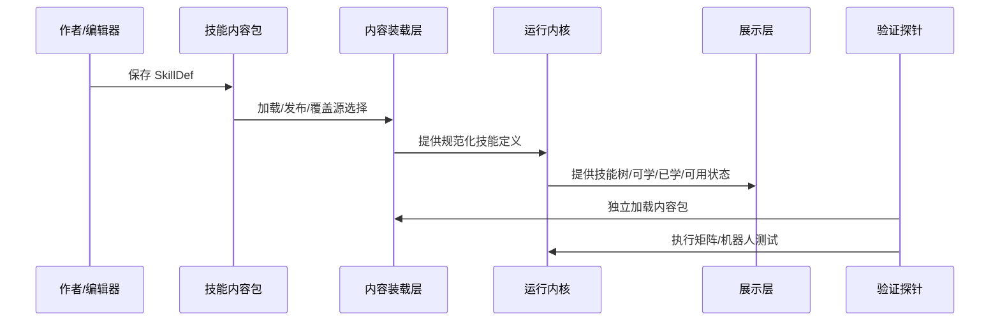
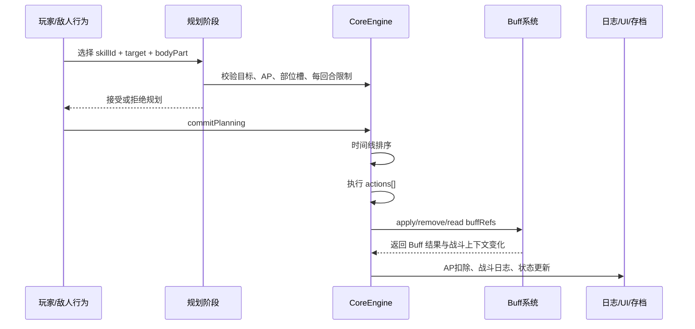
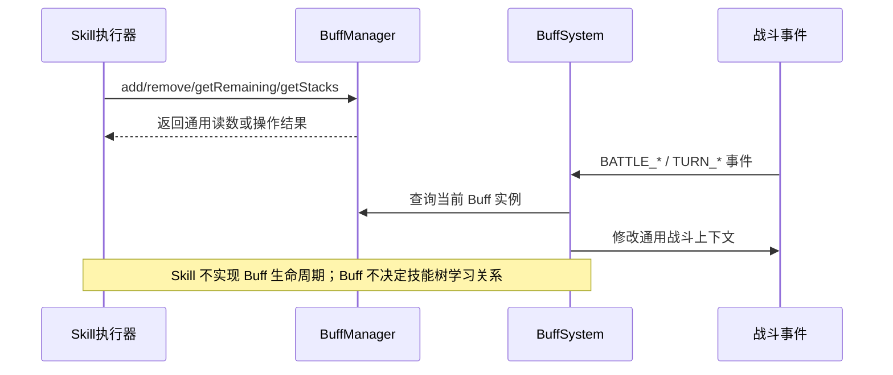

# 技能系统设计说明重构提纲

创建时间：2026-05-28 16:29:10 +0800

状态：`已落入主文档`

## 1. 本文定位

本文不是新的技能系统主设计说明，也不替代 `S4_技能系统与编辑器/03-技能系统(skill_design)-设计说明.md`。

本文是对 `03-技能系统(skill_design)-设计说明.md` 的重构提纲，用于先确认重构口径、章节结构和事实边界。该提纲已于 2026-05-28 落入主设计说明，后续以主设计说明为正式事实源。

重构目标是让技能系统文档达到与 `S5_Buff系统与编辑器/09-Buff系统(buff_design)-设计说明.md` 相同的专业度：

1. 不再混写历史问答、临时结论、目标态设想和当前实现事实。
2. 不再用传统前后端二分描述当前工程，而使用数据契约层、内容装载层、运行内核层、编辑展示层、验证探针层。
3. 技能文档必须能和代码实现、技能 JSON、Buff 文档、编辑器行为、测试入口一一对照。
4. 当前实现已经支持的能力写成事实；未来建议或设计方向必须单独标注，不混入实现章节。

## 2. 当前主文档的主要问题

### 2.1 结构混杂

当前 `03-技能系统(skill_design)-设计说明.md` 同时包含：

- 技能系统总述。
- 合理 Skill 框架原则。
- AP、KP、槽位、稀有度等设计约束。
- 剑系流派设计与数值意图。
- 技能 schema 草案。
- 技能与 Buff 对接规范。
- 旧 Buff 缺口追溯表。

这些内容都重要，但不应处于同一层级。主设计说明应优先描述系统结构、数据契约、运行流程和验收口径；具体流派设计、平衡建议、旧字段退役、脑暴记录应放到对应子文档或附录。

### 2.2 当前实现事实与目标态设想混写

当前文档存在一些更像“建议字段”或“历史目标”的内容，例如：

- 部分 `buffRefs` 字段说明需要重新核对当前运行时是否真实消费。
- `SCALING` 相关内容属于旧口径，用户已明确要求退役。
- 技能流派设计中有些内容是内容设计建议，不是运行内核事实。
- 技能 schema 草案写得较长，但没有清晰区分“当前 JSON 已使用字段”和“未来扩展字段”。

重构时必须把这些内容拆成：

1. **当前实现事实**：代码、数据、测试已能证明。
2. **当前内容约束**：作者新增或调整技能必须遵守。
3. **目标态建议**：尚未落地，不能写成已实现。
4. **历史或退役内容**：保留迁移原因，但不作为新设计入口。

### 2.3 缺少技能生命周期状态图

Buff 文档已经按每个 Buff 写清楚触发时机和状态变迁。技能系统也需要有对应的生命周期图，但它不应复制 Buff 的状态机。

Skill 的核心生命周期应该覆盖：

```text
编辑/保存
  -> 内容装载/规范化
    -> 解锁/学习
      -> 回合规划
        -> 时间线排序
          -> 执行 actions
            -> 施加/移除/读取 Buff
              -> AP 扣除、日志、战斗状态持久化
```

其中每个阶段要写清：

- 由哪个模块负责。
- 消费哪些字段。
- 输出什么中间状态。
- 哪些错误在该阶段暴露。
- 与 Buff 系统、战斗引擎、技能编辑器的边界在哪里。

### 2.4 缺少运行能力矩阵

当前技能运行时能力已经比较明确，但文档没有像 Buff 文档那样形成一张可核对的能力矩阵。

主文档重构后应列出：

- 当前 `actions[].effect.effectType` 支持哪些效果。
- 当前 `amountType` 支持哪些计算来源。
- 当前 `target` 和 action target binding 怎么解析。
- 当前 `buffRefs.apply/remove` 怎么选择目标、传参数、返回日志。
- 当前哪些字段只供编辑器使用，不进入战斗运行时。

### 2.5 Skill 文档不能照搬 Buff 的逐项穷尽写法

Buff 与 Skill 的文档写法应明确区分。

Buff 是技能、敌人、道具和关卡效果的基础机制原子。每新增、删除或修改一个 Buff，都可能改变底层状态机、事件触发、叠加规则和战斗上下文。因此 Buff 文档必须尽量把当前 Buff 类型逐项列清楚，并让每个 Buff 的状态机与实现一一对应。

Skill 则不同。Skill 是面向内容生产的组合层，是应当被编辑器持续扩展、调整和版本化的对象。如果主设计文档把每个具体技能都逐项列完，反而说明系统没有把技能抽象成可统计、可归类、可校验、可编辑的结构化接口，也会削弱技能编辑器作为内容生产工具的意义。

因此，Skill 主文档应采用以下写法：

1. **不逐条穷尽所有技能。** 具体技能清单由技能 JSON、技能编辑器、技能测试矩阵和版本文件承担。
2. **按结构类型归类。** 例如即时伤害、护甲伤害、治疗、护甲回复、Buff 施加、Buff 移除、Buff 读数计算、多段动作、自身目标、敌方部位目标。
3. **按统计口径分析。** 例如各稀有度数量、KP 成本分布、AP 成本分布、流派分布、Buff 引用分布、目标类型分布。
4. **按运行能力描述。** 文档描述“系统支持什么能力、字段如何解释、执行器如何消费”，而不是描述“当前有哪 45 个技能”。
5. **具体技能作为样例，不作为枚举义务。** 主文档可以保留少量代表性样例，用于说明字段和生命周期，但不能把样例误写成全部内容。

## 3. 建议重构后的主文档结构

### 3.1 文档头部

建议主文档开头改为：

```markdown
# S4 技能系统与技能树软件设计说明

> 本文件是 NodeConsoleApp2 中 S4 技能系统与技能树的主软件设计说明文档。本文描述本阶段认可的目标态系统设计：系统边界、分层结构、数据契约、运行内核、编辑展示工具、验证探针、关键流程和验收口径。
>
> 本文不把本项目强行拆成传统前端/后端。技能、Buff、敌人等系统大多由前端语言和静态/本地 JSON 共同实现，因此本文采用数据契约层、内容装载层、运行内核层、编辑展示层、验证探针层。
>
> 技能编辑器、技能规划、技能平衡、技能测试、敌人技能包模式切换分别由本目录下对应子文档展开。

日期：YYYY-MM-DD

对应范围：
- S4 技能系统与技能树
- 玩家技能包：assets/data/skills_melee_v4_5.json
- 敌人技能包：按当前敌人技能包设计文档引用
- 技能运行内核：script/engine/CoreEngine.js 中技能规划与执行相关方法
- 技能编辑工具：test/skill_editor_test_v3.html
- 技能验证入口：skill_formal_skill_matrix.test.mjs 等
```

### 3.2 第 1 章：文档目的与设计口径

本章说明文档要回答的问题：

1. Skill 系统是什么，边界在哪里。
2. 技能数据、技能树、技能编辑器、战斗引擎、Buff 系统之间如何解耦。
3. 技能从 JSON 定义到战斗生效的生命周期是什么。
4. 哪些逻辑属于 Skill 运行时，哪些属于 Buff，哪些只属于编辑器展示。
5. 技能内容包如何被加载、校验、保存、发布和测试。
6. 新增技能时 Codex 必须遵守哪些护栏。

本章应明确：

- 技能是内容契约，不是页面状态。
- 技能负责“做什么、对谁做、付出什么代价、何时可做”。
- Buff 负责“持续多久、如何响应事件、如何叠层或衰减”。
- 敌人负责“何时选择哪个技能”。
- 关卡负责“资源、敌人组合和战斗输入条件”。

### 3.3 第 2 章：系统定位

建议本章包含：

#### 3.3.1 一句话定位

`S4 技能系统与技能树` 是角色成长和战斗动作的统一数据契约与运行消费链。它把玩家技能、敌人技能、技能树学习、回合规划、动作结算和 Buff 引用统一到一套可编辑、可校验、可运行时消费的 Skill 对象中。

#### 3.3.2 正面工作对象

正面工作对象是：

```text
可被运行时消费的技能内容包
```

不是：

- 写在页面中的临时技能按钮。
- 写在主引擎里的单个技能特判。
- 只用于说明、运行时不消费的自由文本。
- 技能树截图或编辑器局部状态。

#### 3.3.3 设计原则

建议固定以下原则：

1. 技能内容包是技能事实源。
2. 技能树布局来自 `editorMeta`，不由运行时自动重排覆盖。
3. 技能只引用 Buff，不内嵌 Buff 生命周期逻辑。
4. 技能执行器只消费通用 `actions[]`、`buffRefs` 和目标选择结果，不写具体技能名特判。
5. 技能说明必须面向玩家表达真实效果，不能把开发者设计标签写进玩家描述。

### 3.4 第 3 章：业务目标与边界

本章建议写成类似 Buff 文档的边界章节。

#### 3.4.1 本阶段负责

- 技能内容包结构。
- 技能树学习结构和 `prerequisites / unlock.cost.kp`。
- 技能目标选择契约。
- 技能 AP、部位槽、每回合限制等规划资源。
- 技能动作 `actions[]` 的可执行效果。
- 技能对 Buff 的施加、移除和读数引用。
- 技能编辑器保存、发布、最近版本加载。
- 技能运行时回归和作者护栏检查。

#### 3.4.2 本阶段不负责

- Buff 自己的生命周期和状态机，这些归入 S5。
- 敌人 AI 的选择策略，这些归入 S6。
- 关卡资源节奏和敌人组合，这些归入 S3/S6。
- 完整战斗公式和部位伤害总模型，这些归入 S2。
- 具体流派全部数值定稿，这些归入技能平衡文档。

#### 3.4.3 上下游边界

建议主文档写成：

```text
S4 技能系统
  -> 读取技能内容包
    -> 规划阶段生成待执行技能动作
      -> S2 战斗运行时执行 actions
        -> S5 Buff 系统处理 buffRefs 和事件响应
          -> UI / 日志 / 存档消费执行结果
```

## 4. 总体架构建议

### 4.1 分层结构

建议采用以下结构：

```text
编辑展示层
  - skill_editor_test_v3.html
  - 技能树视图、Inspector、文件区、保存发布区
  - 技能编辑器中的 Buff 引用面板

验证探针层
  - skill_formal_skill_matrix.test.mjs
  - skill_buff_decoupled_runtime.test.mjs
  - skill_buff_battle_robot.test.mjs
  - skill_editor_file_persistence.test.mjs
  - validate_skill_authoring_guard.mjs

内容装载层
  - DataManager / DataManagerV2
  - ContentPackOverrideStore
  - 技能包保存、发布、最近版本选择

数据契约层
  - skills_melee_v4_5.json
  - enemy skill pack
  - SkillDef / target / costs / requirements / actions / buffRefs / unlock / editorMeta

运行内核层
  - CoreEngine 技能规划与执行方法
  - TurnPlanner 或当前规划快照
  - EventBus 与战斗上下文
```

### 4.2 分层职责矩阵

主文档应补充矩阵：

| 层次 | 负责 | 不负责 |
| --- | --- | --- |
| 数据契约层 | 定义技能字段、目标、动作、Buff 引用、学习成本和布局元数据 | 直接执行战斗逻辑 |
| 内容装载层 | 加载、归一化、保存发布、版本选择、覆盖源选择 | 判断技能是否平衡 |
| 运行内核层 | 目标校验、AP 成本、规划入槽、动作执行、Buff 引用消费 | 编辑器布局和人工说明 |
| 编辑展示层 | 技能树展示、表单编辑、连线编辑、导入保存发布 | 作为运行时生效证据 |
| 验证探针层 | 独立验证技能可执行、Buff 引用解耦、正式技能覆盖 | 替代人工设计审定 |

### 4.3 权威状态矩阵

建议写清：

| 状态 / 信息 | 权威归属 |
| --- | --- |
| skill id/name/description/rarity | 技能内容包 |
| 技能树位置与连线 | `editorMeta.x/y` 与 `prerequisites` |
| 学习成本 | `unlock.cost.kp` |
| 战斗 AP 成本 | `costs.ap` |
| 部位槽资源 | `costs.partSlot` 与规划器 |
| 当前玩家已学技能 | 玩家存档或运行时 playerData |
| 回合中已规划技能 | TurnPlanner / planning snapshot |
| 技能动作效果 | `actions[].effect` 与 CoreEngine 执行器 |
| Buff 生命周期 | S5 Buff 系统 |
| 编辑器选择状态 | 编辑器页面内存 |

## 5. 核心对象模型建议

### 5.1 SkillDef

主文档应把当前技能 JSON 中已经使用的字段作为主对象模型：

```json
{
  "id": "skill_id",
  "name": "技能名",
  "rarity": "Common",
  "description": "面向玩家的一句话效果描述。",
  "prerequisites": [],
  "unlock": {
    "cost": { "kp": 1 },
    "requirements": {},
    "exclusives": [],
    "grants": { "type": "permanent" }
  },
  "editorMeta": {
    "x": 0,
    "y": 0,
    "group": "melee",
    "locked": false,
    "editState": "done"
  },
  "speed": 0,
  "placement": { "maxSlots": 1 },
  "target": {},
  "requirements": {},
  "costs": {},
  "buffRefs": { "apply": [], "remove": [] },
  "actions": []
}
```

重构时要逐字段说明：

- 字段含义。
- 是否运行时消费。
- 是否编辑器消费。
- 是否允许为空。
- 默认值和错误处理。
- 与测试用例的对应关系。

### 5.2 target

应把目标选择拆为两层：

1. **Skill target**：技能本身选择谁。
2. **Action target binding**：每个 action 跟随 skillTarget，还是指向 self 或其他目标。

当前主文档要写清：

- `target.subject` 的当前枚举。
- `target.scope` 的当前枚举。
- `target.selection.mode / candidateParts / selectedParts / selectCount` 的运行意义。
- `_validateSkillTargetSelection` 在规划阶段如何拒绝无效目标。
- `_resolveActionTarget` 在执行阶段如何把 action 绑定到真实 actor/bodyPart。

### 5.3 costs 与 requirements

主文档应区分：

- `requirements`：释放门槛，不一定扣除资源。
- `costs`：释放后扣除或占用的资源。

当前重点字段：

- `costs.ap`
- `costs.partSlot`
- `costs.perTurnLimit`
- `requirements.selfPart`
- `placement.maxSlots`

### 5.4 actions[]

重构时应按当前 `CoreEngine._executeSkillActions` 支持能力列出：

| effectType | 当前意义 | 主要运行方法 |
| --- | --- | --- |
| `DMG_HP` | 对目标造成生命伤害，通常先经过护甲与 Buff 事件 | `_applyBattleDamage` |
| `DMG_ARMOR` | 只伤害目标部位护甲 | `_applyArmorOnlyDamage` |
| `HEAL` | 恢复目标 HP | `_applyHpDelta` |
| `ARMOR_ADD` | 恢复目标部位护甲 | `_applyArmorDelta` |
| `AP_GAIN` | 增加目标 AP | `_setEntityCurrentAp` |
| `BUFF_REMOVE` | 按当前技能效果移除 Buff | `_removeBuffsBySkillEffect` |

还要说明：

- `effect.repeat.count` 是多段动作，不等于命中概率。
- 当前设计不引入概率命中概念。
- 玩家描述不能写“更容易”“概率”一类不存在的机制。

### 5.5 amount 与 amountSource

建议把当前支持的 amountType 单独成表：

| amountType | 当前意义 | 适合机制 |
| --- | --- | --- |
| `ABS` | 固定数值 | 基础伤害、治疗、护甲回复 |
| `PCT_MAX` | 目标最大值百分比 | 最大生命或最大护甲比例效果 |
| `PCT_CURRENT` | 当前值百分比；重构时需核对实现是否严格区分 | 当前生命或当前护甲比例效果 |
| `BUFF_STACKS` | 读取指定 Buff 层数 | 中毒类层数资源 |
| `BUFF_REMAINING` | 读取指定 Buff 剩余持续时间 | 流血类持续时间资源 |

需要特别写清：

- 流血是持续时间型状态，不能按层数设计。
- 中毒如果后续加入，应是层数型状态。
- `BUFF_REMAINING` 和 `BUFF_STACKS` 是 Skill 读取 Buff 通用读数，不是 Skill 自己实现 Buff 生命周期。

### 5.6 buffRefs

建议主文档只描述当前运行时真实消费的结构：

```json
{
  "buffRefs": {
    "apply": [
      {
        "buffId": "buff_bleed",
        "target": "enemy",
        "duration": 2,
        "stacks": 1,
        "extendBy": 1,
        "params": {}
      }
    ],
    "remove": [
      {
        "buffId": "buff_slow",
        "target": "enemy"
      }
    ]
  }
}
```

重构时必须和 `_applySkillBuffRefs` 一一核对：

- `apply` 当前如何决定 target。
- `remove` 当前如何决定 target。
- `duration / params / stacks / stackStrategy / maxStacks / extendBy` 是否透传给 BuffManager。
- `chance` 是否仍存在，是否与“当前游戏不设计概率概念”冲突，若保留要标为历史兼容或禁用字段。
- 旧文档中的 `applySelf` 等字段如果代码不消费，应迁入旧字段退役或删去。

### 5.7 editorMeta

主文档应说明：

- `editorMeta.x/y` 是手工布局事实源。
- `editorMeta.group` 是编辑器和技能树分组展示线索。
- `editorMeta.hiddenInSkillTree` 用于测试/演示技能隐藏。
- `editorMeta` 不应影响战斗结算。

## 6. 技能生命周期与状态机建议

主文档应增加状态图，建议至少包含以下 Mermaid 图。

### 6.1 技能内容生命周期



### 6.2 战斗使用生命周期



### 6.3 Skill 与 Buff 的边界图



## 7. 技能状态机类型分组建议

Skill 不需要像 Buff 一样按具体条目全部展开状态机。主文档应按运行模式、目标模式、资源模式和 Buff 对接模式分类，并让每一类对应真实代码路径。

这不是降低 Skill 文档精度，而是把精度放在更合适的位置：

- Buff 文档的精度落在“每个 Buff 原子机制”。
- Skill 文档的精度落在“每类技能结构如何被数据契约表达、如何被规划器接受、如何被执行器消费、如何被测试矩阵覆盖”。
- 具体技能列表由技能包、技能编辑器、测试矩阵和自测报告动态呈现。

建议分类：

| 类型 | 触发入口 | 运行时路径 | 典型字段 |
| --- | --- | --- | --- |
| 即时 HP 伤害 | 技能执行 | `_executeSkillActions -> DMG_HP` | `actions[].effect.effectType=DMG_HP` |
| 护甲伤害 | 技能执行 | `_executeSkillActions -> DMG_ARMOR` | `DMG_ARMOR` |
| 治疗 | 技能执行 | `_executeSkillActions -> HEAL` | `HEAL` |
| 护甲回复 | 技能执行 | `_executeSkillActions -> ARMOR_ADD` | `ARMOR_ADD` |
| AP 获取 | 技能执行 | `_executeSkillActions -> AP_GAIN` | `AP_GAIN` |
| Buff 施加 | actions 后 | `_applySkillBuffRefs -> buffs.add` | `buffRefs.apply` |
| Buff 移除 | actions 后 | `_applySkillBuffRefs -> buffs.remove` 或 `BUFF_REMOVE` | `buffRefs.remove` / `BUFF_REMOVE` |
| Buff 读数计算 | 数值计算 | `_computeEffectAmount` | `BUFF_STACKS` / `BUFF_REMAINING` |
| 多段动作 | 单个 action 内 | `repeat.count` 循环 | `effect.repeat.count` |
| 自身目标技能 | 规划与执行 | target subject self + action binding | `SUBJECT_SELF` |
| 部位目标技能 | 规划与执行 | target selection + bodyPart | `SCOPE_PART` |

## 8. 技能与 Buff 对接重构重点

主文档应继承 Buff 文档已经确认的原则：

1. Skill 可以施加、移除、读取 Buff。
2. Skill 不实现 Buff 生命周期。
3. Skill 不按具体 buffId 写主引擎特判。
4. 流血类机制使用 `remaining`，不使用层数。
5. 中毒类机制未来可使用 `stacks`，但必须由 Buff 系统定义状态机。
6. 吸血、迸发这类“按某 Buff 资源计算”的技能属于中复杂度：技能指定 `amountSource.buffId`，执行器读取通用 Buff 读数。
7. 需要单独记录来源、部位、回合历史的技能属于高复杂度，不能直接写 JSON 上线。

## 9. 技能说明与内容设计边界

### 9.1 玩家描述

`description` 应面向玩家，描述真实效果，例如：

- `消耗1AP，对目标部位造成10点生命伤害。`
- `消耗1AP，对目标施加2回合流血。流血会在回合结束时造成5点生命伤害。`

不应写：

- `低成本启动器`
- `清流血启动`
- `低 KP`
- `中复杂度 Buff 读数技能`

这些属于设计备注或 Codex 设计表，不属于玩家技能简介。

### 9.2 内容设计迁移建议

当前主文档里与剑系、锤系、法术、护甲、技巧流派相关的内容，不应全部删掉，但建议迁移或降级为：

- `06-技能平衡(skill_balance_design)-设计说明.md`：数值基准、流派定位、KP 成本区间。
- `08-技能头脑风暴(skill_design_brainStorm)-设计说明.md`：未定稿技能思路。
- 主文档附录：只保留“技能内容设计必须遵循数值基准模型”的入口引用。

主文档只保留系统级内容，不把某一版剑系技能方案写成长期架构事实。

## 10. 测试与验收口径建议

主文档应列出最小验证入口：

| 验证目标 | 推荐命令或入口 |
| --- | --- |
| 正式技能逐项可执行 | `node --test test/skill_formal_skill_matrix.test.mjs` |
| Skill/Buff 解耦运行 | `node --test test/skill_buff_decoupled_runtime.test.mjs` |
| 技能 Buff 战斗机器人 | `node --test test/skill_buff_battle_robot.test.mjs` |
| 技能编辑器保存发布 | `node --test test/skill_editor_file_persistence.test.mjs` |
| 新增技能作者护栏 | `node tools/validate_skill_authoring_guard.mjs <skill-json> assets/data/buffs_v2_7.json` |

验收标准：

1. 主文档中的字段说明能在技能 JSON、运行时代码或编辑器代码中找到对应事实。
2. 主文档中的状态机能对应到真实调用链。
3. 主文档不再保留已退役字段作为推荐字段。
4. Buff 生命周期不在技能文档中重复实现，只以引用和消费方式说明。
5. 技能内容设计建议与系统实现事实分离。

## 11. 重构执行步骤建议

待本文确认后，建议分四步重构：

1. **主文档骨架替换**
   - 保留有效原则。
   - 替换为新的分层结构。
   - 删除或迁移问答式、历史式、脑暴式段落。
2. **实现事实核对**
   - 逐项核对 `CoreEngine.js` 技能相关方法。
   - 逐项核对 `skills_melee_v4_5.json` 当前字段。
   - 逐项核对技能编辑器保存发布字段。
3. **状态图与能力矩阵补充**
   - 增加技能内容生命周期图、战斗使用生命周期图、Skill/Buff 边界图。
   - 增加 effectType、amountType、buffRefs、target、editorMeta 矩阵。
4. **README 与子文档关系同步**
   - 更新 S4 README 中主文档描述。
   - 明确哪些内容由平衡、规划、测试、编辑器、敌人技能包模式切换文档承接。

## 12. 已确认处理口径

该提纲落入主文档时，采用以下处理口径：

1. 主文档命名为 `S4 技能系统与技能树软件设计说明`。
2. 当前主文档中的剑系技能设计内容不作为系统架构事实保留，流派和平衡内容由 `06-技能平衡` 和 `08-技能头脑风暴` 承接。
3. `chance` 字段按“当前代码兼容、当前游戏不推荐概率机制”处理。
4. 玩家技能包与敌人技能包在主文档中定义共同 Skill schema，敌人侧差异由 `29-敌人技能包与技能编辑器模式切换` 展开。
5. 主文档只写系统事实和通用内容约束，不承载具体新增技能方案。
6. 主文档明确采用“结构归类 + 统计口径 + 代表样例”的 Skill 写法，不像 Buff 文档那样逐条穷尽所有技能。
