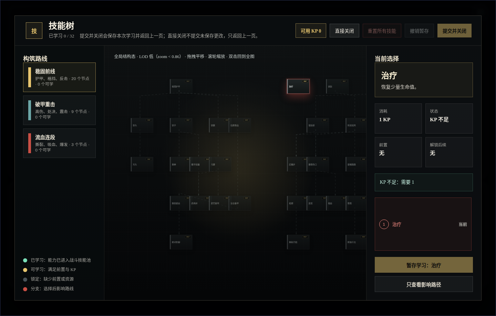
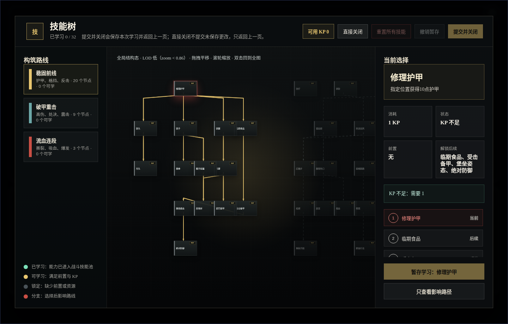
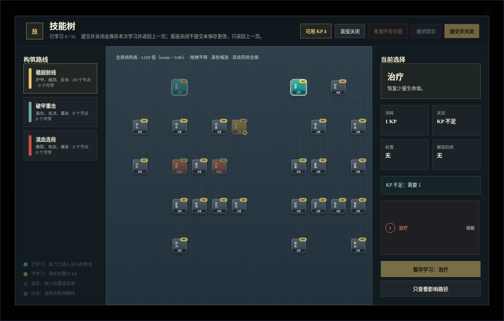
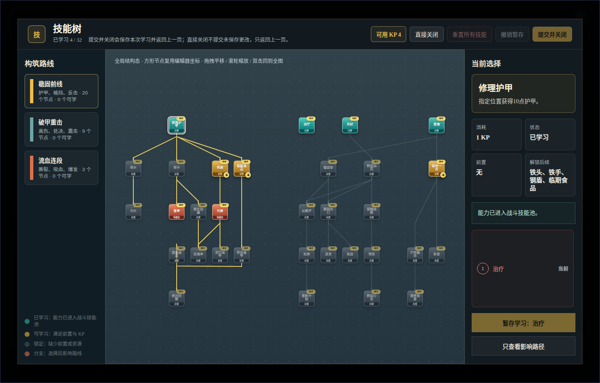

# NodeConsoleApp2 技能树方形节点视觉修正原型 v2

- 生成时间：2026-05-20 23:00:52 +0800
- 当前状态：待用户确认
- 目标页面：技能树弹层
- 目标路由：`http://127.0.0.1:3122/mock_ui_v11.html`
- 目标视口：`1440 x 920`
- 说明：本版按用户要求基于当前运行截图做评审图，因此使用当前可复现运行视口 `1440 x 920`，不冒充标准 `1920 x 1080` 静态画板。

## 本版定位

本版用于修正上一轮运行态视觉方向的问题：长方形节点破坏编辑器手工排布、全局态黑底黑节点不易读、已学/可学/未学状态不明显、KP 与加号挤占技能名。

本版建议改为：

1. 运行态节点回到接近编辑器的 `72 x 72` 方形。
2. 复用编辑器 `editorMeta.x/y`、前置关系和拓扑，不再用长方形卡片挤压人工布局。
3. 用整块节点底色表达状态，弱化底部图例依赖。
4. KP 使用右上角小徽章，状态使用底部短条，可学习加号放右下角且不遮挡技能名。
5. 左右栏压缩，把中央画布作为第一视觉主体。

## 非目标

本版只讨论技能树节点视觉和空间利用，不修改技能数据、KP 规则、前置关系、存档结构或战斗结算逻辑。

## 共用事实源与设计依据

- 用户批注：当前界面偏暗，状态不明显，长方形节点仍会重叠，技能名太小，KP 与加号占位不合理，图例不应承担主要识别。
- 编辑器事实源：`script/editor/skill/skillEditor.js` 中 `NODE_SIZE = 72`、`GRID_SIZE = 100`。
- 运行态事实源：当前分支技能树已使用 Canvas 绘制连接线，并复用编辑器坐标。
- 设计判断：运行态节点应扩充内容和状态，但不应改变编辑器人工布局的几何前提。

## 画板规格与布局预算

- 截图视口：`1440 x 920`
- 顶栏：约 `72px`
- 左侧路线栏：约 `210px`
- 右侧决策栏：约 `282px`
- 中央画布：剩余区域，作为首要视觉区域
- 节点基准：`72 x 72`

## 01 当前全局问题截图

- 文件：`01-current-global-1440x920.png`
- 评阅状态：问题证据
- 设计依据：用户要求先截当前图并分析问题。
- 观察点：黑底黑节点、状态只靠边框/小条、全局态难以识别已学/可学、节点视觉重叠。



## 02 当前选中态问题截图

- 文件：`02-current-selected-block-1440x920.png`
- 评阅状态：问题证据
- 设计依据：以“修理护甲”为例检查节点文字、KP、连线和右侧面板关系。
- 观察点：长方形节点与既有坐标不匹配，局部链路可读性依赖高亮线，节点本体仍不够清楚。



## 03 方形节点状态表达草案

- 文件：`03-prototype-square-states-global-1440x920.png`
- 评阅状态：中间草案
- 设计依据：验证“整块节点颜色表达状态”是否比图例更直观。
- 需要用户判断：已学、可学、待提交、前置这几类颜色是否够直观。



## 04 推荐实现方向

- 文件：`04-prototype-final-layout-1440x920.png`
- 评阅状态：推荐方案，待用户确认
- 设计依据：在 `72 x 72` 方形节点基础上压缩左右栏、放大中央画布、保留 KP 和直接学习加号。
- 自检结果：本截图中 `32` 个节点，检测到 `0` 组视觉重叠。
- 需要用户判断：这版是否作为下一轮代码实现基准。



## 原始材料说明

本版无外部原始图片。`01`、`02` 为当前运行态截图；`03`、`04` 为同一运行页面通过浏览器临时样式注入得到的视觉原型截图。

## 原型到实现映射

- 目标文件：
  - `script/ui/UI_SkillTreeModal.js`
  - `mock_ui_v11.css`
  - `test/skill_tree_visual_redesign.test.mjs`
- 实现重点：
  - 节点尺寸改回方形，锚点计算使用方形尺寸。
  - 状态 class 对应整块节点底色。
  - 可学习节点的 `+` 按钮可直接暂存学习。
  - 全局视角不隐藏状态表达，但文本可以更克制。
  - Canvas 连接线继续保留。
- 验收方法：
  - 截图比对 `04-prototype-final-layout-1440x920.png`。
  - DOM 检测节点视觉重叠为 `0`。
  - 回归测试覆盖状态、KP、直接加号学习、Canvas 连接层。

## 允许偏差与不可接受偏差

允许偏差：

- 具体色值可微调，但状态必须通过节点本体直接可见。
- 字号可按真实缩放略调，但技能名不能被 KP 或加号遮挡。
- 右侧 Inspector 文案可按运行态实际状态变化。

不可接受偏差：

- 重新使用长方形节点导致编辑器坐标失效。
- 已学/可学/前置只靠边框或图例识别。
- `+` 按钮遮挡技能名，或可学习节点不能直接点击 `+` 暂存学习。
- 全局态再次出现明显节点重叠。

## 查看与再生成

先启动服务：

```bash
cd /home/wgw/CodexProject/NodeConsoleApp2/.worktree/skill-optimization-20260518/NodeConsoleApp2
PORT=3122 node app.js
```

重新生成截图：

```bash
cd /home/wgw/CodexProject/NodeConsoleApp2/.worktree/skill-optimization-20260518/NodeConsoleApp2
node DOC/CODEX_DOC/08_原型与附图/2026-05-20-230052-NodeConsoleApp2-技能树方形节点视觉修正原型-v2/source/capture-skilltree-square-prototype.mjs
```

## 评审结论与后续处理

- 当前结论：待用户确认。
- 如果确认通过：按 `04-prototype-final-layout-1440x920.png` 实现运行态。
- 如果不通过：保留本版作为评审记录，新建 v3，不覆盖本版图片。
