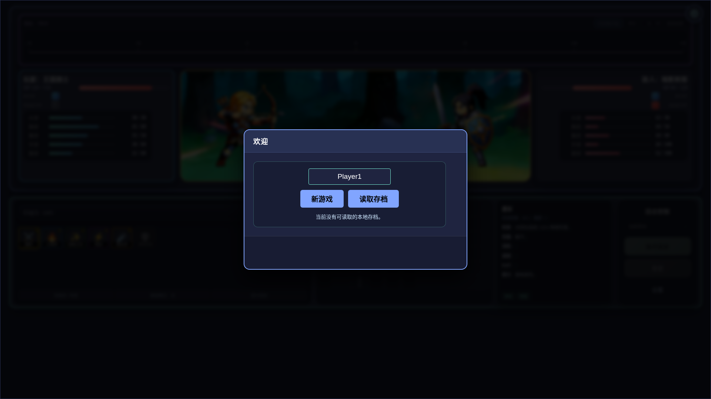
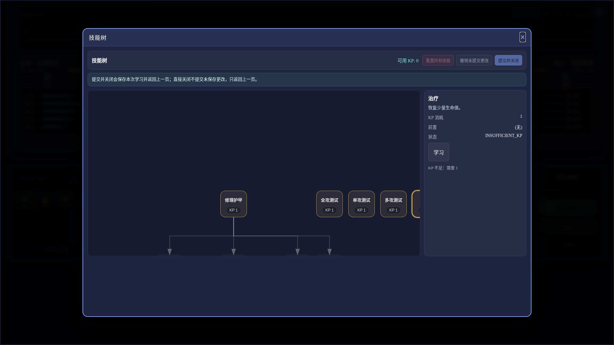
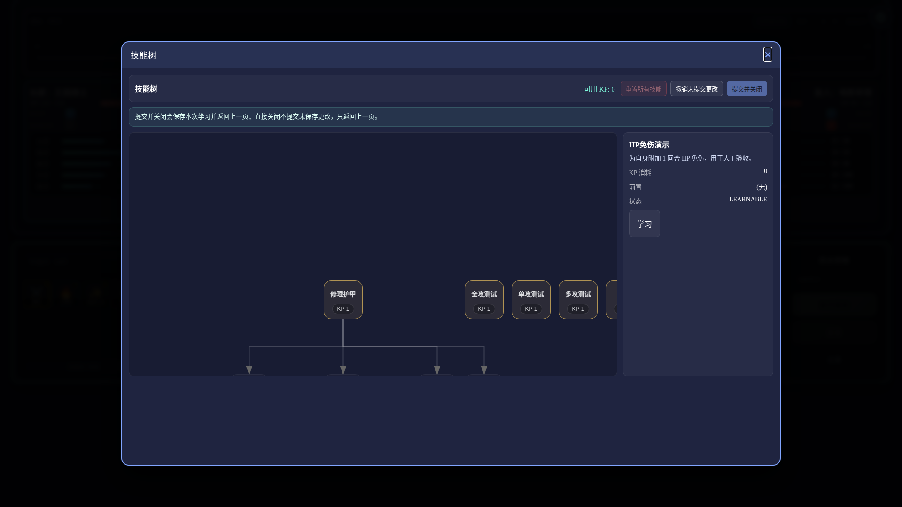
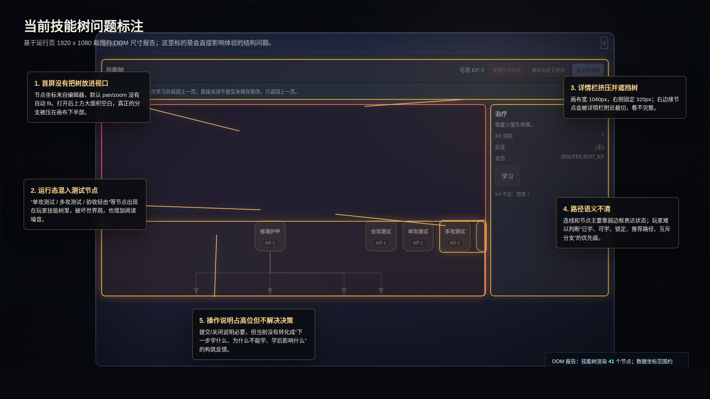
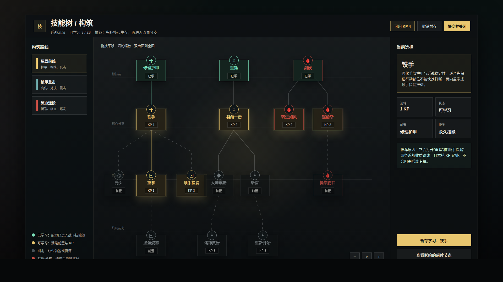
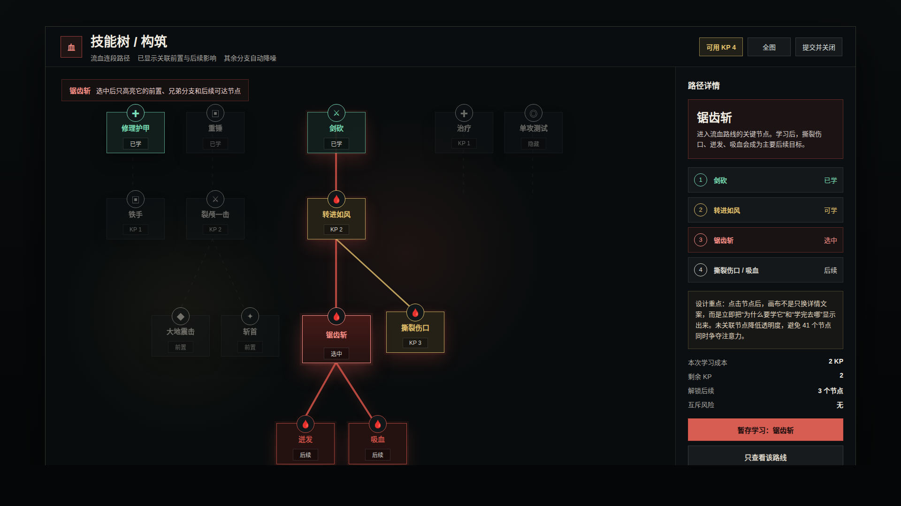

# NodeConsoleApp2 技能树视觉优化草图 v1

- 生成时间：2026-05-18 23:47:17 +0800
- 当前状态：待用户确认
- 适用页面：`mock_ui_v11.html` 的 `技能树 / 构筑` Overlay
- 页面主对象：运行态技能树、技能学习路径、右侧技能详情
- 主画板规格：1920 x 1080

## 本版定位

本版先不修改正式功能代码，只完成三件事：

1. 截取当前运行态技能树。
2. 标出当前技能树在默认展示、信息层级和构筑决策上的主要问题。
3. 给出一个更适合运行态玩家使用的视觉草图方向。

## 非目标

本版不是最终 UI 实现稿，不处理移动端，不改技能数据，也不承诺所有节点位置已经是最终排布。节点文案和分支名称用于说明设计意图，后续实现应绑定真实运行数据。

## 事实源与设计依据

1. 当前运行页面：`mock_ui_v11.html`
2. 当前技能树实现：`script/ui/UI_SkillTreeModal.js`
3. 当前技能树样本数据：`assets/data/skills_melee_v4_5.json`
4. 当前样式：`mock_ui_v11.css`
5. 当前运行截图与 DOM 报告：`original/`

设计判断：技能树是玩家做成长决策的界面，不应只复刻编辑器坐标。运行态首要目标是让玩家看懂“已学什么、现在能学什么、为什么不能学、学完通向哪里”。

## 画板规格与布局预算

- 桌面整体画板：1920 x 1080。
- 建议运行态弹窗安全区：约 1728 x 968，保留暗化背景。
- 建议布局：顶部资源与提交栏、左侧路线筛选、中央画布、右侧详情。
- 中央画布应默认 fit 全图，不能依赖玩家打开后手动拖拽找节点。

## 图文证据链

### 01 当前主流程截图

- 文件：`original/01-current-main-1920x1080.png`
- 评阅状态：事实源截图
- 设计依据：确认技能树入口在主流程左下技能面板中。
- 需要用户判断：无，主要作为入口证据。



### 02 当前技能树默认打开态

- 文件：`original/02-current-skilltree-overview-1920x1080.png`
- 评阅状态：事实源截图
- 设计依据：真实运行页打开技能树后的默认状态。
- 主要问题：上方大面积空白、节点被挤到画布下半部、右侧节点有裁切风险、测试节点混入运行态、状态语义弱。



### 03 当前技能树选中态

- 文件：`original/03-current-skilltree-selected-1920x1080.png`
- 评阅状态：事实源截图
- 设计依据：真实运行页点击节点后的详情状态。
- 主要问题：详情栏只给单点信息，没有把前置、后续、推荐路线转化为构筑判断。



### 04 当前问题标注图

- 文件：`04-current-problem-analysis-1920x1080.png`
- 评阅状态：问题分析图
- 设计依据：运行截图 + `current-skilltree-dom-report.json`。
- 需要用户判断：这些是否就是你认为“不好看 / 不好用”的核心问题，是否还缺少你在人工使用中观察到的问题。



### 05 建议设计：总览态

- 文件：`05-skilltree-concept-overview-1920x1080.png`
- 评阅状态：设计草图，待确认
- 设计依据：运行态需要先给玩家完整路径感和可学目标，而不是显示编辑器原始坐标。
- 需要用户判断：是否接受“左侧路线筛选 + 中央技能图 + 右侧详情”的结构。
- 允许偏差：具体颜色、图标和节点位置可以在实现中调整。



### 06 建议设计：选中路径态

- 文件：`06-skilltree-concept-selected-path-1920x1080.png`
- 评阅状态：设计草图，待确认
- 设计依据：点击节点后应降低无关分支噪声，突出前置、兄弟分支、后续可达节点和学习影响。
- 需要用户判断：是否接受“选中节点后局部聚焦 / 其他分支降噪”的交互方向。
- 允许偏差：实际高亮路径可由数据关系自动计算，不必完全复刻静态图位置。



## 原始材料说明

`original/` 保存当前运行页截图和 DOM 报告：

1. `01-current-main-1920x1080.png`：主流程入口。
2. `02-current-skilltree-overview-1920x1080.png`：当前默认打开态。
3. `03-current-skilltree-selected-1920x1080.png`：当前选中态。
4. `current-skilltree-dom-report.json`：节点数量、画布尺寸、详情栏尺寸等证据。

本版无外部原始图片。

## 原型到实现映射

- 目标路由：`http://127.0.0.1:<PORT>/mock_ui_v11.html`
- 目标组件：`script/ui/UI_SkillTreeModal.js`、`script/ui/UI_SkillTreeOverlay.js`
- 目标样式：`mock_ui_v11.css`
- 数据来源：`DataManagerV2.getSkillCatalog()` 与 `assets/data/skills_melee_v4_5.json`
- 后续验收方法：打开技能树，截取 1920 x 1080 默认态和选中态，比对是否满足全图可见、测试节点隐藏、状态语义清晰、选中路径聚焦。

## 允许偏差与不可接受偏差

允许偏差：

1. 节点精确坐标可由布局算法或数据迁移决定。
2. 图标可替换为项目统一图标体系。
3. 色彩可根据主 UI 主题微调。

不可接受偏差：

1. 默认打开后仍需要玩家手动拖拽才能找到主要节点。
2. 运行态继续展示测试 / 验收 / demo 节点。
3. 已学、可学、锁定、互斥、推荐路径无法一眼区分。
4. 选中节点后仍只显示单点详情，不显示前置与后续影响。
5. 右侧详情栏遮挡或裁切树节点。

## 查看与再生成

在 `NodeConsoleApp2` 目录运行：

```bash
PORT=3122 node app.js
node DOC/CODEX_DOC/08_原型与附图/2026-05-18-234717-NodeConsoleApp2-技能树视觉优化草图-v1/source/capture-current-skilltree.mjs
google-chrome --headless=new --disable-gpu --no-sandbox --allow-file-access-from-files --window-size=1920,1080 --screenshot=DOC/CODEX_DOC/08_原型与附图/2026-05-18-234717-NodeConsoleApp2-技能树视觉优化草图-v1/04-current-problem-analysis-1920x1080.png file://$PWD/DOC/CODEX_DOC/08_原型与附图/2026-05-18-234717-NodeConsoleApp2-技能树视觉优化草图-v1/source/current-problem-analysis.html
google-chrome --headless=new --disable-gpu --no-sandbox --allow-file-access-from-files --window-size=1920,1080 --screenshot=DOC/CODEX_DOC/08_原型与附图/2026-05-18-234717-NodeConsoleApp2-技能树视觉优化草图-v1/05-skilltree-concept-overview-1920x1080.png file://$PWD/DOC/CODEX_DOC/08_原型与附图/2026-05-18-234717-NodeConsoleApp2-技能树视觉优化草图-v1/source/skilltree-concept-overview.html
google-chrome --headless=new --disable-gpu --no-sandbox --allow-file-access-from-files --window-size=1920,1080 --screenshot=DOC/CODEX_DOC/08_原型与附图/2026-05-18-234717-NodeConsoleApp2-技能树视觉优化草图-v1/06-skilltree-concept-selected-path-1920x1080.png file://$PWD/DOC/CODEX_DOC/08_原型与附图/2026-05-18-234717-NodeConsoleApp2-技能树视觉优化草图-v1/source/skilltree-concept-selected-path.html
```

也可以直接打开：

- `source/current-problem-analysis.html`
- `source/skilltree-concept-overview.html`
- `source/skilltree-concept-selected-path.html`

## 自检结论

已完成：

1. 当前运行页截图生成。
2. 三张评审图均为 1920 x 1080。
3. 已人工查看三张评审图，未发现关键文字遮挡、主要对象裁切或画板比例错误。
4. 源文件、截图和 DOM 报告均保留在本版本包。

## 评审结论与后续处理

当前状态：待用户确认。

建议下一步：用户先确认采用哪条方向。若方向通过，再进入实现计划，处理运行态 fit 布局、隐藏测试节点、节点状态视觉层级、路径聚焦和详情栏信息结构。
