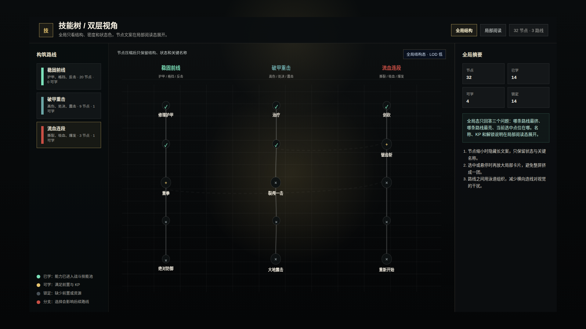
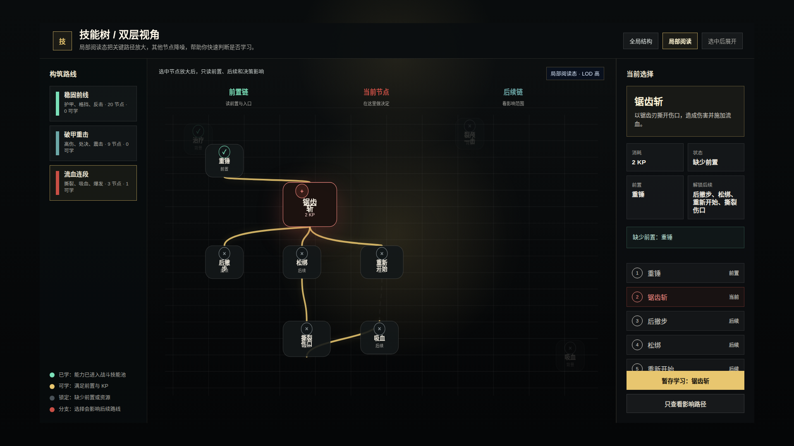

# NodeConsoleApp2 技能树双层视角原型 v1

- 生成时间：2026-05-19 00:45:00 +0800
- 当前状态：待用户确认
- 目标页面：技能树弹层
- 目标画板：1920 x 1080
- 本版目标：解决全局视角下技能节点拥挤、卡片互相抢视觉的问题。

## 本版定位

本版提供两张图，用于评审技能树下一步展示策略：

1. 全局结构态：把技能节点降级为点位，只保留状态色和少量关键名称。
2. 局部阅读态：选中节点后放大关键路径，保留卡片信息和右侧决策面板。

## 非目标

本版只讨论展示方式，不修改技能数据、技能前置、KP 计算或实际运行代码。

## 01 全局结构态

- 文件：`01-skilltree-global-structure-1920x1080.png`
- 设计意图：全局视角只看结构、路线和状态，不强行阅读所有技能。
- 关键变化：普通节点变成点位，关键节点才显示短名称，减少全屏卡片堆叠。



## 02 局部阅读态

- 文件：`02-skilltree-selected-reading-1920x1080.png`
- 设计意图：用户点选技能后，再进入可阅读卡片模式。
- 关键变化：当前节点、前置链、后续链放大；无关节点作为背景降噪。



## 查看与再生成

```bash
cd /home/wgw/CodexProject/NodeConsoleApp2/NodeConsoleApp2
CHROME_DEBUG_PORT=9451 node DOC/CODEX_DOC/08_原型与附图/2026-05-19-004500-NodeConsoleApp2-技能树双层视角原型-v1/source/capture-skilltree-lod-prototype.mjs
```

## 评审问题

1. 全局态是否接受“点位化”，还是希望保留更多技能名称？
2. 局部态是否足够清楚表达前置、当前和后续影响？
3. 是否把这个方向作为下一轮运行态实现标准？
