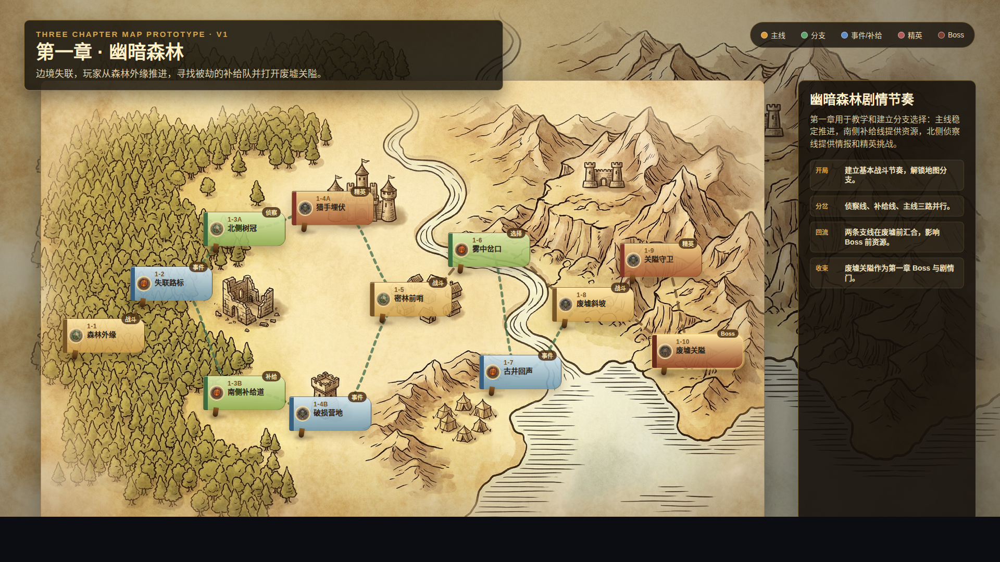
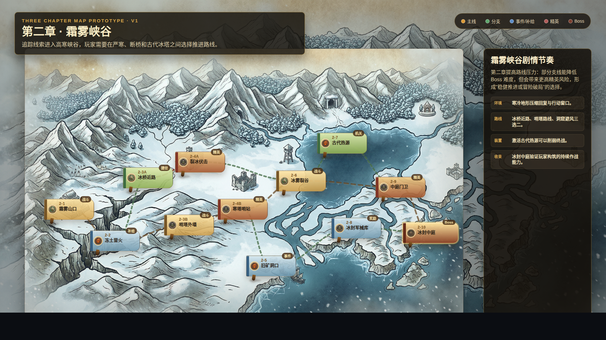
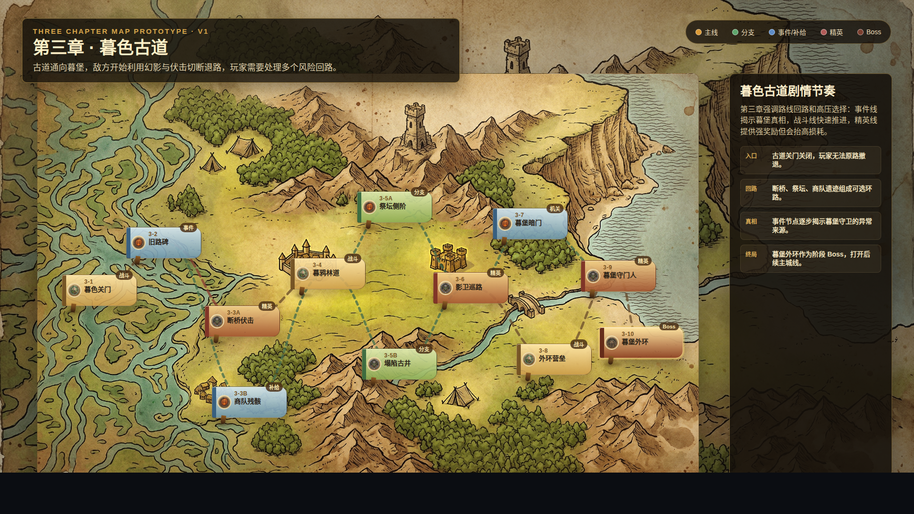

# 关卡地图三章节点方案 v1

- 生成时间：2026-05-19 16:36:14
- 当前状态：待用户确认
- 所属应用：NodeConsoleApp2
- 目标页面：主流程关卡选择地图、地图编辑器、地图预览页
- 目标画板规格：1920 x 1080，16:9
- 原型源文件：`source/three-chapter-map-prototype.html`

## 本版定位

本版用于回答“当前地图关卡设计是否合理”，并给出三张带简单剧情的关卡地图方案。每张地图设计为 12 个节点，包含主线、分支、事件/补给、精英、Boss 五类节点，用来验证章节节奏、路线选择、风险回报和右侧剧情说明是否成立。

当前运行态地图包 `assets/data/level_map_pack_v1.json` 中三章各只有 3 个节点，编辑器示例 `assets/data/level_map_pack_v1.example.json` 只有 1 张 4 节点示例图。因此当前地图作为演示骨架可以成立，但作为正式关卡地图不够合理：路线过短、选择过少、事件/补给/精英节奏不足，难以支撑一章内的探索感和策略选择。

## 非目标

本版不修改运行态地图数据，不修改地图编辑器，不修改主流程渲染逻辑，也不代表已写入 `assets/data/level_map_pack_v1.json`。本版只提供可评审的关卡结构和视觉原型。

## 共用事实源与设计依据

- 用户要求：给出带简单剧情的三张地图关卡方案，每张地图不少于 10 个节点，先不要改代码。
- 当前运行态数据：`assets/data/level_map_pack_v1.json`，三章各 3 节点。
- 当前编辑器示例数据：`assets/data/level_map_pack_v1.example.json`，1 张 4 节点示例图。
- 现有视觉资产：`source/map/` 三张地图背景图、`source/scene_icon/` 节点图标。
- 设计判断：一章地图建议至少提供“主线推进 + 1 到 2 条支线 + 回流 + Boss 前风险节点”，否则地图选择功能的价值不足。

## 画板规格与布局预算

- 主画板：1920 x 1080。
- 地图画布：左侧主区域，约 1390 x 848，用于展示节点、路径和背景地形。
- 右侧剧情栏：约 342 x 848，用于展示章节节奏、路线说明和用户需要判断的剧情节拍。
- 顶部标题与图例：只提供章节识别和类型说明，不承担操作入口。
- 静态图中的节点坐标是设计摆位，后续实现可通过数据坐标或编辑器布局写入。

## 图文证据链

### 01 - 第一章幽暗森林

- 文件：`01-1920x1080-第一章幽暗森林.png`
- 评阅状态：待用户确认
- 画板规格：1920 x 1080
- 设计依据：第一章承担教学和基础分支选择，主线应稳定，支线应轻量，Boss 前回流。
- 节点方案：森林外缘、失联路标、北侧树冠、猎手埋伏、南侧补给道、破损营地、密林前哨、雾中岔口、古井回声、废墟斜坡、关隘守卫、废墟关隘。
- 需要用户判断：第一章是否应该保留“侦察线 + 补给线 + 主线”的三路结构；Boss 前是否需要一个可跳过精英节点。
- 允许偏差：节点图标、坐标和具体命名可调整。
- 不可接受偏差：不能退回 3 节点直线结构，不能取消支线回流。



### 02 - 第二章霜雾峡谷

- 文件：`02-1920x1080-第二章霜雾峡谷.png`
- 评阅状态：待用户确认
- 画板规格：1920 x 1080
- 设计依据：第二章需要比第一章更有压力，路线选择围绕严寒、断桥、哨塔和古代装置展开。
- 节点方案：霜雾山口、冻土营火、冰桥近路、裂冰伏击、哨塔外墙、寒塔哨站、旧矿洞口、冰雾裂谷、古代热源、冰封军械库、中庭门卫、冰封中庭。
- 需要用户判断：第二章是否采用“冒险削弱 Boss 或稳健推进”的节奏；古代热源是否作为削弱终战的关键事件。
- 允许偏差：寒冷机制可先只在文案和节点类型中表达，后续再决定是否做实际数值效果。
- 不可接受偏差：不能只有一路战斗推进，必须保留至少一条高风险高收益支线。



### 03 - 第三章暮色古道

- 文件：`03-1920x1080-第三章暮色古道.png`
- 评阅状态：待用户确认
- 画板规格：1920 x 1080
- 设计依据：第三章应提高路线复杂度，用断桥、祭坛、商队遗迹和暮堡外环形成回路与真相揭示。
- 节点方案：暮色关门、旧路碑、断桥伏击、商队残骸、暮鸦林道、祭坛侧阶、塌陷古井、影卫巡路、暮堡暗门、外环营垒、暮堡守门人、暮堡外环。
- 需要用户判断：第三章是否应该加入“无法原路撤退”的剧情压力；事件线是否承担揭示暮堡异常来源。
- 允许偏差：暮色古道的回路数量和精英节点位置可在编辑器中微调。
- 不可接受偏差：不能把第三章做得比第二章更线性，至少保留两次有意义的路线选择。



## 原始材料说明

本版无外部原始图片。原型引用仓库内既有素材：

- `source/map/image_w2752_h1536_map-bg-01.jpeg`
- `source/map/image_w2752_h1536_map-bg-02-winter.jpeg`
- `source/map/image_w2752_h1536_map-bg-03.jpeg`
- `source/scene_icon/level-node-04-elemental_1000.png`
- `source/scene_icon/level-node-05-elf-archer_1000.png`
- `source/scene_icon/level-node-06-goblin-warrior_1000.png`
- `source/scene_icon/level-node-07-owlbear_1000.png`

`original/` 目录保留为空，用于后续放置用户批注截图或外部设计稿。

## 原型到实现映射

- 目标数据：确认后可扩展 `assets/data/level_map_pack_v1.json`，把每章从 3 节点改为 12 节点。
- 目标编辑器：地图编辑器应能读取同一份地图包，展示并编辑节点坐标、节点类型、路径和剧情字段。
- 目标运行页：主流程关卡选择地图应读取同一份地图包，展示节点、路径、选中态、右侧关卡说明。
- 目标组件：`LevelSelectMapView`、地图编辑器页面、地图预览页。
- 验收方法：确认方案后，运行主流程和地图编辑器，截图比对节点数量、路线结构、选中态右侧信息和背景一致性。

## 允许偏差与不可接受偏差

允许偏差：

- 节点中文名、图标、精确坐标、路线曲线可根据编辑器和实际画布微调。
- 章节剧情可以在不改变地图结构的前提下改写。
- 事件/补给节点可以根据数值设计合并或拆分。

不可接受偏差：

- 每章少于 10 个节点。
- 缺少分支、回流或 Boss 前风险选择。
- 主流程地图与地图编辑器读取不同事实源，导致两边显示结构不一致。
- 右侧信息栏仍为空或只展示极少字段，不能支撑点选关卡后的决策。

## 查看与再生成

打开源文件：

```bash
cd /home/wgw/CodexProject/NodeConsoleApp2/.worktree/map-optimization-20260518/NodeConsoleApp2
google-chrome --allow-file-access-from-files "file://$PWD/DOC/CODEX_DOC/08_原型与附图/2026-05-19-163614-关卡地图三章节点方案-v1/source/three-chapter-map-prototype.html?map=1"
google-chrome --allow-file-access-from-files "file://$PWD/DOC/CODEX_DOC/08_原型与附图/2026-05-19-163614-关卡地图三章节点方案-v1/source/three-chapter-map-prototype.html?map=2"
google-chrome --allow-file-access-from-files "file://$PWD/DOC/CODEX_DOC/08_原型与附图/2026-05-19-163614-关卡地图三章节点方案-v1/source/three-chapter-map-prototype.html?map=3"
```

重新生成三张 1920 x 1080 截图：

```bash
cd /home/wgw/CodexProject/NodeConsoleApp2/.worktree/map-optimization-20260518/NodeConsoleApp2
PKG="$PWD/DOC/CODEX_DOC/08_原型与附图/2026-05-19-163614-关卡地图三章节点方案-v1"
google-chrome --headless=new --no-sandbox --disable-gpu --allow-file-access-from-files --force-device-scale-factor=1 --window-size=1920,1080 --screenshot="$PKG/01-1920x1080-第一章幽暗森林.png" "file://$PKG/source/three-chapter-map-prototype.html?map=1"
google-chrome --headless=new --no-sandbox --disable-gpu --allow-file-access-from-files --force-device-scale-factor=1 --window-size=1920,1080 --screenshot="$PKG/02-1920x1080-第二章霜雾峡谷.png" "file://$PKG/source/three-chapter-map-prototype.html?map=2"
google-chrome --headless=new --no-sandbox --disable-gpu --allow-file-access-from-files --force-device-scale-factor=1 --window-size=1920,1080 --screenshot="$PKG/03-1920x1080-第三章暮色古道.png" "file://$PKG/source/three-chapter-map-prototype.html?map=3"
```

## 评审结论与后续处理

当前结论：待用户确认。

建议评审顺序：

1. 先确认三章各 12 节点的节奏是否符合预期。
2. 再确认每章的分支数量、Boss 前风险选择和事件/补给分布。
3. 最后确认是否把本方案写入正式地图包，并同步主流程、地图编辑器和地图预览页。

