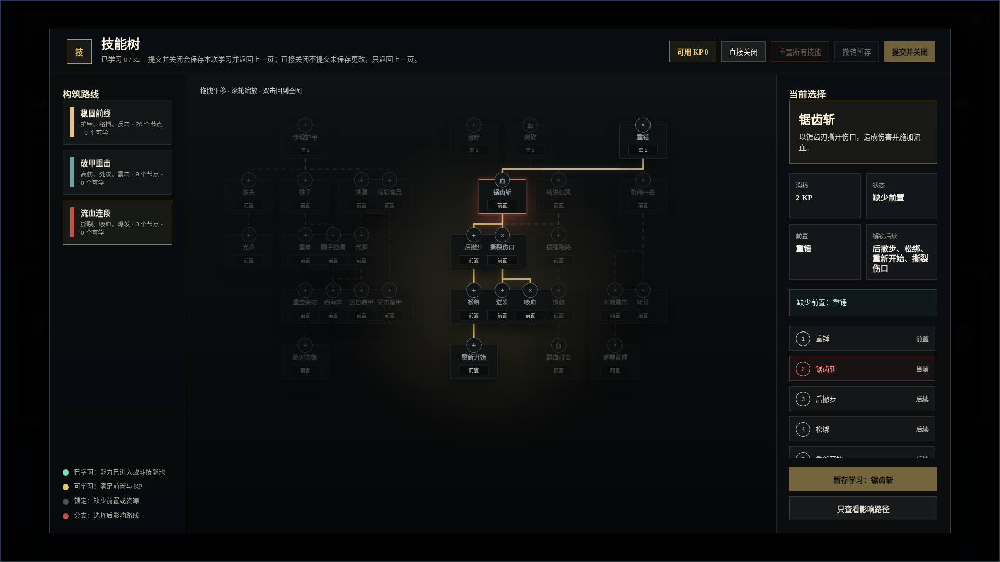

# 技能树运行态重设计截图验证

- 生成时间：2026-05-19 00:41:02 +0800
- 当前状态：待人工验收
- 目标页面：`mock_ui_v11.html` 的技能树弹层
- 实现依据：`2026-05-18-234717-NodeConsoleApp2-技能树视觉优化草图-v1`
- 画板规格：1920 x 1080

## 本版定位

本包记录已批准技能树草图落地到真实运行页后的截图验证。重点验证大尺寸暗色战术面板、左侧构筑路线、中央技能图谱、右侧决策面板、选中路径高亮、隐藏测试节点过滤、顶栏提交/直接关闭动作。

## 非目标

本包不重新定义技能数值、技能前置关系、战斗结算给多少 KP，也不替代技能编辑器的坐标编辑能力。运行页会把编辑器坐标投影到更适合阅读的画布密度。

## 图文证据链

### 01-runtime-skilltree-overview-1920x1080.png

- 评阅状态：待人工验收
- 设计依据：总览态应优先表达技能树本体，左侧路线与右侧详情只是辅助观察面。
- 需要判断：整体视觉密度、节点尺寸、三栏布局、顶栏动作是否符合已批准草图。
- 允许偏差：真实技能名称和前置关系来自当前技能包，和草图样例文字可不同。


### 02-runtime-skilltree-selected-path-1920x1080.png

- 评阅状态：待人工验收
- 设计依据：选中态必须突出当前节点、前置和后续影响路径，右侧展示消耗、状态、前置、解锁后续和可操作按钮。
- 需要判断：路径高亮、非相关节点降噪、右侧列表与按钮是否清楚且不互相遮挡。
- 自动检查：`runtime-skilltree-redesign-report.json` 中 `actionsOverlapChain` 为 `false`。



## 原型到实现映射

- `UI_SkillTreeModal.js`：运行态树结构、坐标投影、路线归类、选中路径、右侧决策面板。
- `mock_ui_v11.css`：已批准暗色战术视觉、三栏布局、节点/连线/路径样式。
- `skills_melee_v4_5.json`：使用 `editorMeta.hiddenInSkillTree` 隐藏测试/验收用技能节点。
- `skill_tree_visual_redesign.test.mjs`：DOM 结构、过滤、中文详情、坐标密度和遮挡回归测试。

## 查看与再生成

```bash
cd /home/wgw/CodexProject/NodeConsoleApp2/NodeConsoleApp2
PORT=3122 node app.js
CHROME_DEBUG_PORT=9447 node DOC/CODEX_DOC/08_原型与附图/2026-05-19-skilltree-runtime-redesign-verification/capture-runtime-skilltree-redesign.mjs
```

## 当前结论

运行截图与自动报告显示：32 个正式技能节点渲染，测试/验收样例节点未出现在技能树文本中，默认缩放为 `scale(0.81382)`，右侧路径列表与底部操作区没有覆盖。状态仍为待人工验收。
