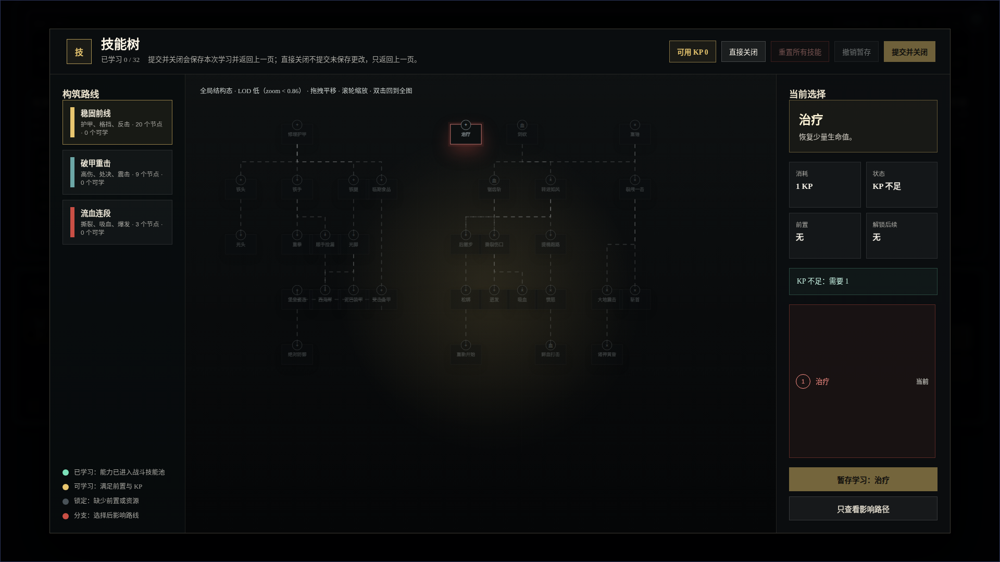
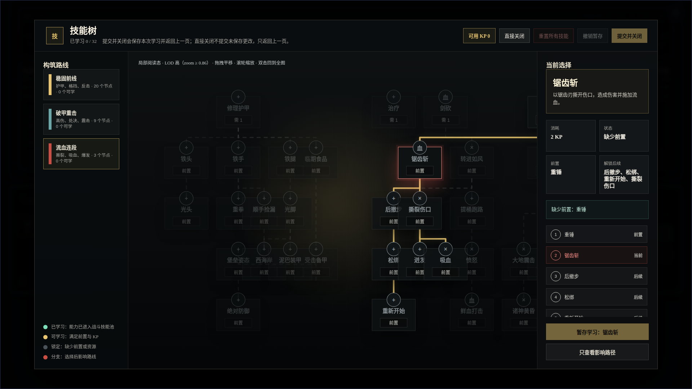

# 技能树运行态 LOD 实验截图验证

- 生成时间：2026-05-19 17:59:11 +0800
- 当前状态：待人工验收
- 目标页面：`mock_ui_v11.html` 的技能树弹层
- 实现依据：`2026-05-18-234717-NodeConsoleApp2-技能树视觉优化草图-v1`
- 画板规格：1920 x 1080

## 本版定位

本包记录“全局视角技能挤在一起”后的运行态 LOD 实验。重点不是重新发明两段视角，而是把切换时机明确下来：

1. `zoom < 0.86`：全局结构态。节点压缩为 74 x 48 的短标签卡，只保留名称、路线图标、状态色和连线，隐藏 KP / 状态 meta。
2. `zoom >= 0.86`：局部阅读态。节点恢复 112 x 82 阅读卡，显示名称、状态 meta、路径高亮和右侧决策面板。
3. 回切缓冲：`zoom <= 0.82` 才从阅读态退回结构态，避免滚轮临界值附近来回抖动。

## 非目标

本包不重新定义技能数值、技能前置关系、战斗结算给多少 KP，也不替代技能编辑器的坐标编辑能力。运行页仍使用当前技能包与坐标投影，只改变运行态的缩放展示层级。

## 图文证据链

### 01-runtime-skilltree-overview-1920x1080.png

- 评阅状态：待人工验收
- 展示状态：全局结构态，`runtime-skilltree-redesign-report.json` 中 `structure.lod = "structure"`。
- 设计依据：总览态只回答路线结构、节点状态、当前选中在哪里，不强迫玩家阅读全部技能细节。
- 需要判断：节点短标签是否比原大卡片堆叠更清楚，是否保留足够的技能名称识别度。
- 自动检查：`structure.compactNodeCount = 32`，`structure.metaCount = 0`，隐藏测试节点未出现在文本中。



### 02-runtime-skilltree-reading-lod-1920x1080.png

- 评阅状态：待人工验收
- 展示状态：局部阅读态，脚本在真实页面滚轮放大到 `scale(1.08319)` 后截图，`reading.lod = "reading"`。
- 设计依据：当玩家放大或聚焦路径时，再恢复完整技能卡阅读，避免全局状态下 32 张卡片互相抢视觉。
- 需要判断：阅读态是否比全局态更适合看选中技能的前置、后续和当前状态。
- 自动检查：`reading.metaCount = 32`，`reading.actionsOverlapChain = false`。



## 原型到实现映射

- `UI_SkillTreeModal.js`：运行态树结构、坐标投影、路线归类、LOD 阈值、选中路径、右侧决策面板。
- `mock_ui_v11.css`：已批准暗色战术视觉、三栏布局、结构态紧凑节点、阅读态卡片节点、连线/路径样式。
- `skills_melee_v4_5.json`：使用 `editorMeta.hiddenInSkillTree` 隐藏测试/验收用技能节点。
- `skill_tree_visual_redesign.test.mjs`：DOM 结构、过滤、中文详情、坐标密度、LOD 阈值和遮挡回归测试。

## 查看与再生成

```bash
cd /home/wgw/CodexProject/NodeConsoleApp2/NodeConsoleApp2
PORT=3122 node app.js
CHROME_DEBUG_PORT=9448 node DOC/CODEX_DOC/08_原型与附图/2026-05-19-skilltree-runtime-redesign-verification/capture-runtime-skilltree-redesign.mjs
```

## 当前结论

运行截图与自动报告显示：32 个正式技能节点渲染；默认全图为 `structure`，`scale(0.81382)`，节点 meta 全部隐藏；放大后为 `reading`，`scale(1.08319)`，32 个节点恢复 meta；测试/验收样例节点未出现在技能树文本中，右侧路径列表与底部操作区没有覆盖。状态仍为待人工验收。
