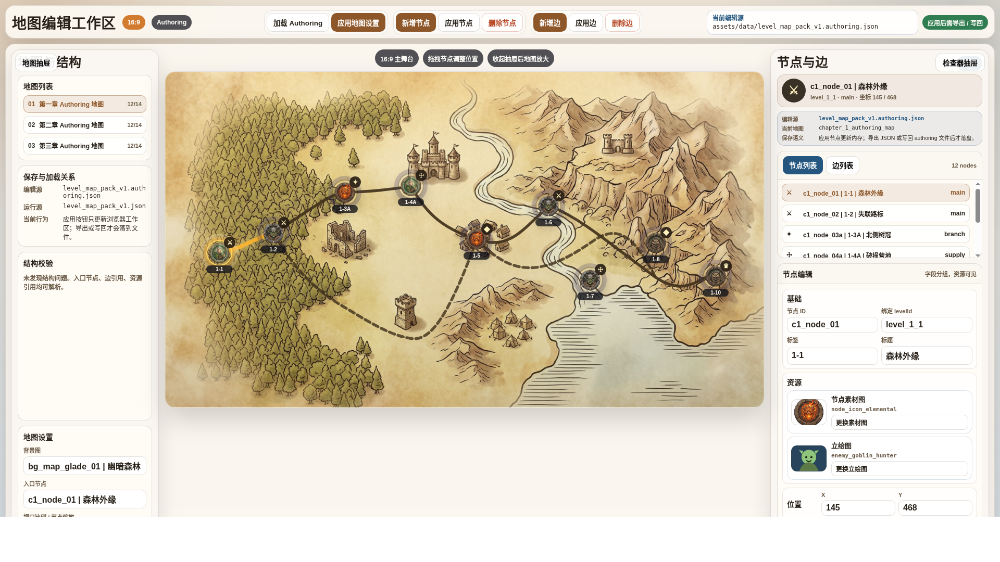

# 地图编辑器检查器重设计原型 v1

- 生成时间：2026-05-20 22:48:25
- 当前状态：待用户确认
- 所属应用：NodeConsoleApp2
- 目标页面：`test/level_map_editor_v1.html`
- 目标画板规格：1920 x 1080，16:9
- 原型源文件：`source/map-editor-inspector-redesign.html`
- 评审图：`01-1920x1080-地图编辑器检查器重设计总览.png`

## 本版定位

本版只处理地图编辑器的可用性和检查器信息层级，不改运行页面代码。它回应当前评审中暴露的三个核心问题：

1. 右侧检查器把节点列表、节点字段和资源字段挤成一团，无法看清。
2. 节点素材图、立绘图不能只是下拉框，必须可视化显示当前资源。
3. “保存地图”语义不清，必须明确当前编辑源、运行加载源，以及应用、导出、写回之间的区别。

## 非目标

本版不改地图数据，不改主流程运行地图，不实现文件写回能力，不替代后续交互实现计划。它只作为下一轮 UI 实现前的原型评审依据。

## 共用事实源与设计依据

- 用户反馈：右侧检查器和节点列表挤在一起，节点素材图/立绘图排版不可接受；保存地图不知道保存到哪里。
- 当前编辑入口：`test/level_map_editor_v1.html`。
- 当前 authoring 数据源：`assets/data/level_map_pack_v1.authoring.json`。
- 当前运行加载源：`assets/data/level_map_pack_v1.json`。
- 现有素材：`source/map/`、`source/scene_icon/`、`assets/images/level_map/portraits/`。
- 设计判断：地图编辑器是工具台，不应把所有字段平铺；右侧检查器应固定为“当前对象摘要、对象列表、字段编辑”三段结构。

## 画板规格与布局预算

- 主画板：1920 x 1080。
- 顶部工具栏：约 64px，承载全局操作和保存目标。
- 左侧地图抽屉：约 284px，承载地图列表、保存与加载关系、结构校验、地图设置。
- 中央地图：保留为主视觉，抽屉收起后继续放大。
- 右侧检查器：约 420px，固定三段结构：
  - 顶部：当前对象摘要与保存语义。
  - 中部：节点列表 / 边列表。
  - 底部：节点字段编辑，资源卡必须在首屏可见。

## 图文证据链

### 01 - 地图编辑器检查器重设计总览

- 文件：`01-1920x1080-地图编辑器检查器重设计总览.png`
- 评阅状态：待用户确认
- 画板规格：1920 x 1080
- 设计依据：右侧检查器必须先解决“看不清对象、看不见资源、看不懂保存目标”的问题。
- 需要用户判断：
  - 右侧三段式结构是否比当前表单堆叠清楚。
  - 节点素材图、立绘图是否应按这种缩略图资源卡展示。
  - “当前编辑源 / 运行源 / 应用后需导出或写回”的保存语义是否足够明确。
- 允许偏差：颜色、按钮文案、列表高度和字段顺序可在实现时微调。
- 不可接受偏差：资源字段退回普通下拉框；保存目标不可见；节点列表和字段区继续互相挤压。



## 原始材料说明

本版无外部原始图片。原型引用仓库内既有素材：

- `source/map/image_w2752_h1536_map-bg-01.jpeg`
- `source/scene_icon/level-node-04-elemental_1000.png`
- `source/scene_icon/level-node-05-elf-archer_1000.png`
- `source/scene_icon/level-node-06-goblin-warrior_1000.png`
- `source/scene_icon/level-node-07-owlbear_1000.png`
- `assets/images/level_map/portraits/enemy_goblin_hunter.svg`

`original/` 目录仅保留说明文件，用于后续放置用户批注截图。

## 原型到实现映射

- 目标路由：`test/level_map_editor_v1.html`
- 目标结构：
  - 顶部工具栏显示当前编辑源和写回语义。
  - 左侧抽屉显示“编辑源 / 运行源 / 当前行为”。
  - 右侧检查器拆成摘要、列表、编辑三段。
  - 节点资源字段改为缩略图资源卡。
- 数据来源：
  - 当前编辑源：`assets/data/level_map_pack_v1.authoring.json`
  - 当前运行源：`assets/data/level_map_pack_v1.json`
- 验收方法：
  - 1920 x 1080 截图确认右侧资源卡和保存目标可见。
  - DOM/截图检查无横向溢出。
  - 编辑器测试继续覆盖节点、边、地图设置和 authoring 地图包。

## 允许偏差与不可接受偏差

允许偏差：

- 字体、阴影、圆角、按钮色阶可以根据现有页面风格微调。
- 节点列表和字段区高度可根据实际浏览器空间调整。
- 资源卡可用真实 select、弹层或资源选择器实现。

不可接受偏差：

- 保存按钮仍叫“保存地图”且不说明保存到哪里。
- 资源字段仍只显示普通下拉框。
- 右侧节点列表和字段编辑继续混在一个小滚动区域。
- authoring 编辑源和运行加载源继续不可见。

## 查看与再生成

打开原型源文件：

```bash
cd /home/wgw/CodexProject/NodeConsoleApp2/.worktree/map-optimization-20260518/NodeConsoleApp2
google-chrome --allow-file-access-from-files "file://$PWD/DOC/CODEX_DOC/08_原型与附图/2026-05-20-224825-NodeConsoleApp2-地图编辑器检查器重设计原型-v1/source/map-editor-inspector-redesign.html"
```

重新生成 1920 x 1080 截图：

```bash
cd /home/wgw/CodexProject/NodeConsoleApp2/.worktree/map-optimization-20260518/NodeConsoleApp2
PKG="$PWD/DOC/CODEX_DOC/08_原型与附图/2026-05-20-224825-NodeConsoleApp2-地图编辑器检查器重设计原型-v1"
google-chrome --headless=new --no-sandbox --disable-gpu --allow-file-access-from-files --force-device-scale-factor=1 --window-size=1920,1080 --screenshot="$PKG/01-1920x1080-地图编辑器检查器重设计总览.png" "file://$PKG/source/map-editor-inspector-redesign.html"
```

## 评审结论与后续处理

当前结论：待用户确认。

建议先确认这张原型图的结构是否成立，再决定是否按它改 `test/level_map_editor_v1.html`。
