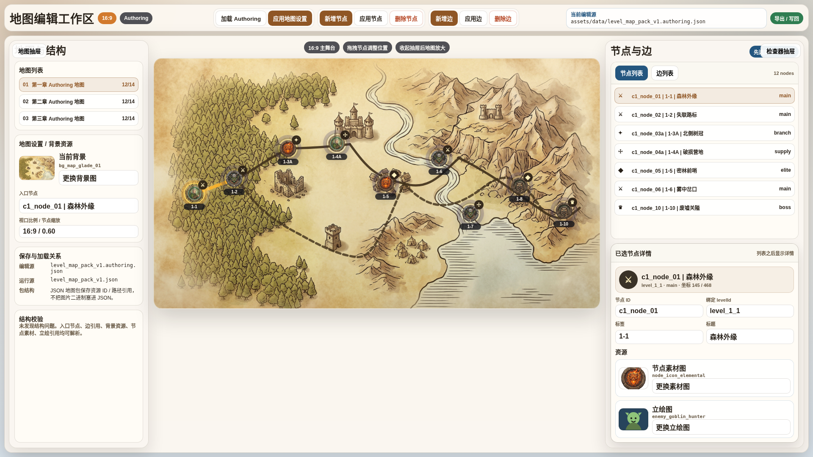
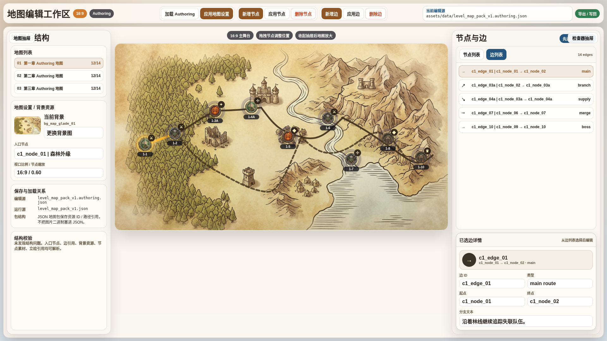
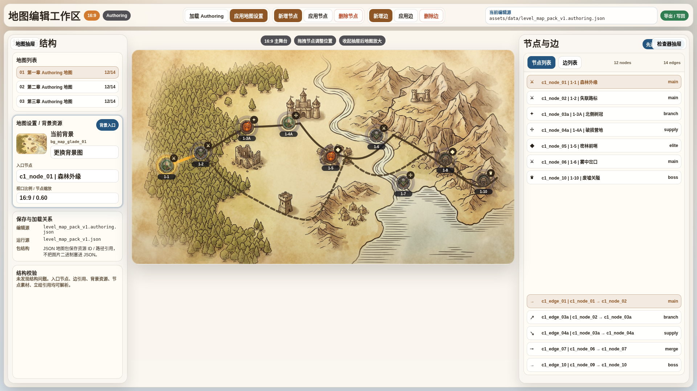
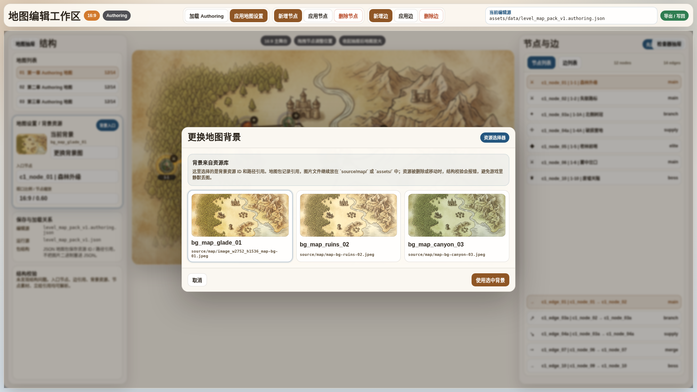
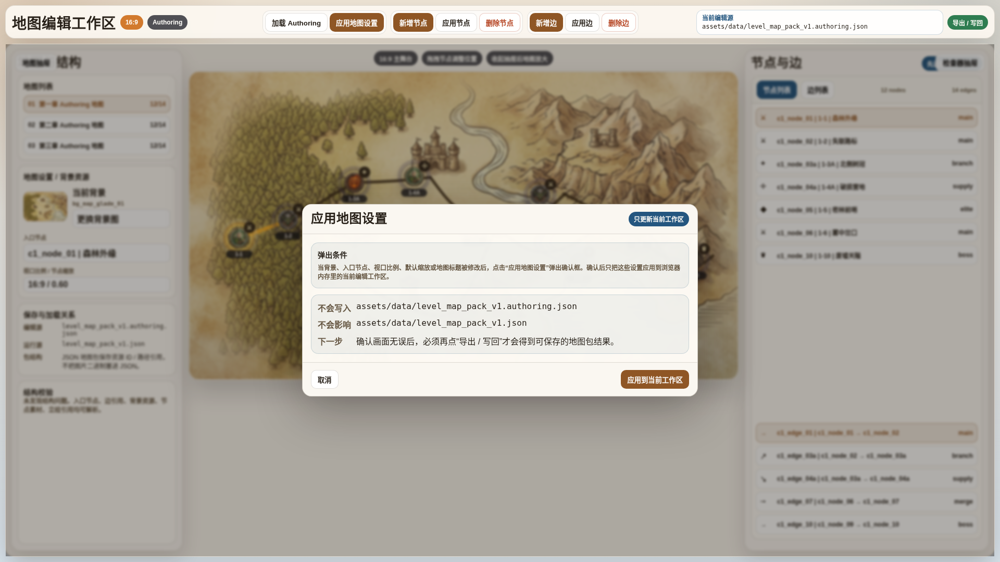
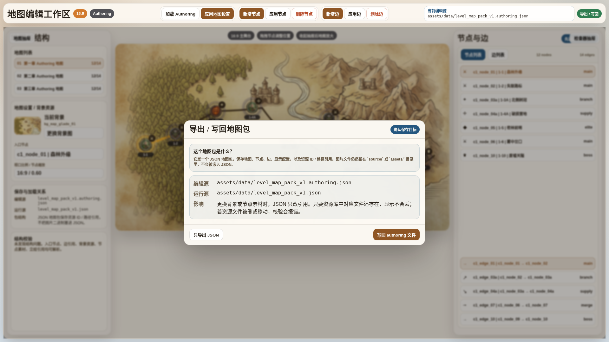

# 地图编辑器检查器重设计原型 v2

- 生成时间：2026-05-20 23:02:00
- 当前状态：待用户确认
- 所属应用：NodeConsoleApp2
- 目标页面：`test/level_map_editor_v1.html`
- 目标画板规格：1920 x 1080，16:9
- 原型源文件：`source/map-editor-inspector-redesign-v2.html`
- 截图脚本：`source/capture-map-editor-inspector-redesign-v2.mjs`
- 截图报告：`prototype-report.json`

## 本版定位

本版只画地图编辑器 UI 原型，不改产品代码。它回应当前评审里的四个问题：

1. 右侧检查器必须先显示节点列表和边列表，再显示当前选中节点或边的详情。
2. 左侧必须明确显示地图背景在哪里换，并给出背景资源选择器状态。
3. “应用地图设置”必须弹确认框，并说明它只更新当前浏览器工作区。
4. “导出 / 写回”必须说明保存目标，以及地图包是 JSON 资源引用包，不是把图片二进制塞进 JSON。

## 保存与资源包语义

- 编辑源：`assets/data/level_map_pack_v1.authoring.json`
- 运行源：`assets/data/level_map_pack_v1.json`
- “应用地图设置”：只把地图标题、背景、入口节点、视口比例、默认缩放等设置应用到浏览器内存里的当前工作区，不写文件。
- “导出 / 写回”：弹出确认框后选择保存方式，才生成可持久化结果。
- 地图包本质：JSON 地图包，保存地图、节点、边、显示配置、资源 ID 和路径引用。
- 资源文件：背景图、节点素材图、立绘图仍在 `source/` 或 `assets/` 目录中。若资源文件被删除或移动，结构校验应该报错，避免运行时静默丢图。

## 图文证据链

### 01 - 右侧节点列表优先

- 文件：`01-1920x1080-右侧节点列表优先.png`
- 设计意图：右侧检查器先列出节点，再在列表下方显示已选节点详情和资源卡。
- 评审重点：节点列表是否足够清楚，详情是否不会抢占列表空间。



### 02 - 右侧边列表优先

- 文件：`02-1920x1080-右侧边列表优先.png`
- 设计意图：边编辑时先看边列表，再编辑已选边的起点、终点、类型和描述。
- 评审重点：边列表和边详情是否符合“先选对象，再编辑”的工作流。



### 03 - 左侧背景资源更换入口

- 文件：`03-1920x1080-左侧背景资源更换入口.png`
- 设计意图：背景入口放在左侧地图列表之后，和入口节点、视口比例放在同一组地图设置里。
- 评审重点：是否能第一眼看到背景在哪里换。



### 04 - 背景资源选择器弹窗

- 文件：`04-1920x1080-背景资源选择器弹窗.png`
- 设计意图：更换背景不是填裸路径，而是从资源库选择背景资源。
- 评审重点：资源引用、路径、缺失校验的说明是否足够清楚。



### 05 - 应用地图设置确认弹窗

- 文件：`05-1920x1080-应用地图设置确认弹窗.png`
- 设计意图：点击“应用地图设置”后弹确认框，明确只更新当前工作区。
- 评审重点：用户是否能理解它不是保存，不会写回 authoring 文件，也不会影响运行源。



### 06 - 导出写回地图包说明弹窗

- 文件：`06-1920x1080-导出写回地图包说明弹窗.png`
- 设计意图：导出和写回前明确保存目标、包结构和资源引用风险。
- 评审重点：是否能解决“保存到哪里”“是不是只是 JSON”“资源换了会不会丢”的疑问。



## 原始材料说明

本版无外部原始图片。原型引用仓库内既有素材：

- `source/map/image_w2752_h1536_map-bg-01.jpeg`
- `source/scene_icon/level-node-04-elemental_1000.png`
- `source/scene_icon/level-node-05-elf-archer_1000.png`
- `source/scene_icon/level-node-06-goblin-warrior_1000.png`
- `source/scene_icon/level-node-07-owlbear_1000.png`
- `assets/images/level_map/portraits/enemy_goblin_hunter.svg`

`original/` 目录仅保留说明文件，用于后续放置用户批注截图或当前线上截图。

## 原型到实现映射

- 右侧检查器：改成“节点列表 / 边列表”作为主区域，选中后在列表下方展示对应详情。
- 左侧地图设置：背景资源、入口节点、视口比例、节点缩放放在地图列表后面。
- 背景资源：使用资源选择器，字段保存资源 ID 和路径引用。
- 应用地图设置：弹确认框，只更新内存工作区。
- 导出 / 写回：弹确认框，明确输出到 authoring 或导出 JSON。

## 查看与再生成

打开原型源文件：

```bash
cd /home/wgw/CodexProject/NodeConsoleApp2/.worktree/map-optimization-20260518/NodeConsoleApp2
google-chrome --allow-file-access-from-files "file://$PWD/DOC/CODEX_DOC/08_原型与附图/2026-05-20-230200-NodeConsoleApp2-地图编辑器检查器重设计原型-v2/source/map-editor-inspector-redesign-v2.html?state=node"
```

重新生成全部 1920 x 1080 截图：

```bash
cd /home/wgw/CodexProject/NodeConsoleApp2/.worktree/map-optimization-20260518/NodeConsoleApp2
node DOC/CODEX_DOC/08_原型与附图/2026-05-20-230200-NodeConsoleApp2-地图编辑器检查器重设计原型-v2/source/capture-map-editor-inspector-redesign-v2.mjs
```

可用状态参数：

- `?state=node`
- `?state=edge`
- `?state=bg`
- `?state=picker`
- `?state=apply`
- `?state=package`

## 评审结论与后续处理

当前结论：待用户确认。

如果这个结构成立，下一步才进入编辑器实现；当前原型包没有修改 `script/editor/`、`test/` 或运行地图数据。
