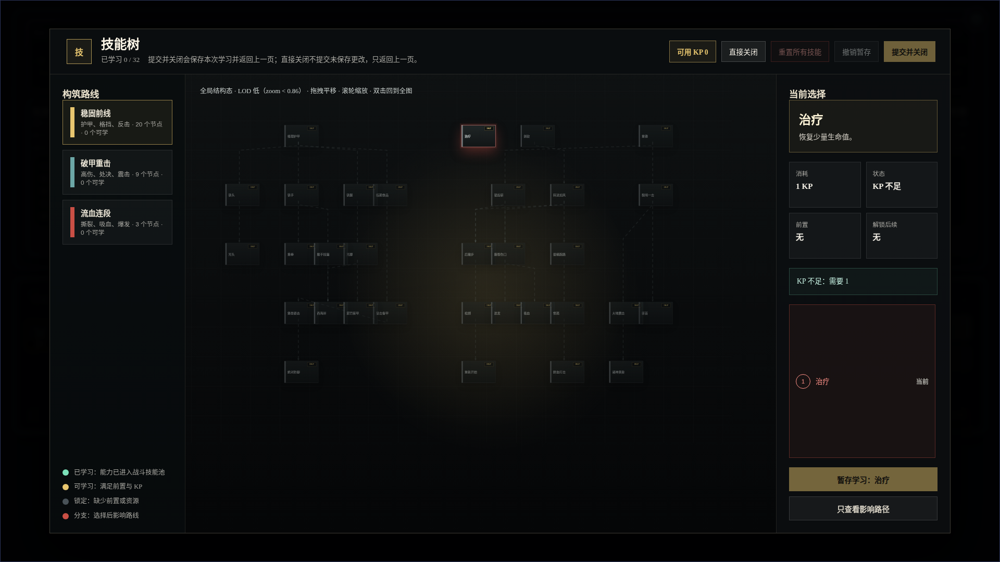
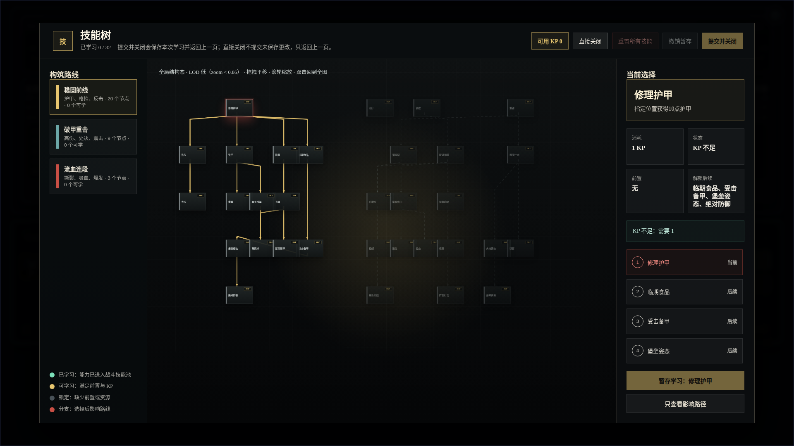
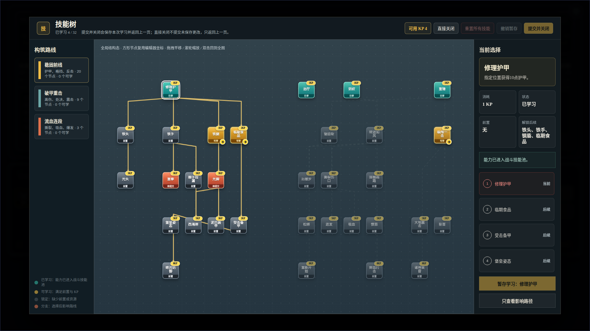

# NodeConsoleApp2 技能树方形节点视觉修正原型 v3

- 生成时间：2026-05-20 23:09:19 +0800
- 当前状态：用户已确认，已按本原型实现，待运行态人工验收
- 目标页面：技能树弹层
- 目标路由：`http://127.0.0.1:3122/mock_ui_v11.html`
- 目标画板规格：`1920 x 1080`
- 本版修正：v2 错误使用 `1440 x 920` 运行截图作为正式原型图，本版改回项目默认原型画板 `1920 x 1080`。

## 本版定位

本版用于评审技能树节点视觉修正方向，解决当前运行态的几个问题：

1. 长方形节点破坏编辑器人工排好的 `72 x 72` 节点布局。
2. 黑底黑节点导致全局态看不清已学、可学、未学差异。
3. KP 和直接学习 `+` 的位置容易挤压技能名。
4. 左右面板占用过多，中央画布不够像主对象。

本版推荐：运行态复用编辑器拓扑和坐标，但节点视觉回到方形；节点内容、状态、KP、加号由运行态动态扩充。

## 非目标

本版不修改技能数据、前置关系、KP 计算、存档结构或战斗结算逻辑。

## 共用事实源与设计依据

- 用户批注：正式原型图应为 `1920 x 1080`，当前界面偏暗，长方形节点仍重叠，状态不明显，节点名/KP/加号空间处理不合理。
- 编辑器事实源：`script/editor/skill/skillEditor.js` 中 `NODE_SIZE = 72`、`GRID_SIZE = 100`。
- 运行态事实源：当前技能树已复用 `editorMeta.x/y` 和 Canvas 连接线。
- 设计判断：节点位置、连接关系、拓扑关系应复用编辑器定义；每个节点的学习状态、KP、加号等运行态内容可以动态扩展。

## 画板规格与布局预算

- 主画板：`1920 x 1080`
- 顶栏：约 `72px`
- 左侧路线栏：约 `210px`
- 右侧决策栏：约 `282px`
- 中央画布：剩余区域，作为第一视觉主体
- 节点基准：`72 x 72`

## 01 当前全局问题截图

- 文件：`01-current-global-1920x1080.png`
- 评阅状态：问题证据
- 画板规格：`1920 x 1080`
- 设计依据：用户要求先看当前截图并分析问题。
- 观察点：整体偏暗、全局态状态不明显、节点本体和背景接近，主要依靠边框和小条识别。



## 02 当前选中态问题截图

- 文件：`02-current-selected-block-1920x1080.png`
- 评阅状态：问题证据
- 画板规格：`1920 x 1080`
- 设计依据：以“修理护甲”为例检查选中路径、节点文字、KP 和右侧详情。
- 观察点：长方形节点与编辑器方形布局假设冲突，局部链路依赖线条高亮，节点本体状态仍不够直观。



## 03 推荐实现方向

- 文件：`03-prototype-final-layout-1920x1080.png`
- 评阅状态：推荐方案，用户已确认并进入实现
- 画板规格：`1920 x 1080`
- 设计依据：回到 `72 x 72` 方形节点，压缩左右栏，放大中央画布，用整块节点颜色表达状态。
- 自检结果：本截图中 `32` 个节点，检测到 `0` 组视觉重叠。
- 用户判断：已确认把这张图作为代码实现基准。



## 原始材料说明

本版无外部原始图片。`01`、`02` 为当前运行态截图；`03` 为同一运行页面通过浏览器临时样式注入得到的视觉原型截图。

## 原型到实现映射

- 目标文件：
  - `script/ui/UI_SkillTreeModal.js`
  - `mock_ui_v11.css`
  - `test/skill_tree_visual_redesign.test.mjs`
- 实现重点：
  - 节点尺寸改回方形，锚点计算使用方形尺寸。
  - 状态 class 对应整块节点底色。
  - 可学习节点的 `+` 按钮可直接暂存学习。
  - Canvas 连接线继续保留。
  - 全局态仍能直接看出已学、可学、待提交、前置。
- 验收方法：
  - 截图比对 `03-prototype-final-layout-1920x1080.png`。
  - DOM 检测节点视觉重叠为 `0`。
  - 回归测试覆盖状态、KP、直接加号学习、Canvas 连接层。

## 允许偏差与不可接受偏差

允许偏差：

- 具体色值可微调，但状态必须通过节点本体直接可见。
- 字号可按真实缩放略调，但技能名不能被 KP 或加号遮挡。
- 右侧 Inspector 文案可按运行态实际状态变化。

不可接受偏差：

- 正式原型图不是 `1920 x 1080`。
- 重新使用长方形节点导致编辑器坐标失效。
- 已学、可学、前置只靠边框或图例识别。
- `+` 按钮遮挡技能名，或可学习节点不能直接点击 `+` 暂存学习。
- 全局态再次出现明显节点重叠。

## 查看与再生成

先启动服务：

```bash
cd /home/wgw/CodexProject/NodeConsoleApp2/.worktree/skill-optimization-20260518/NodeConsoleApp2
PORT=3122 node app.js
```

重新生成截图：

```bash
cd /home/wgw/CodexProject/NodeConsoleApp2/.worktree/skill-optimization-20260518/NodeConsoleApp2
node DOC/CODEX_DOC/08_原型与附图/2026-05-20-230919-NodeConsoleApp2-技能树方形节点视觉修正原型-v3/source/capture-skilltree-square-prototype.mjs
```

## 自检结论

已完成：

1. 三张图均为 `1920 x 1080`。
2. 已人工查看截图，未发现主要文字遮挡、主要对象裁切或画板比例错误。
3. 推荐图检测结果：`32` 个节点，`0` 组视觉重叠。
4. v2 错误尺寸版本已移出正式原型目录，保留在过程记录中。

## 实现后运行态验收

- 运行截图：`runtime-verification/runtime-skilltree-v3-1920x1080.png`
- 指标文件：`runtime-verification/runtime-skilltree-v3-metrics.json`
- 验收脚本：`source/capture-skilltree-runtime-verification.mjs`
- 关键结果：`32` 个节点，`0` 组节点重叠，默认 `structure` LOD，技能名与 KP、`+`、状态底条均无重叠，截图尺寸为 `1920 x 1080`。

## 评审结论与后续处理

- 当前结论：本原型已确认并完成实现，等待用户对运行态截图和实际交互做人工验收。
- 如果运行态验收通过：保留本版作为实现基线记录。
- 如果运行态验收不通过：保留本版作为评审记录，新建 v4 或下一轮修正，不覆盖本版图片。
