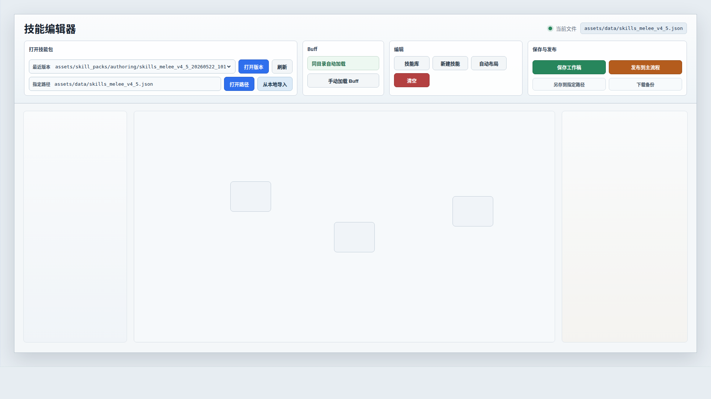

# 技能编辑器顶栏文件区原型 v1

生成时间：2026-05-22 10:19:21 +0800
当前状态：待用户确认
目标画板：1920 x 1080
范围：只处理技能编辑器顶部工具栏，不处理下方画布、节点、检查器布局。

## 本版定位

本版用于解决顶部按钮语义混乱的问题。核心设计判断：

1. `导入本地` 改名为 `从本地导入`。
2. 不再并列使用 `加载项目` 和 `加载版本` 这两个容易混淆的动作名。
3. 顶栏按工作流排序：打开技能包 -> Buff -> 编辑 -> 保存与发布。
4. 打开来源拆成三类：`最近版本`、`指定路径`、`从本地导入`。

## 非目标

1. 不改变技能编辑器画布、节点、连线或右侧检查器。
2. 不在本版讨论保存接口和发布接口的后端实现。
3. 不把本图直接视作已批准实现标准，需用户确认。

## 图文证据链

### 01 顶栏文件区 1920x1080

评阅状态：待用户确认
设计依据：用户指出 `导入本地` 应叫 `从本地导入`，且无法区分 `加载项目` 和 `加载版本`。
需要判断：是否接受把 `加载项目` 改成 `打开路径`，把 `加载版本` 改成 `打开版本`。
允许偏差：按钮颜色、字号、间距实现时可微调。
不可接受偏差：重新出现 `加载项目` / `加载版本` 这组难区分命名；`从本地导入` 与项目路径打开混在同一按钮语义中。



## 原始材料说明

本版无外部原始图片。事实源来自当前运行页顶部工具栏结构和本轮用户反馈。

## 原型到实现映射

目标路由：

`/test/skill_editor_test_v3.html`

涉及区域：

1. `#toolbar`
2. `#recent-skill-file-select`
3. `#project-file-path`
4. 文件导入 input 的触发按钮
5. 保存、发布、另存、下载相关按钮

## 查看与再生成

打开源文件：

`DOC/CODEX_DOC/08_原型与附图/2026-05-22-101921-NodeConsoleApp2-技能编辑器顶栏文件区原型-v1/source/index.html`

截图命令：

```bash
google-chrome --headless --disable-gpu --window-size=1920,1080 --screenshot=DOC/CODEX_DOC/08_原型与附图/2026-05-22-101921-NodeConsoleApp2-技能编辑器顶栏文件区原型-v1/01-toolbar-file-zone-1920x1080.png DOC/CODEX_DOC/08_原型与附图/2026-05-22-101921-NodeConsoleApp2-技能编辑器顶栏文件区原型-v1/source/index.html
```

## 评审结论

待用户确认。
