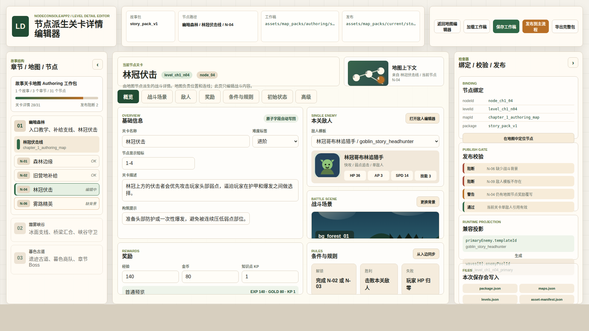

# NodeConsoleApp2 节点派生关卡详情编辑器原型 v1

生成时间：2026-05-24 10:41:06
状态：`待用户确认`
所属页面：关卡详情编辑器
目标画板：`1920 x 1080`
建议实现入口：`test/level_detail_editor_v1.html` 或后续正式编辑器路由
主对象：故事地图包内由地图节点派生的单关卡详情

## 1. 本版定位

本版用于评审新的关卡详情编辑器页面结构。它不参考旧关卡编辑器，而是按最新地图编辑器与技能编辑器的模式组织：

1. 顶部保留故事包上下文、工作稿路径、发布路径和保存 / 发布操作。
2. 左侧按故事包、章节、地图、节点导航，不做全局关卡库。
3. 中央按关卡详情 Tabs 编辑概览、战斗场景、敌人、奖励、条件与规则。
4. 右侧显示节点绑定、发布校验、运行时兼容投影和保存文件清单。

## 2. 非目标

1. 本版不是最终实现代码。
2. 本版不设计旧关卡编辑器迁移 UI。
3. 本版不做多敌人、敌人池、波次或多阶段战斗编排。
4. 本版不替代地图编辑器中的节点和边编辑。
5. 本版只提供桌面总览图，暂不提供移动端方案。

## 3. 事实源与设计依据

1. `DOC/CODEX_DOC/02_设计说明/S3_关卡地图与编辑器/28-节点派生关卡编辑器(node_derived_level_editor)-设计说明.md`
2. `DOC/CODEX_DOC/02_设计说明/S3_关卡地图与编辑器/26-关卡地图选择与地图包(level_map_selection)-设计说明.md`
3. `DOC/CODEX_DOC/02_设计说明/27-地图编辑器故事章节与目录式地图包(map_editor_story_package)-设计说明.md`
4. `DOC/CODEX_DOC/02_设计说明/S4_技能系统与编辑器/04-技能编辑器(skill_editor_design)-设计说明.md`
5. `test/level_map_editor_v1.html` 的最新地图编辑器顶部操作、抽屉和检查器形态。
6. `test/skill_editor_test_v3.html` 的技能编辑器文件区、字段分组和保存 / 发布口径。

## 4. 画板规格与布局预算

主画板固定为 `1920 x 1080`。

布局预算：

1. 顶部文件区：132px 高。
2. 主工作区：824px 高。
3. 左侧结构抽屉：330px 宽。
4. 右侧检查器抽屉：420px 宽。
5. 中央关卡详情区：自适应剩余宽度。

## 5. 图文证据链

### 5.1 `01-关卡详情编辑器总览-1920x1080.png`

评阅状态：`待用户确认`
画板规格：`1920 x 1080`

设计依据：

1. 关卡从地图节点派生，因此左侧是章节 / 地图 / 节点结构。
2. 保存和发布主体是故事地图包，因此顶部显示 authoring/current 路径。
3. 每关只有一个敌人，因此中央只显示“本关敌人”选择器和敌人摘要。
4. 运行时兼容投影只放在右侧检查器，不进入主编辑心智。
5. 保存文件清单明确显示 `package.json / maps.json / levels.json / asset-manifest.json`。

需要用户判断的问题：

1. 左侧结构导航是否符合你对“从地图节点进入关卡详情”的理解。
2. 中央 Tabs 的分组是否足够覆盖关卡详情编辑。
3. 右侧检查器的信息密度是否合适。
4. 当前整体风格是否能作为后续实现基线。

允许偏差：

1. 具体字段名称和枚举值可在实现时根据数据契约微调。
2. 图标、按钮文案、卡片尺寸可根据运行页面实际空间微调。
3. 右侧问题列表数量可根据真实校验结果动态变化。

不可接受偏差：

1. 不能回到旧关卡库式列表。
2. 不能暴露多敌人、波次、敌人池作为主编辑入口。
3. 不能隐藏保存和发布目标路径。
4. 不能让地图节点、关卡详情和主游戏加载来源割裂。



## 6. 原始材料说明

本版无外部原始图片。页面内使用了项目已有 SVG 资源引用：

1. `assets/images/level_map/portraits/enemy_goblin_hunter.svg`
2. `assets/images/level_map/backgrounds/bg_forest_canopy.svg`

## 7. 原型到实现映射

建议实现映射：

1. 顶部文件区
   - 对应故事地图包加载、保存、发布、导出能力。
2. 左侧结构抽屉
   - 对应地图包中的 `stories / chapters / maps / nodes`。
3. 中央详情 Tabs
   - 对应新的 `LevelDetailWorkspace`。
4. 右侧检查器
   - 对应节点绑定、校验问题、运行时兼容投影和保存文件列表。
5. 数据来源
   - `assets/map_packs/authoring/<packageId>/package.json`
   - `maps.json`
   - `levels.json`
   - `asset-manifest.json`
   - `assets/data/enemies.json`

## 8. 查看与再生成

打开源文件：

```bash
xdg-open NodeConsoleApp2/DOC/CODEX_DOC/08_原型与附图/2026-05-24-104106-NodeConsoleApp2-节点派生关卡详情编辑器原型-v1/source/index.html
```

重新生成截图：

```bash
google-chrome --headless --disable-gpu --no-sandbox --window-size=1920,1080 \
  --screenshot=NodeConsoleApp2/DOC/CODEX_DOC/08_原型与附图/2026-05-24-104106-NodeConsoleApp2-节点派生关卡详情编辑器原型-v1/01-关卡详情编辑器总览-1920x1080.png \
  file:///home/wgw/CodexProject/NodeConsoleApp2/.worktree/map-optimization-20260518/NodeConsoleApp2/DOC/CODEX_DOC/08_原型与附图/2026-05-24-104106-NodeConsoleApp2-节点派生关卡详情编辑器原型-v1/source/index.html
```

## 9. 自检记录

1. 已用 Google Chrome headless 以 `1920 x 1080` 视口导出 PNG。
2. 已检查图片尺寸：`PNG image data, 1920 x 1080`。
3. 已实际查看截图：未出现浏览器滚动条；主要结构、路径、保存/发布、单敌人、战斗场景、奖励、规则、右侧校验均在画板内可见。
4. 本版状态为 `待用户确认`，尚不能作为实现批准基线。

## 10. 评审结论

当前结论：`待用户确认`。
