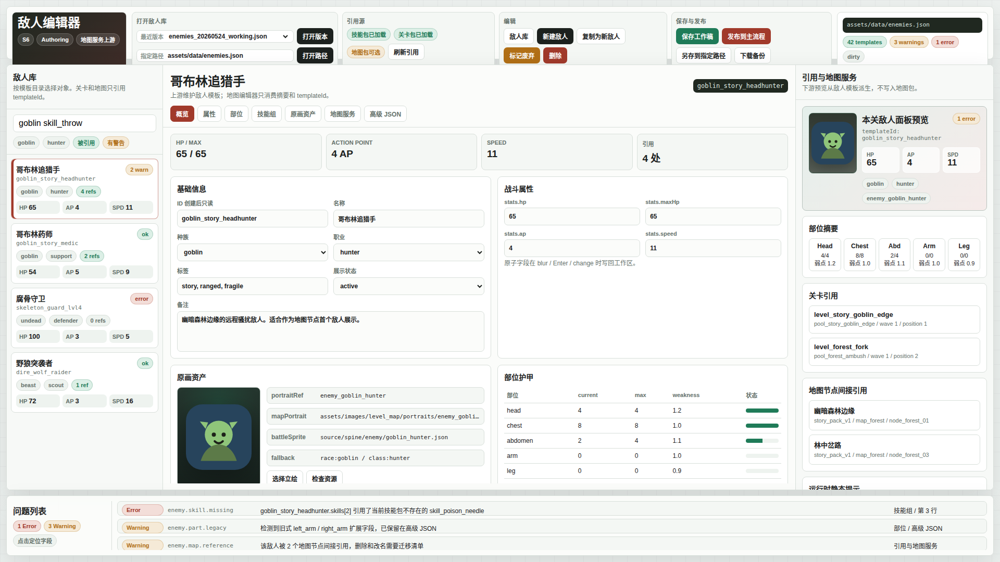

# 敌人编辑器工作区原型 v1

生成时间：2026-05-24

当前状态：待用户确认

## 本版定位

本原型只画敌人编辑器的作者工具界面，不改产品代码，也不接真实保存、发布、运行时逻辑。

它按 `S6_敌人系统与编辑器/28-敌人编辑器(enemy_editor)-设计说明.md` 的基线落图，重点验证：

1. 顶栏是否能承载“打开敌人库 / 引用源 / 编辑 / 保存与发布”。
2. 左侧敌人库是否适合搜索、筛选和查看引用状态。
3. 中央编辑区是否能同时放下概览、属性、部位和技能组。
4. 右侧是否能清楚表达“敌人编辑器服务地图编辑器”的引用与预览关系。
5. 底部问题列表是否足够明确地承载发布前阻塞错误。

## 文件

- `source/enemy-editor-workspace-prototype-v1.html`：可打开的静态原型页。
- `source/capture-enemy-editor-workspace-prototype-v1.mjs`：截图脚本。
- `01-1920x1080-敌人编辑器工作区总览.png`：1920 x 1080 总览截图。
- `prototype-report.json`：截图报告。

## 截图



## 查看

```bash
cd /home/wgw/CodexProject/NodeConsoleApp2/.worktree/enemy-design-20260522/NodeConsoleApp2
google-chrome --allow-file-access-from-files "file://$PWD/DOC/CODEX_DOC/08_原型与附图/2026-05-24-敌人编辑器工作区原型-v1/source/enemy-editor-workspace-prototype-v1.html"
```

## 重新生成截图

```bash
cd /home/wgw/CodexProject/NodeConsoleApp2/.worktree/enemy-design-20260522/NodeConsoleApp2
node DOC/CODEX_DOC/08_原型与附图/2026-05-24-敌人编辑器工作区原型-v1/source/capture-enemy-editor-workspace-prototype-v1.mjs
```

## 原型到实现映射

1. 顶栏参考技能编辑器的打开、保存、发布链。
2. 左侧敌人库对应 `EnemyWorkspaceDocument.enemies` 的目录视图。
3. 中央编辑区对应 `EnemyTemplate` 主表单。
4. 右侧引用与地图服务对应关卡包、地图包和敌人目录的派生摘要。
5. 底部问题列表对应结构、数值、引用和下游消费校验。
