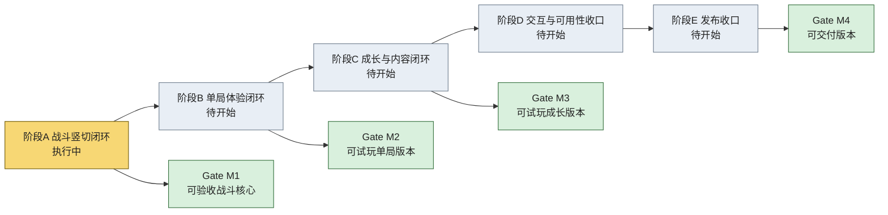
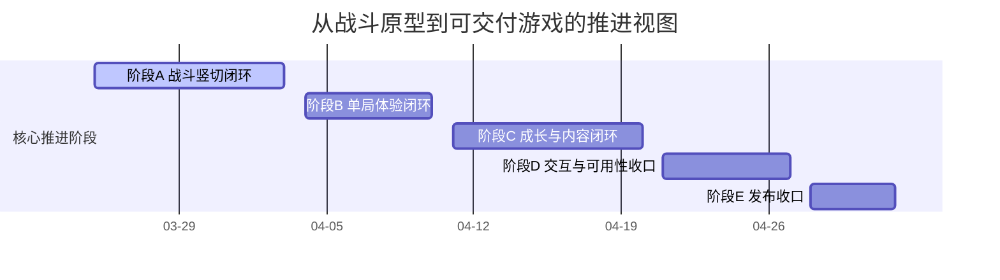

# 研发总览看板

创建时间：2026-03-28

状态：`当前有效，展示层`

## 1. 使用说明

这份文档不是新的计划事实源，而是为了让人更直观看到：

1. 项目整体工作流
2. 当前推进到哪一阶段
3. 当前 Gate 离完成还有多远
4. 当前最重要的阻塞和下一步

事实源分成两层：

1. [01-WBS-L0-NodeConsoleApp2-可交付版本研发总纲](/home/wgw/CodexProject/NodeConsoleApp2/NodeConsoleApp2/DOC/CodexAnylyse/开发计划/01-WBS-L0-NodeConsoleApp2-可交付版本研发总纲.md)
2. [02-WBS-L1-阶段A-战斗竖切闭环](/home/wgw/CodexProject/NodeConsoleApp2/NodeConsoleApp2/DOC/CodexAnylyse/开发计划/02-WBS-L1-阶段A-战斗竖切闭环.md)
3. [05-严格树形任务分解与GitHub-Issue-Tree方案](/home/wgw/CodexProject/NodeConsoleApp2/NodeConsoleApp2/DOC/CodexAnylyse/计划管理归档/05-严格树形任务分解与GitHub-Issue-Tree方案.md)
4. [06-阶段A-Issue-Tree初始迁移记录](/home/wgw/CodexProject/NodeConsoleApp2/NodeConsoleApp2/DOC/CodexAnylyse/计划管理归档/06-阶段A-Issue-Tree初始迁移记录.md)
5. [07-全阶段骨架Issue-Tree与Project迁移记录](/home/wgw/CodexProject/NodeConsoleApp2/NodeConsoleApp2/DOC/CodexAnylyse/计划管理归档/07-全阶段骨架Issue-Tree与Project迁移记录.md)

其中：

1. `01/02` 定义计划内容
2. `05/06` 定义执行树和落地状态
3. 本看板只做展示镜像，不单独定义需求，不单独定义范围

## 2. 项目整体工作流



## 2.1 如何理解这张图

这张图表达的是“阶段推进顺序 + 阶段贡献到 Gate”，不是“所有卡片完全同级并列”。

正确理解方式：

1. `阶段` 是工作包
2. `Gate` 是验收节点，不是树节点
3. `当前执行切片` 不直接画在这张总图里，但它属于 `阶段 A`
4. `阶段 A` 服务于 `M1`
5. `阶段 B` 服务于 `M2`
6. `阶段 C` 服务于 `M3`
7. `阶段 D` 和 `阶段 E` 共同服务于 `M4`

Gate 是累计成立的：

1. `M1 = A`
2. `M2 = A + B`
3. `M3 = A + B + C`
4. `M4 = A + B + C +  D + E`

## 3. 当前推进位置

### 3.1 阶段状态总览

| 阶段 | 目标 | 当前状态 | 直观判断 |
| --- | --- | --- | --- |
| A 战斗竖切闭环 | 技能、Buff、敌人行为、战斗恢复形成稳定核心 | `执行中` | 已接近后段，但恢复闭环和阶段最终确认未完成 |
| B 单局体验闭环 | 从进关到胜负结算形成完整一局 | `待开始` | 依赖阶段 A 收口后推进 |
| C 成长与内容闭环 | 技能树、成长资源、关卡内容形成连续可玩 | `待开始` | 当前仅有方向定义，未进入正式实现 |
| D 交互与可用性收口 | 从研发原型 UI 收敛为可交付 UI | `待开始` | 必须放在核心玩法稳定之后 |
| E 发布收口 | 形成可交付版本、说明和冻结基线 | `待开始` | 明显是最后阶段 |

### 3.2 当前阶段细看

| 项目 | 当前判断 |
| --- | --- |
| 当前阶段 | `阶段 A：战斗竖切闭环` |
| 当前激活 WBS 节点 | `#14 / #15 / #16 / #17` |
| 当前 Gate | `M1：可验收战斗核心` |
| 当前整体交付进度 | `35% ~ 45%` |
| 当前最强能力 | `mock_ui_v11.html` 主流程和战斗原型已可真实操作 |
| 当前主要缺口 | `战斗恢复闭环`、`单局结算闭环`、`内容量不足` |
| 当前状态性质 | `不是从零开发，也还不是可交付游戏` |

### 3.3 当前严格任务树快照

全阶段骨架已经迁移到 GitHub issue tree。当前快照如下：

```text
#13 WBS L0: NodeConsoleApp2 可交付版本研发总纲
├── #14 WBS L1: 阶段A 战斗竖切闭环
│   ├── #15 WBS L2: A1 Buff 主流程完成
│   │   ├── #18 WBS L3: A1.1 补齐 Buff 人工验收入口与真实主流程样本
│   │   └── #19 WBS L3: A1.2 扩展 Buff 学习-装配-执行闭环
│   ├── #16 WBS L2: A2 敌人行为完成
│   │   ├── #20 WBS L3: A2.1 扩展敌人策略样本到真实关卡
│   │   └── #21 WBS L3: A2.2 固化敌人行为的人工验收路径
│   └── #17 WBS L2: A3 战斗恢复完成
│       ├── #22 WBS L3: A3.1 梳理战斗恢复所需的最小 runtime snapshot
│       ├── #23 WBS L3: A3.2 恢复后重建 BuffManager 与 planning state
│       └── #24 WBS L3: A3.3 增加恢复后继续执行回归
├── #25 WBS L1: 阶段B 单局体验闭环
│   ├── #26 WBS L2: B1 结果与奖励
│   └── #27 WBS L2: B2 关卡流转
├── #28 WBS L1: 阶段C 成长与内容闭环
│   ├── #29 WBS L2: C1 技能树与构筑
│   └── #30 WBS L2: C2 内容扩充
├── #31 WBS L1: 阶段D 交互与可用性收口
│   ├── #32 WBS L2: D1 UI 统一
│   └── #33 WBS L2: D2 新手与反馈
└── #34 WBS L1: 阶段E 发布收口
    ├── #35 WBS L2: E1 测试冻结
    └── #36 WBS L2: E2 发布包整理
```

这部分的详细说明见：

1. [05-严格树形任务分解与GitHub-Issue-Tree方案](/home/wgw/CodexProject/NodeConsoleApp2/NodeConsoleApp2/DOC/CodexAnylyse/计划管理归档/05-严格树形任务分解与GitHub-Issue-Tree方案.md)
2. [06-阶段A-Issue-Tree初始迁移记录](/home/wgw/CodexProject/NodeConsoleApp2/NodeConsoleApp2/DOC/CodexAnylyse/计划管理归档/06-阶段A-Issue-Tree初始迁移记录.md)
3. [07-全阶段骨架Issue-Tree与Project迁移记录](/home/wgw/CodexProject/NodeConsoleApp2/NodeConsoleApp2/DOC/CodexAnylyse/计划管理归档/07-全阶段骨架Issue-Tree与Project迁移记录.md)

## 4. 当前 Gate 看板

### 4.1 关系说明

Gate 看板不是要替代阶段看板，而是要回答“当前阶段完成后，项目会进入哪个验收节点”。

| Gate | 通过线 | 状态 | 当前判断 |
| --- | --- | --- | --- |
| M1 可验收战斗核心 | Buff、敌人行为、恢复链路可验收 | `执行中` | Buff 与敌人样本基本到位，恢复链路仍是核心缺口 |
| M2 可试玩单局版本 | 一局从进入到结算完整成立 | `待开始` | 尚未进入开发主线 |
| M3 可试玩成长版本 | 多关卡、成长、构筑差异可体验 | `待开始` | 需要在 M2 后推进 |
| M4 可交付版本 | 可交给非开发者试玩和复测 | `待开始` | 仍是中后期目标 |

## 5. 研发推进时间视图



说明：

1. 这是一版可执行的首版时间估计，不是合同式死线
2. 日期应与 GitHub Project 的 `Start Date / Target Date` 保持同步
3. 当前执行切片应被理解为挂在 `阶段 A` 之下，而不是与 `阶段 A` 并列

## 6. 当前证据板

| 类别 | 当前有效证据 | 说明 |
| --- | --- | --- |
| 总计划 | [01-WBS-L0-NodeConsoleApp2-可交付版本研发总纲](/home/wgw/CodexProject/NodeConsoleApp2/NodeConsoleApp2/DOC/CodexAnylyse/开发计划/01-WBS-L0-NodeConsoleApp2-可交付版本研发总纲.md) | L0/L1/L2 主文档 |
| 当前激活阶段计划 | [02-WBS-L1-阶段A-战斗竖切闭环](/home/wgw/CodexProject/NodeConsoleApp2/NodeConsoleApp2/DOC/CodexAnylyse/开发计划/02-WBS-L1-阶段A-战斗竖切闭环.md) | `#14` 的稳定阶段计划 |
| WBS 定义 | [05-严格树形任务分解与GitHub-Issue-Tree方案](/home/wgw/CodexProject/NodeConsoleApp2/NodeConsoleApp2/DOC/CodexAnylyse/计划管理归档/05-严格树形任务分解与GitHub-Issue-Tree方案.md) | 严格树形语义定义 |
| WBS 迁移记录 | [06-阶段A-Issue-Tree初始迁移记录](/home/wgw/CodexProject/NodeConsoleApp2/NodeConsoleApp2/DOC/CodexAnylyse/计划管理归档/06-阶段A-Issue-Tree初始迁移记录.md) | 阶段 A 已落地 issue tree 证据 |
| 全阶段骨架记录 | [07-全阶段骨架Issue-Tree与Project迁移记录](/home/wgw/CodexProject/NodeConsoleApp2/NodeConsoleApp2/DOC/CodexAnylyse/计划管理归档/07-全阶段骨架Issue-Tree与Project迁移记录.md) | 全阶段骨架与 Project 同步证据 |
| 测试基线 | [05-mock_ui_v11主流程测试基线](/home/wgw/CodexProject/NodeConsoleApp2/NodeConsoleApp2/DOC/CodexAnylyse/05-mock_ui_v11主流程测试基线.md) | 主流程验收入口 |
| 最新自测 | [2026-03-28-1302-验收反馈修正与等待技能自测报告](/home/wgw/CodexProject/NodeConsoleApp2/NodeConsoleApp2/DOC/CodexAnylyse/自测报告/2026-03-28-1302-验收反馈修正与等待技能自测报告.md) | 当前最近的工程证据 |
| 最新人工清单 | [2026-03-28-1302-人工验收清单](/home/wgw/CodexProject/NodeConsoleApp2/NodeConsoleApp2/DOC/CodexAnylyse/验收清单/2026-03-28-1302-人工验收清单.md) | 当前阶段用户验收入口 |
| 最新交接 | [2026-03-28-1302-验收反馈修订记录](/home/wgw/CodexProject/NodeConsoleApp2/NodeConsoleApp2/DOC/CodexAnylyse/会话交接/2026-03-28-1302-验收反馈修订记录.md) | 当前阶段判断 |

## 7. 当前阻塞与下一步

### 7.1 当前阻塞

| 阻塞项 | 影响 |
| --- | --- |
| 战斗恢复链路未形成用户级闭环 | M1 不能完全关闭 |
| 当前阶段仍待人工验收最终确认 | 阶段 A 不能正式切段 |
| 单局结算与奖励尚未进入主线实现 | M2 不能启动验收 |

### 7.2 建议下一步

1. 先完成阶段 A 剩余的战斗恢复闭环
2. 让 M1 达到可人工验收关闭状态
3. 继续把阶段 A 的 issue tree 当作执行入口，而不是回到 Gate 卡片并列模式
4. 随后进入阶段 B，补胜负结算、奖励入账、下一关/重开/返回菜单路径

## 8. 给人的阅读顺序

如果你只想快速判断项目状态，推荐顺序是：

1. 本看板
2. [01-WBS-L0-NodeConsoleApp2-可交付版本研发总纲](/home/wgw/CodexProject/NodeConsoleApp2/NodeConsoleApp2/DOC/CodexAnylyse/开发计划/01-WBS-L0-NodeConsoleApp2-可交付版本研发总纲.md)
3. [02-WBS-L1-阶段A-战斗竖切闭环](/home/wgw/CodexProject/NodeConsoleApp2/NodeConsoleApp2/DOC/CodexAnylyse/开发计划/02-WBS-L1-阶段A-战斗竖切闭环.md)

## 9. 维护规则

后续维护时遵守：

1. 计划状态先更新总计划，再同步更新本看板
2. 本看板的图表和表格必须与总计划保持一致
3. 如果图表与总计划冲突，以总计划为准
